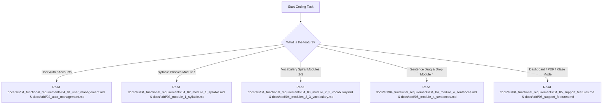

# PAMANA Project Brain & Modular Knowledge Base

Welcome to the **PAMANA Project Brain**. This document is a centralized knowledge hub and index map designed for human developers and agentic AI systems. It breaks down the system requirements, technical designs, and codebase structure of **PAMANA**, a gamified web-based Filipino language learning application for Grade 2 learners.

By modularizing the core document files (Proposal, SRS, and SDD) and extracting the heavy embedded image assets, we have created a lightweight, high-performance retrieval index.

---

## 🧠 System Overview & Architecture

PAMANA is a standalone three-tier web application built on the following stack:
* **Frontend:** React 18 SPA (single-page application) powered by **Vite** for fast hot module reloading, **shadcn/ui** as the core component library for clean, premium, and accelerated component creation, Web Audio API for audio playback, and HTML5 drag-and-drop.
* **Backend:** Spring Boot 3.x REST API for core business logic, JWT authentication validation, progress threshold evaluation, and automated PDF report generation (via Apache PDFBox).
* **Database (Dual Environment Strategy):**
  * **Local Development:** **Local PostgreSQL 15+** database (connected on `localhost:5432` for fast, offline, and zero-latency development).
  * **Production / Deployment (Final):** **Supabase PostgreSQL** cloud database.
  * **JPA Security:** Spring Security JPA Authorization policies for user data isolation, and Local static asset directories (Spring Boot) for hosting pre-recorded native audio/image assets.
* **Social/Real-time:** Spring Boot WebSockets (STOMP) WebSocket subscriptions powering the asynchronous classroom leaderboard (Klase Mode).

### Core Game Narrative
Grade 2 child visiting their grandparents Lolo and Lola in the province for the summer. To complete household tasks ("Pamanang Gawain") and communicate with Lolo and Lola (who speak only Filipino), the child must progress along the **Pamana Trail** map across four modules, eventually unlocking the **Reunion Ending** to speak in complete Filipino sentences to their parents on the phone.

---

## 🌐 Git & Repository Guidelines

* **GitHub Repository Link:** [https://github.com/KobeVLM/PAMANA](https://github.com/KobeVLM/PAMANA)
* **Branching Strategy:**
  * **`main`**: Production-ready branch. This is where our deployment and final product live.
  * **`develop`**: Active development branch. This is where we do our day-to-day development, feature branching, and integration.

---

## 🗺️ Modular Documentation Directory

Use the directory map below to dynamically fetch only the relevant markdown files for the feature you are currently researching or building.

### 1. Project Proposal (`docs/proposal/`)
*Contains high-level objectives, research context, and validation methodologies.*

| File Name | Description & Key Topics | Direct Link |
| :--- | :--- | :--- |
| **`README.md`** | Index of proposal modules. | [README.md](proposal/README.md) |
| **`01_introduction.md`** | Background of the problem, MATATAG Grade 2 Filipino curriculum Q1-Q2 alignment context, problem statement, and literature research gaps. | [01_introduction.md](proposal/01_introduction.md) |
| **`02_objectives.md`** | General and specific objectives for Module 1 (Syllables), Modules 2-3 (Vocabulary spiral loops), Module 4 (Sentences), and Dashboard. Research questions. | [02_objectives.md](proposal/02_objectives.md) |
| **`03_methods.md`** | Proposed solution concept, narrative design, Agile/Scrum sprint timeline, and user validation phases with 30 Grade 2 public school students. | [03_methods.md](proposal/03_methods.md) |
| **`04_expected_system_mvp.md`** | Key MVP features checklist (F1-F7) with measurable accuracy/speed targets, character settings, and user workflow steps. | [04_expected_system_mvp.md](proposal/04_expected_system_mvp.md) |
| **`05_discussion_limitations.md`** | Scope inclusions vs. exclusions (e.g. speech recognition is out of scope). Project limitations (unreliable internet, parent literacy). | [05_discussion_limitations.md](proposal/05_discussion_limitations.md) |
| **`06_traceability_matrix.md`** | Traceability matrix mapping Review of Related Literature (RRL) findings to research questions and proposed system features. | [06_traceability_matrix.md](proposal/06_traceability_matrix.md) |

---

### 2. Software Requirements Specifications (`docs/srs/`)
*Contains functional, non-functional, and interface requirements along with use cases and wireframes.*

| File Name | Description & Key Topics | Direct Link |
| :--- | :--- | :--- |
| **`README.md`** | Index of SRS chapters and sections. | [README.md](srs/README.md) |
| **`01_introduction.md`** | Document change history, purpose, scope, definitions, acronyms, and references. | [01_introduction.md](srs/01_introduction.md) |
| **`02_overall_description.md`** | Product perspective, user characteristics, overall constraints, assumptions, and a detailed risk-mitigation registry. | [02_overall_description.md](srs/02_overall_description.md) |
| **`03_ext_interfaces.md`** | Hardware interface constraints (speakers, mouse/touchpad targets) and software/communications interfaces (TLS 1.2, WebSocket port 443). | [03_ext_interfaces.md](srs/03_ext_interfaces.md) |
| **`04_functional_requirements/`** | **Functional requirements folder containing details, use cases, activity diagrams, and wireframes.** | [Go to Folder](srs/04_functional_requirements/) |
| ↳ **`04_01_user_management.md`** | **SF.1 Learner Account Registration**, **SF.2 User Login**, and **SF.3 Teacher Klase Creation** detailed requirements, use cases, and diagrams. | [04_01_user_management.md](srs/04_functional_requirements/04_01_user_management.md) |
| ↳ **`04_02_module_1_syllable.md`** | **Module 1 (Syllable Recognition):** Pagsama blending, Pakinggan listening, Kilalanin recognition, Rhyming tasks, and the ≥80% accuracy progression lock. | [04_02_module_1_syllable.md](srs/04_functional_requirements/04_02_module_1_syllable.md) |
| ↳ **`04_03_module_2_3_vocabulary.md`** | **Modules 2-3 (Vocabulary Development):** 4-step spiral loops (Pakinggan-Kilalanin-Basahin-Gamitin), Hamon ng Pamana auto-trigger mechanics, and locks. | [04_03_module_2_3_vocabulary.md](srs/04_functional_requirements/04_03_module_2_3_vocabulary.md) |
| ↳ **`04_04_module_4_sentences.md`** | **Module 4 (Sentence Construction):** Drag-and-drop word arrangement, declarative (paturol) and interrogative (patanong) sentence tiers, and the reunion ending. | [04_04_module_4_sentences.md](srs/04_functional_requirements/04_04_module_4_sentences.md) |
| ↳ **`04_05_support_features.md`** | **Dashboard & Social Features:** Parent/Guardian Progress Dashboard, At-risk word color indicators, PDF session reports, and Klase Mode Leaderboard. | [04_05_support_features.md](srs/04_functional_requirements/04_05_support_features.md) |
| **`05_non_functional_requirements.md`** | Performance (latency ≤0.3s), child usability (unlimited retries, Hint-First no punishment), reliability, and strict Data Privacy Act of 2012 security. | [05_non_functional_requirements.md](srs/05_non_functional_requirements.md) |
| **`06_requirements_validation.md`** | Detailed Requirements Validation Table (VR.1 to VR.7) and the complete Traceability Matrix mapping SRS features back to system objectives. | [06_requirements_validation.md](srs/06_requirements_validation.md) |

---

### 3. Software Design Description (`docs/sdd/`)
*Contains physical class interfaces, Spring Boot REST controllers, sequence diagrams, React components, and Postgres schemas.*

| File Name | Description & Key Topics | Direct Link |
| :--- | :--- | :--- |
| **`README.md`** | Index of SDD chapters. | [README.md](sdd/README.md) |
| **`01_detailed_design_overview.md`** | SDD Preface, versions, change history, and design introduction. | [01_detailed_design_overview.md](sdd/01_detailed_design_overview.md) |
| **`02_user_management.md`** | React components (`RegisterPage`, `AuthContext`), Spring Boot classes (`AuthController`, `AuthService`, `UserRepository`), sequence diagrams, and Postgres table schemas (`users`, `module_progress`). | [02_user_management.md](sdd/02_user_management.md) |
| **`03_module_1_syllable.md`** | Front-end components (`PagsamaGame`, `PakingganGame`), backend classes (`SyllableService`, `SyllableProgressRepository`, `ModuleLockService`), sequence diagrams, and schema (`syllable_progress`). | [03_module_1_syllable.md](sdd/03_module_1_syllable.md) |
| **`04_modules_2_3_vocabulary.md`** | React components (`SpiralLoopContainer`, `HamonGame`), backend classes (`VocabularyService`, `WordMasteryRepository`), sequence diagrams, and database schemas (`word_mastery`, `active_session`). | [04_modules_2_3_vocabulary.md](sdd/04_modules_2_3_vocabulary.md) |
| **`05_module_4_sentences.md`** | React components (`DragAndDropGame`, `SentenceCompletionGame`), backend classes (`SentenceService`, `SentenceProgressRepository`), sequence diagrams, and database schema (`sentence_progress`). | [05_module_4_sentences.md](sdd/05_module_4_sentences.md) |
| **`06_support_features.md`** | React components (`ParentDashboardPage`, `KlaseLeaderboard`), backend classes (`ReportService` using Apache PDFBox, `KlaseService` real-time updates), sequence diagrams, and database schema (`klases`). | [06_support_features.md](sdd/06_support_features.md) |

---

## 🤖 Guide for Code-Generating Agents

When assigned a specific implementation task, follow these search and retrieval instructions to construct correct, cohesive, and compliant code:

### Step 0: Adopt Your Role Persona & Git Workflows (CRITICAL FIRST STEP)
Before you write any code, design database schemas, or make commits, you **MUST** load, read, and adopt the exact guidelines, coding conventions, child-friendly parameters, architecture rules, and git branching/commit specifications defined in our core engineering profiles in the project root:
* **If you are implementing UI/Frontend tasks:** Read and follow [engineering-frontend-developer.md](../engineering-frontend-developer.md).
* **If you are implementing API/Database/Backend tasks:** Read and follow [engineering-backend-architect.md](../engineering-backend-architect.md).
* **For any Git actions, commits, branches, or pushes:** Read and follow [engineering-git-workflow-master.md](../engineering-git-workflow-master.md) to ensure atomic, conventional commits and clean, rebased branches.

Adopting these profiles ensures that your generated code is 100% compliant with standard child-safety guidelines, motor targets, local configurations, and git-flow branch hierarchies.

### Step 1: Locate Your Feature Area
Refer to the mapping below to find the specific files you must read:

### Step 2: Implement Aligning to Standards
Ensure that:
1. **Frontend Interactions** conform strictly to the touch targets, layouts, audio states, and local feedback requirements defined in the SRS.
2. **Spring Boot Classes** implement the exact class relationships, signatures, methods, and sequence steps defined in the SDD.
3. **Database Schemas** are written with the exact table columns, foreign keys, constraints, and default values specified in the Data Design section of the SDD.
4. **Non-Functional Targets** (Performance: visual feedback ≤0.3s; Accessibility: large touch targets; Usability: no progress penalty on incorrect answers) are hardcoded into components and APIs.

---

## 📁 Shared Assets Directory

All base64 image data inside `PAMANA_SRS.md` has been extracted and converted into high-performance, physical `.png` files to keep the markdown light:
* **Storage Location:** `docs/assets/images/`
* **File Format:** Descriptive file names matching the specific features and diagram type (e.g. `srs_sf1_learner_account_registration_use_case_diagram.png`).
* **Usage:** Embedded inside all functional markdown files using relative markdown links (e.g., ``).

---
> **PAMANA Source of Truth:** This brain and modular documentation folder supersedes all older, raw documentation files. Always consult this directory as the sole baseline for requirements and detailed designs.
