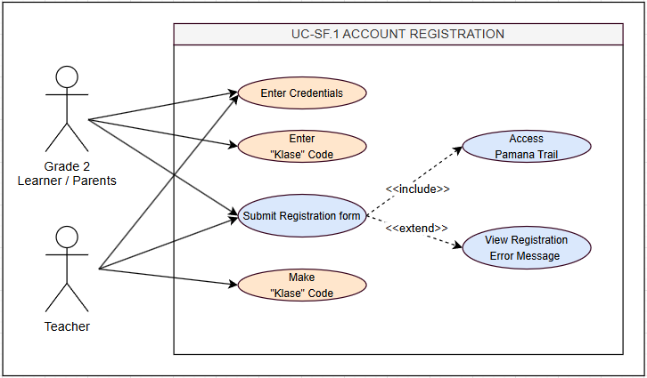
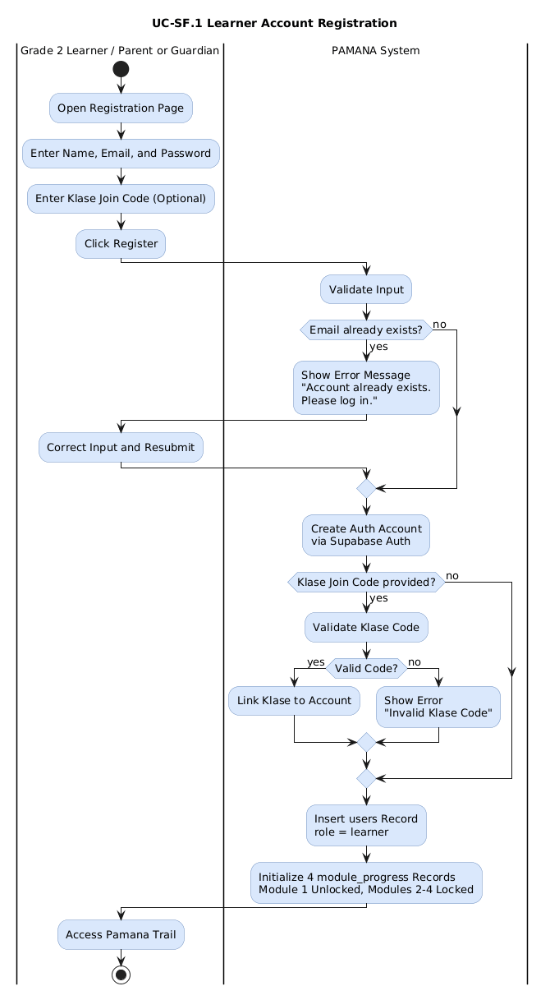
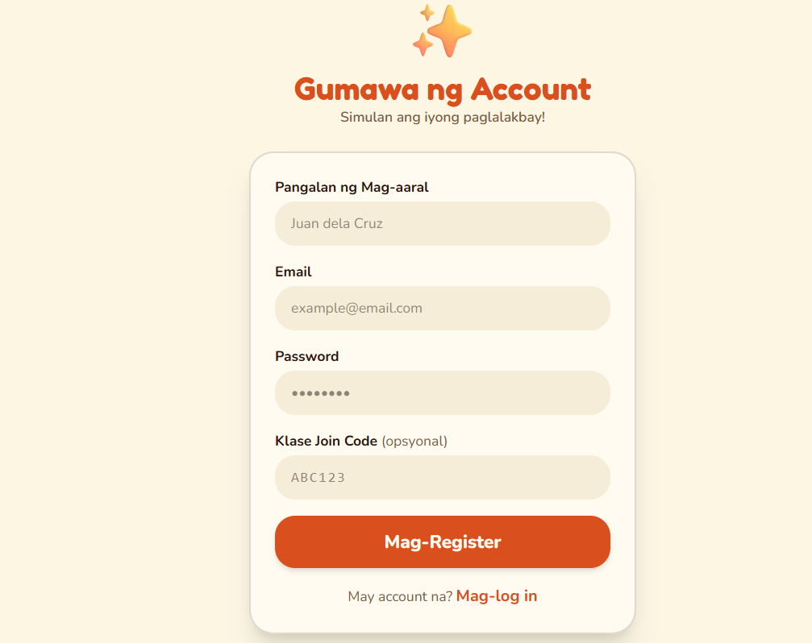
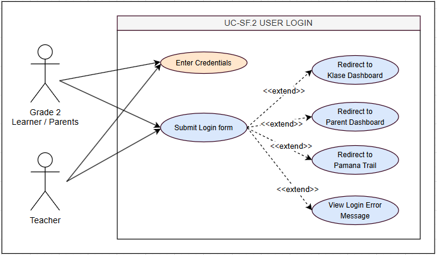
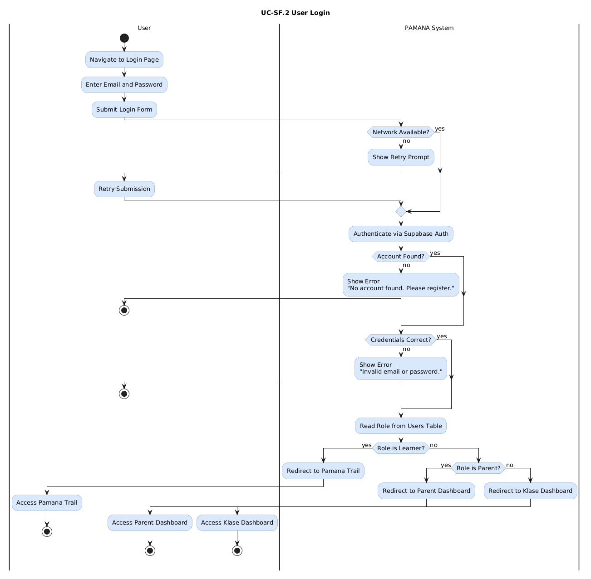
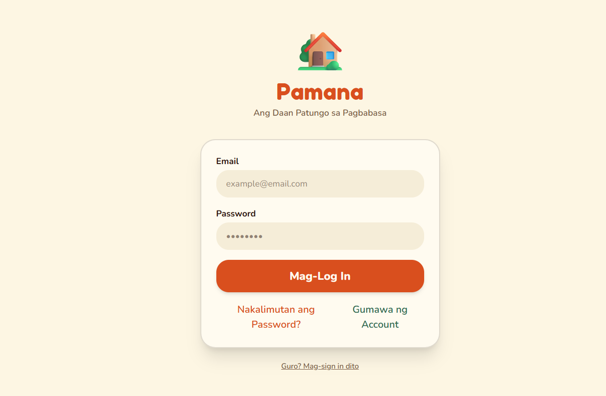
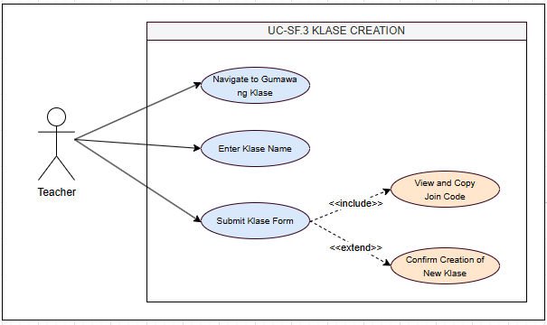
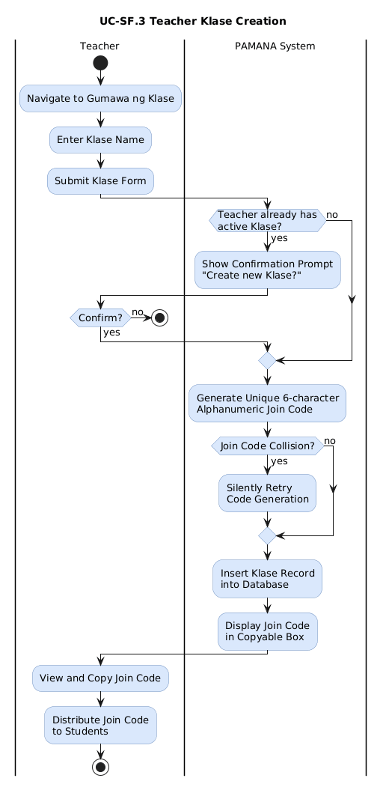
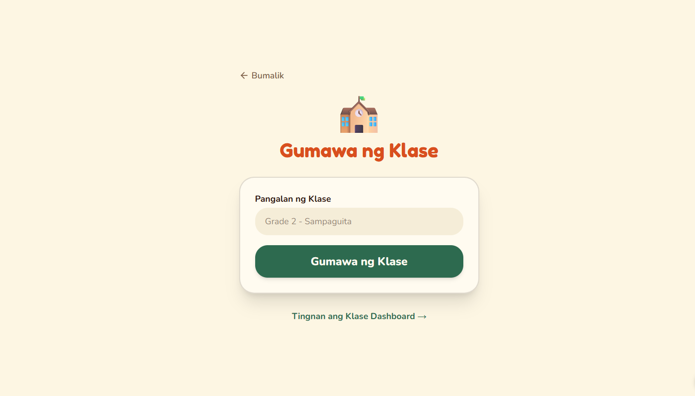

### Features: User Management

#### SF.1 Learner Account Registration

##### Use Case Diagram

##### Use Case Description

| **Field**        | **Details**                                                                                                                                                                                                                                                                                                                                                                                                                                                                                      |
| ---------------- | ------------------------------------------------------------------------------------------------------------------------------------------------------------------------------------------------------------------------------------------------------------------------------------------------------------------------------------------------------------------------------------------------------------------------------------------------------------------------------------------------ |
| Use Case ID      | UC-SF.1                                                                                                                                                                                                                                                                                                                                                                                                                                                                                          |
| Transaction Name | Learner Account Registration                                                                                                                                                                                                                                                                                                                                                                                                                                                                     |
| Actor(s)         | Grade 2 Learner / Parent or Guardian                                                                                                                                                                                                                                                                                                                                                                                                                                                             |
| Description      | A parent or learner creates a new Grade 2 learner account. Optionally joins a Klase via teacher-provided join code. Supabase Auth creates the auth account, the users table is populated, and module_progress is initialized with Module 1 unlocked and Modules 2-4 locked.                                                                                                                                                                                                                      |
| Precondition     | No existing account for the provided email. Registration page accessible via browser.                                                                                                                                                                                                                                                                                                                                                                                                            |
| Normal Flow      | 1\. Navigate to registration page.  2\. Enter learner name, email, password.  3\. Optionally enter Klase join code.  4\. Submit form.  5\. System calls Supabase Auth to create auth account.  6\. System inserts users record (role = 'learner').  7\. System initializes 4 module_progress records (Module 1 is_unlocked = TRUE; Modules 2-4 FALSE).  8\. If valid Klase code provided, users.klase_id updated.  9\. Redirect to Pamana Trail with Lola welcome audio. |
| Alternative Flow | A1. Invalid Klase code → error shown → user proceeds without Klase. A2. Email already registered → "Account already exists. Please log in." A3. Network error → retry prompt shown.                                                                                                                                                                                                                                                                                                              |
| Postcondition    | users record created. 4 module_progress records initialized. If valid Klase code: users.klase_id set. Learner on Pamana Trail at Module 1.                                                                                                                                                                                                                                                                                                                                                       |

##### Activity Diagram

##### Wireframe

#### SF.2 User Login

##### Use Case Diagram

##### Use Case Description

| **Field**        | **Details**                                                                                                                                                                                                                                                                                        |
| ---------------- | -------------------------------------------------------------------------------------------------------------------------------------------------------------------------------------------------------------------------------------------------------------------------------------------------- |
| Use Case ID      | UC-SF.2                                                                                                                                                                                                                                                                                            |
| Transaction Name | User Login                                                                                                                                                                                                                                                                                         |
| Actor(s)         | Grade 2 Learner, Parent or Guardian, Teacher                                                                                                                                                                                                                                                       |
| Description      | Registered user logs in via email and password. System authenticates via Supabase Auth and redirects based on role: Learner → Pamana Trail; Parent → Dashboard; Teacher → Klase Dashboard.                                                                                                         |
| Precondition     | Existing registered account. Login page accessible.                                                                                                                                                                                                                                                |
| Normal Flow      | 1\. Navigate to login page.  2\. Enter email and password.  3\. Submit.  4\. React calls supabase.auth.signInWithPassword().  5\. Supabase returns JWT.  6\. System reads role from users table.  7\. Redirect by role: Learner → /trail, Parent → /dashboard, Teacher → /klase. |
| Alternative Flow | A1. Incorrect credentials → "Invalid email or password." A2. Account not found → "No account found. Please register." A3. Network error → retry prompt.                                                                                                                                            |
| Postcondition    | User authenticated. JWT in browser session via AuthContext. User on role-appropriate interface.                                                                                                                                                                                                    |

##### Activity Diagram

##### Wireframe

#### SF.3 Teacher Klase Creation

##### Use Case Diagram

##### Use Case Description

| **Field**        | **Details**                                                                                                                                                                                                                                                                      |
| ---------------- | -------------------------------------------------------------------------------------------------------------------------------------------------------------------------------------------------------------------------------------------------------------------------------- |
| Use Case ID      | UC-SF.3                                                                                                                                                                                                                                                                          |
| Transaction Name | Teacher Klase Creation                                                                                                                                                                                                                                                           |
| Actor(s)         | Teacher                                                                                                                                                                                                                                                                          |
| Description      | A teacher creates a class group (Klase). System generates a unique 6-character alphanumeric join code the teacher distributes to students.                                                                                                                                       |
| Precondition     | Teacher logged in with Teacher role.                                                                                                                                                                                                                                             |
| Normal Flow      | 1\. Teacher navigates to "Gumawa ng Klase."  2\. Enters Klase name.  3\. Submits.  4\. System generates unique 6-character join code. 5. System inserts klases record.  6\. System displays join code in copyable box.  7\. Teacher distributes code to students. |
| Alternative Flow | A1. Teacher already has active Klase → confirmation prompt to create new. A2. Join code collision → system silently retries generation.                                                                                                                                          |
| Postcondition    | klases record created with join_code. Teacher Dashboard shows 0 members. Join code visible and copyable.                                                                                                                                                                         |

##### Activity Diagram

##### Wireframe

##### . .

