### Module 1 Pakinggan at Kilalanin (Syllable Recognition)

#### 1.1 Pagsama (Phoneme Blending)

##### Use Case Diagram

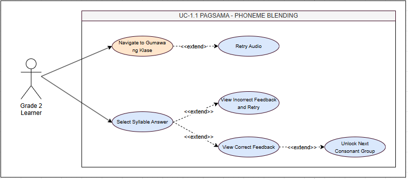

##### Use Case Description

| **Field**        | **Details**                                                                                                                                                                                                                                                                                                                                                                                                                                        |
| ---------------- | -------------------------------------------------------------------------------------------------------------------------------------------------------------------------------------------------------------------------------------------------------------------------------------------------------------------------------------------------------------------------------------------------------------------------------------------------- |
| Use Case ID      | UC-1.1                                                                                                                                                                                                                                                                                                                                                                                                                                             |
| Transaction Name | Pagsama - Phoneme Blending                                                                                                                                                                                                                                                                                                                                                                                                                         |
| Actor(s)         | Grade 2 Learner                                                                                                                                                                                                                                                                                                                                                                                                                                    |
| Description      | System plays an isolated consonant sound then isolated vowel sound. Learner selects the correct resulting syllable blend from 4 written options. Targets MATATAG Q1 competency: distinguishing that B + A = BA, not BE or BI.                                                                                                                                                                                                                      |
| Precondition     | Learner logged in. Module 1 unlocked (is_unlocked = TRUE). Pagsama sub-level active.                                                                                                                                                                                                                                                                                                                                                               |
| Normal Flow      | 1\. Lola NPC: "Pakinggan at Pagsamahin!"  2\. System plays consonant sound (e.g., /B/).  3\. System plays vowel sound (e.g., /A/).  4\. 4 syllable tile options displayed (BA, BE, BI, BO).  5\. Learner selects tile.  6\. Correct: green highlight + confirmation audio "B at A ay BA!" + accuracy recorded.  7\. Incorrect: red flash + hint audio + unlimited retry. 8. 3 correct of 4 items → next consonant group unlocks. |
| Alternative Flow | A1. Audio fails → retry button + text label shown. A2. Repeated incorrect → hint replays each time; no penalty.                                                                                                                                                                                                                                                                                                                                    |
| Postcondition    | Accuracy recorded in syllable_progress (sub_level = 'pagsama'). Complete when ≥80% average across all Pagsama sets.                                                                                                                                                                                                                                                                                                                                |

##### Activity Diagram

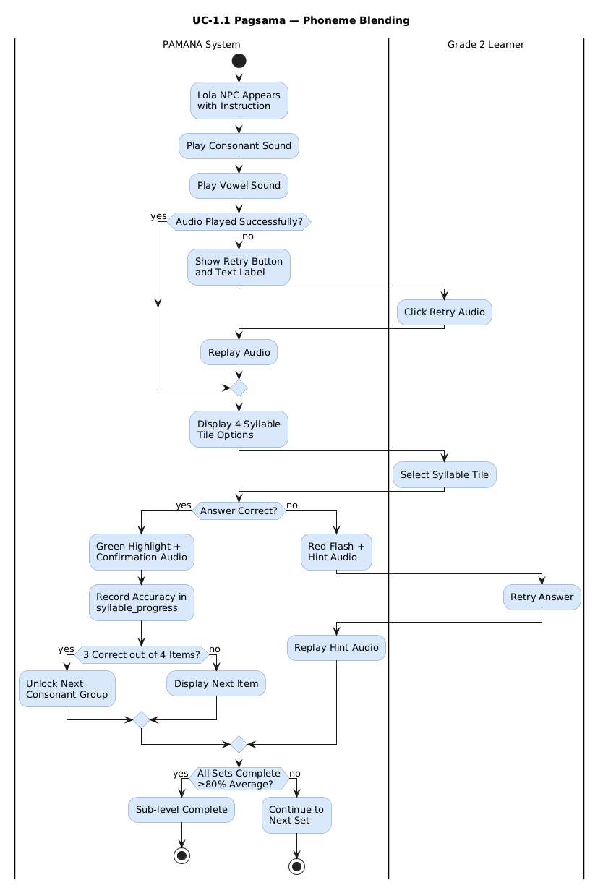

##### Wireframe

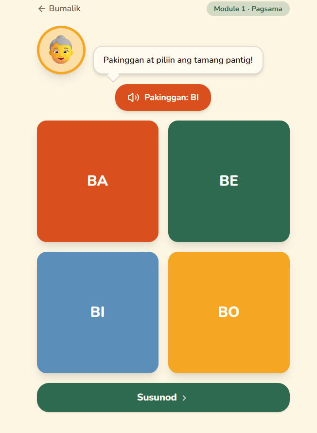

#### 1.2 Pakinggan (Syllable Recognition)

##### Use Case Diagram

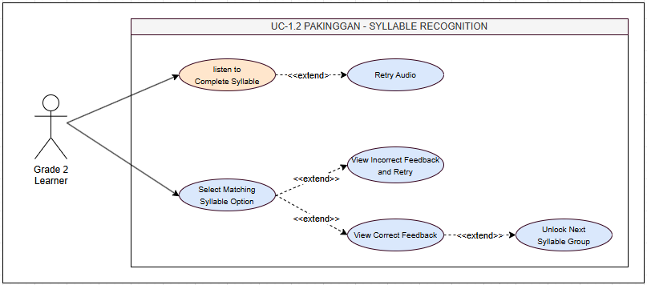

##### Use Case Description

| **Field**        | **Details**                                                                                                                                                                                                                                                                                                                                  |
| ---------------- | -------------------------------------------------------------------------------------------------------------------------------------------------------------------------------------------------------------------------------------------------------------------------------------------------------------------------------------------- |
| Use Case ID      | UC-1.2                                                                                                                                                                                                                                                                                                                                       |
| Transaction Name | Pakinggan - Syllable Recognition                                                                                                                                                                                                                                                                                                             |
| Actor(s)         | Grade 2 Learner                                                                                                                                                                                                                                                                                                                              |
| Description      | System plays a complete syllable. Learner selects the matching written syllable from 4 options. Develops receptive phonological awareness aligned with MATATAG Q1 phonics competency.                                                                                                                                                        |
| Precondition     | Pagsama sub-level complete (≥80% average). Pakinggan sub-level active.                                                                                                                                                                                                                                                                       |
| Normal Flow      | 1\. Lola NPC: "Pakinggan!"  2\. System plays complete syllable (e.g., "BA").  3\. 4 written syllable options displayed.  4\. Learner selects matching syllable.  5\. Correct: green highlight + confirmation + accuracy recorded.  6\. Incorrect: hint replays + unlimited retry.  7\. 3 of 4 correct → next syllable set. |
| Alternative Flow | A1. Audio fails → retry button shown.  A2. Repeated incorrect → hint replays each time; no penalty.                                                                                                                                                                                                                                       |
| Postcondition    | Accuracy recorded in syllable_progress (sub_level = 'pakinggan'). Complete when ≥80% average.                                                                                                                                                                                                                                                |

##### Activity Diagram

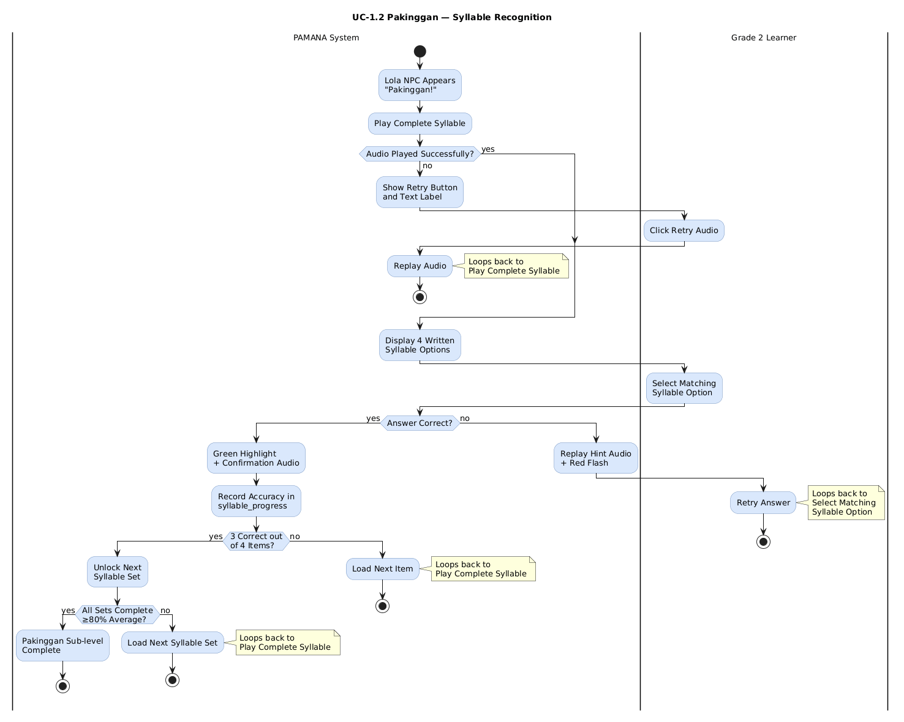

##### Wireframe

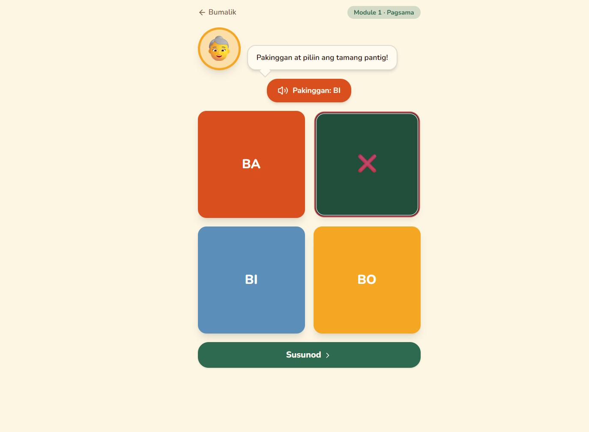

#### 1.3 Kilalanin (Syllable in Word Identification)

##### Use Case Diagram

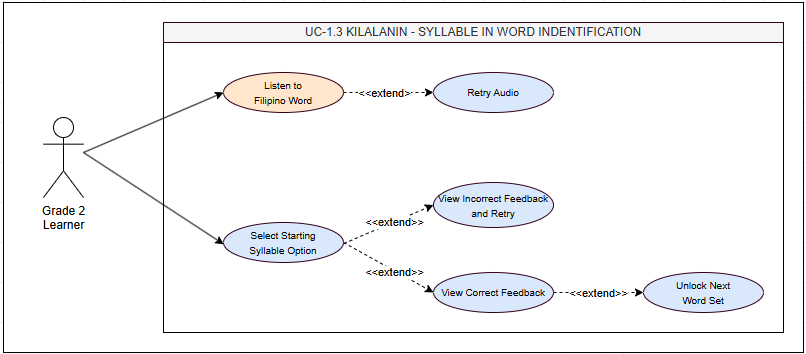

##### Use Case Description

| **Field**        | **Details**                                                                                                                                                                                                                                                                                                                                                  |
| ---------------- | ------------------------------------------------------------------------------------------------------------------------------------------------------------------------------------------------------------------------------------------------------------------------------------------------------------------------------------------------------------ |
| Use Case ID      | UC-1.3                                                                                                                                                                                                                                                                                                                                                       |
| Transaction Name | Kilalanin - Syllable in Word Identification                                                                                                                                                                                                                                                                                                                  |
| Actor(s)         | Grade 2 Learner                                                                                                                                                                                                                                                                                                                                              |
| Description      | System plays a 1-to-2-syllable Filipino word. Learner identifies the starting syllable from 4 written options. Develops syllable segmentation within whole words aligned with MATATAG Q1 phonics competency.                                                                                                                                                 |
| Precondition     | Pakinggan sub-level complete. Kilalanin sub-level active.                                                                                                                                                                                                                                                                                                    |
| Normal Flow      | 1\. Lola NPC: "Kilalanin ang unang pantig!"  2\. System plays Filipino word (e.g., "bata").  3\. 4 syllable options shown (BA, TA, KA, NA).  4\. Learner selects starting syllable.  5\. Correct: confirmation + accuracy recorded.  6\. Incorrect: hint replays word with emphasis on start + retry.  7\. 3 of 4 correct → next word set. |
| Alternative Flow | A1. Audio fails → text label + retry.  A2. Repeated incorrect → hint emphasizes starting syllable with each replay.                                                                                                                                                                                                                                       |
| Postcondition    | Accuracy recorded (sub_level = 'kilalanin'). Complete when ≥80% average.                                                                                                                                                                                                                                                                                     |

##### Activity Diagram

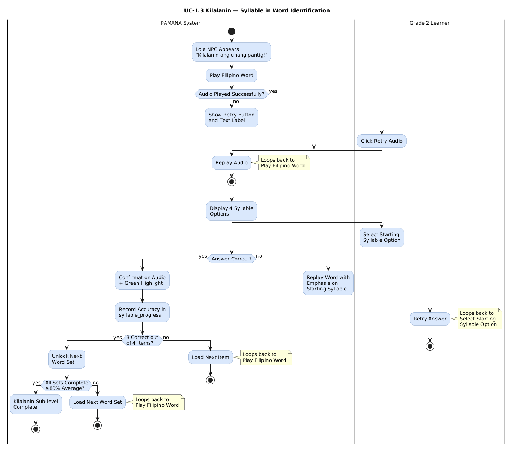

##### Wireframe

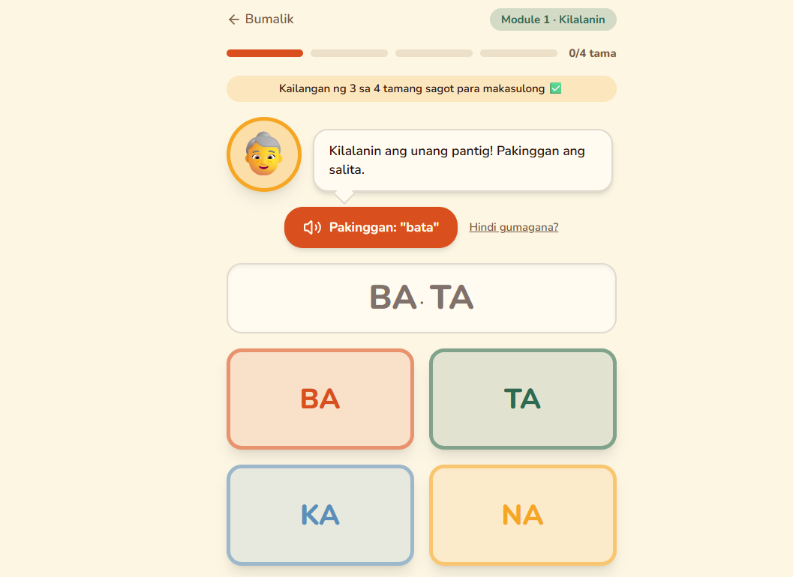

#### 1.4 Rhyming Word Recognition

##### Use Case Diagram

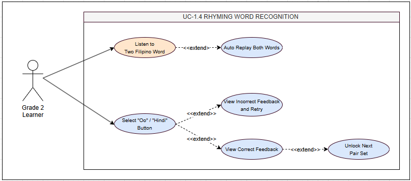

##### Use Case Description

| **Field**        | **Details**                                                                                                                                                                                                                                                                                                                                                        |
| ---------------- | ------------------------------------------------------------------------------------------------------------------------------------------------------------------------------------------------------------------------------------------------------------------------------------------------------------------------------------------------------------------ |
| Use Case ID      | UC-1.4                                                                                                                                                                                                                                                                                                                                                             |
| Transaction Name | Rhyming Word Recognition                                                                                                                                                                                                                                                                                                                                           |
| Actor(s)         | Grade 2 Learner                                                                                                                                                                                                                                                                                                                                                    |
| Description      | System plays two Filipino words in sequence. Learner determines whether they rhyme by selecting Yes or No. Aligned with MATATAG Q1 competency "Natutukoy ang magkatunog na salita."                                                                                                                                                                                |
| Precondition     | Kilalanin sub-level complete. Rhyming sub-level active.                                                                                                                                                                                                                                                                                                            |
| Normal Flow      | 1\. Lola NPC: "Magkatunog ba?"  2\. System plays Word 1 (e.g., "bata").  3\. System plays Word 2 (e.g., "mata").  4\. Two large buttons: "Oo" and "Hindi."  5\. Learner selects.  6\. Correct: confirmation + green highlight.  7\. Incorrect: hint replays both words with emphasis on endings + retry.  8\. 3 of 4 correct → next pair set. |
| Alternative Flow | A1. No response within 30 seconds → system auto-replays both words. A2. Incorrect → hint emphasizes word endings each replay; no penalty.                                                                                                                                                                                                                          |
| Postcondition    | Accuracy recorded (sub_level = 'rhyming'). Complete when ≥80% average.                                                                                                                                                                                                                                                                                             |

##### Activity Diagram

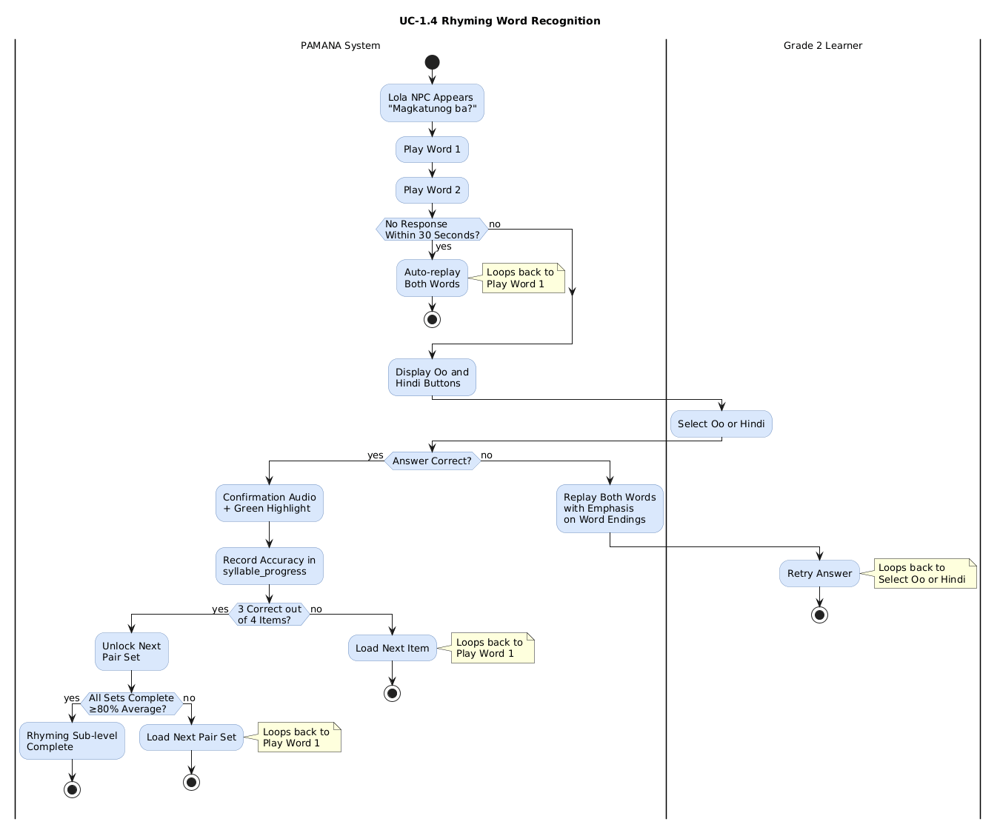

##### Wireframe

#### 1.5 Module 1 Progression Lock Evaluation

##### Use Case Diagram

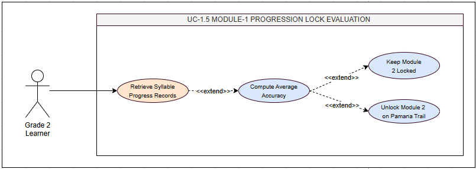

##### Use Case Description

| **Field**        | **Details**                                                                                                                                                                                                                                                                                                                                     |
| ---------------- | ----------------------------------------------------------------------------------------------------------------------------------------------------------------------------------------------------------------------------------------------------------------------------------------------------------------------------------------------- |
| Use Case ID      | UC-1.5                                                                                                                                                                                                                                                                                                                                          |
| Transaction Name | Module 1 Progression Lock Evaluation                                                                                                                                                                                                                                                                                                            |
| Actor(s)         | System (automated)                                                                                                                                                                                                                                                                                                                              |
| Description      | System evaluates whether learner has achieved ≥80% average accuracy across all Module 1 sub-levels and sets. If met, Module 2 unlocks on the Pamana Trail.                                                                                                                                                                                      |
| Precondition     | Learner has completed at least one Module 1 sub-level. Evaluation triggered by POST /api/syllables/evaluate/{userId}.                                                                                                                                                                                                                           |
| Normal Flow      | 1\. System retrieves all syllable_progress records for learner.  2\. Computes average accuracy across all 4 sub-levels and all sets.  3\. If ≥80%: module_progress Module 2 is_unlocked = TRUE. Pamana Trail Garden unlocks. Lola: "Magaling! Buksan na natin ang Hardin!"  4\. If <80%: Module 2 stays locked. Progress ring updates. |
| Alternative Flow | A1. Not all sub-levels attempted → Module 2 stays locked regardless of partial accuracy.                                                                                                                                                                                                                                                        |
| Postcondition    | module_progress updated. If unlocked: Module 2 is_unlocked = TRUE. Pamana Trail reflects status.                                                                                                                                                                                                                                                |

##### Activity Diagram

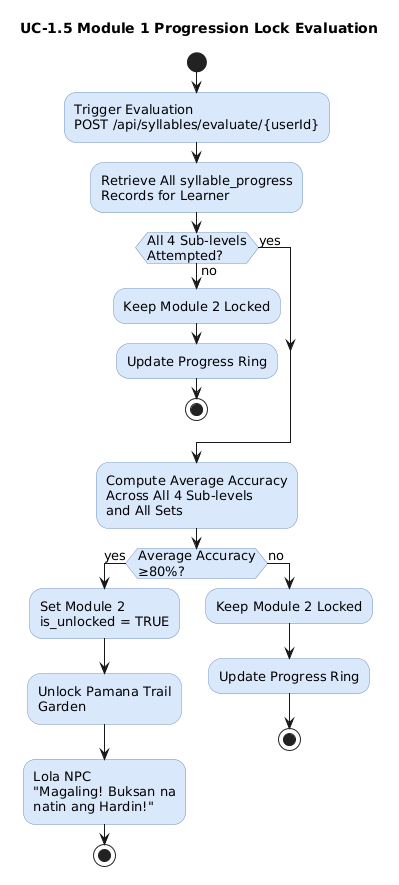

##### Wireframe

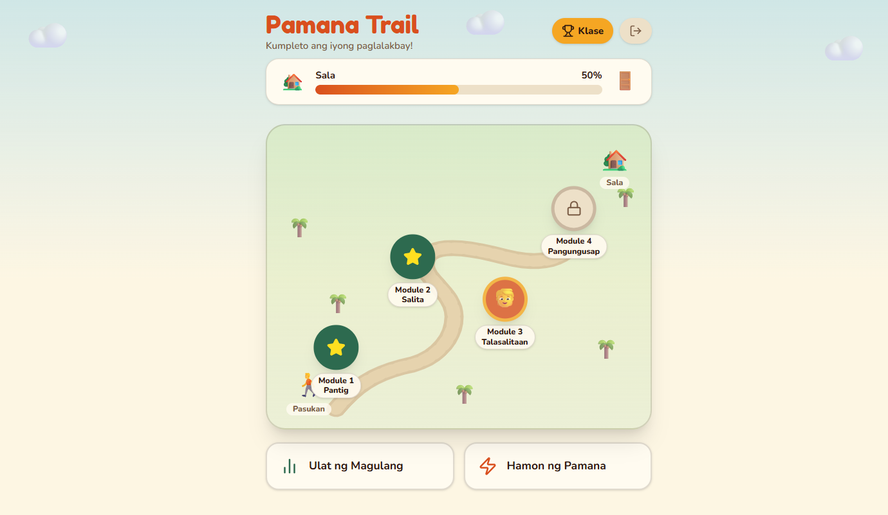

##### . .

