### Module 2-3 Vocabulary Learning

#### 2.1 Word Introduction (Pakinggan Step)

##### Use Case Diagram

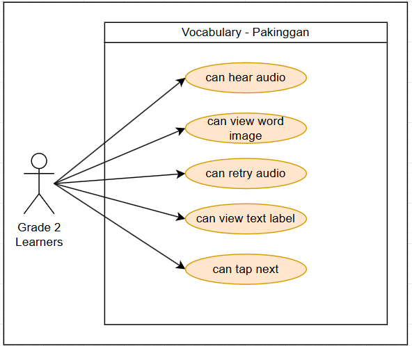

##### Use Case Description

| **Field**        | **Details**                                                                                                                                                                                                                                                                           |
| ---------------- | ------------------------------------------------------------------------------------------------------------------------------------------------------------------------------------------------------------------------------------------------------------------------------------- |
| Use Case ID      | UC-2.1                                                                                                                                                                                                                                                                                |
| Transaction Name | Word Introduction - Pakinggan Step                                                                                                                                                                                                                                                    |
| Actor(s)         | Grade 2 Learner                                                                                                                                                                                                                                                                       |
| Description      | System introduces a new Filipino vocabulary word by displaying its image and playing audio twice. No learner response required - purely receptive exposure. Step 1 of the 4-step spiral loop.                                                                                         |
| Precondition     | Module 2 or 3 unlocked. Target word not yet introduced this session.                                                                                                                                                                                                                  |
| Normal Flow      | 1\. Lola NPC says "Pakinggan!"  2\. System displays word image  3\. System plays word audio (1st time)  4\. System plays word audio (2nd time automatically)  5\. Learner taps "Susunod"  6\. System logs word as introduced  7\. Step 2 (Kilalanin) becomes active |
| Alternative Flow | A1. Audio fails → System shows retry button + text label → Learner taps retry → return to step 3  A2. Learner taps "Susunod" before 2nd play → System skips 2nd play → proceed to step 6                                                                                           |
| Postcondition    | Word logged as "introduced" in word mastery. Step 2 is active.                                                                                                                                                                                                                        |

##### Activity Diagram

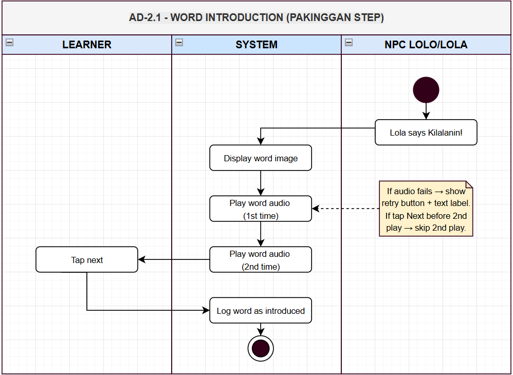

##### Wireframe

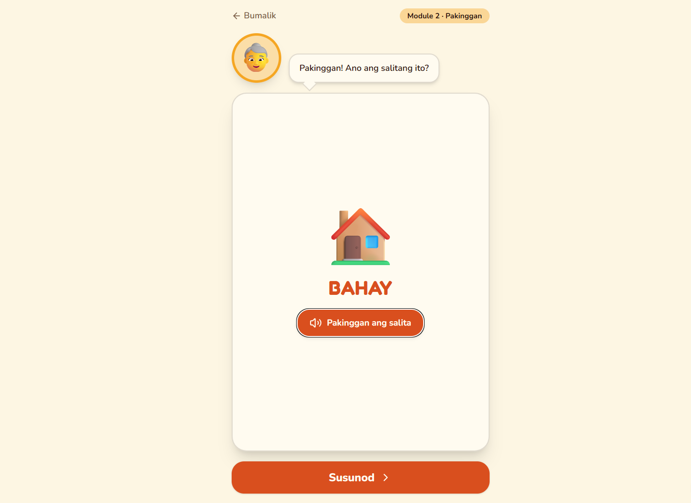

#### 2.2 Audio-to-Image Matching (Kilalanin Step)

##### Use Case Diagram

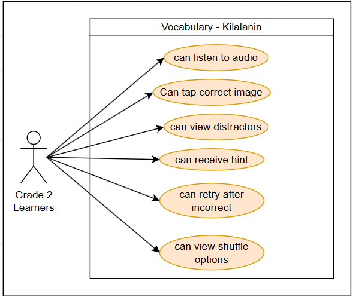

##### Use Case Description

| **Field**        | **Details**                                                                                                                                                                                                                                                                                                                                                                                                                              |
| ---------------- | ---------------------------------------------------------------------------------------------------------------------------------------------------------------------------------------------------------------------------------------------------------------------------------------------------------------------------------------------------------------------------------------------------------------------------------------- |
| Use Case ID      | UC-2.2                                                                                                                                                                                                                                                                                                                                                                                                                                   |
| Transaction Name | Audio-to-Image Matching - Kilalanin Step                                                                                                                                                                                                                                                                                                                                                                                                 |
| Actor(s)         | Grade 2 Learner                                                                                                                                                                                                                                                                                                                                                                                                                          |
| Description      | System plays target word audio. The learner matches the correct image from 4 options. Step 2 of the spiral loop.                                                                                                                                                                                                                                                                                                                         |
| Precondition     | Step 1 complete for target word.                                                                                                                                                                                                                                                                                                                                                                                                         |
| Normal Flow      | 1\. Lola says "Kilalanin!"  2\. System plays target word audio  3\. System displays 2×2 image grid (1 correct + 3 distractors from mastered words)  4\. Learner taps an image  5\. If correct: System shows green highlight + confirmation audio, records accuracy, activates Step 3 (Basahin)  6\. If incorrect: System shows red flash, replays hint audio, reshuffles distractors, returns to step 3 (unlimited retry) |
| Alternative Flow | A1. First word with no mastered words → System uses placeholder images as 3 distractors                                                                                                                                                                                                                                                                                                                                                  |
| Postcondition    | word_mastery.kilalanin_accuracy updated. Step 3 (Basahin) is active.                                                                                                                                                                                                                                                                                                                                                                     |

##### Activity Diagram

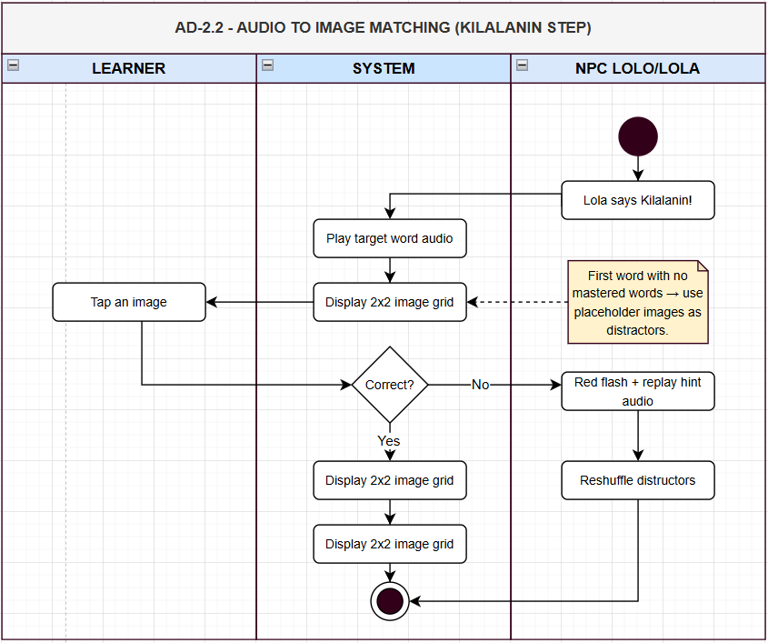

##### Wireframe

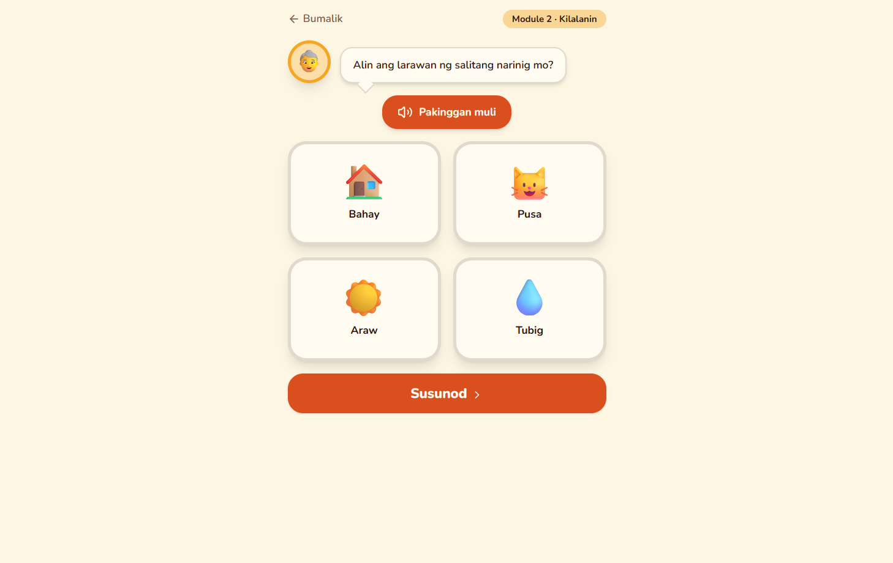

#### 2.3 Audio-to-Written Matching (Basahin Step)

##### Use Case Diagram

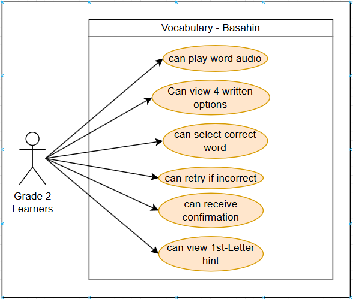

##### Use Case Description

| **Field**        | **Details**                                                                                                                                                                                                                                                                                                                                                                                                                                                       |
| ---------------- | ----------------------------------------------------------------------------------------------------------------------------------------------------------------------------------------------------------------------------------------------------------------------------------------------------------------------------------------------------------------------------------------------------------------------------------------------------------------- |
| Use Case ID      | UC-2.3                                                                                                                                                                                                                                                                                                                                                                                                                                                            |
| Transaction Name | Audio-to-Written Matching - Basahin Step                                                                                                                                                                                                                                                                                                                                                                                                                          |
| Actor(s)         | Grade 2 Learner                                                                                                                                                                                                                                                                                                                                                                                                                                                   |
| Description      | System plays target word audio. Learner selects correct written Filipino word from 4 options. Develops audio-to-script connection. Step 3 of the spiral loop.                                                                                                                                                                                                                                                                                                     |
| Precondition     | Step 2 (Kilalanin) complete for target word.                                                                                                                                                                                                                                                                                                                                                                                                                      |
| Normal Flow      | 1\. Lola says "Basahin!"  2\. System plays target word audio  3\. System displays 4 written word options (1 correct + 3 same-domain distractors)  4\. Learner selects written word  5\. If correct: System shows confirmation, records accuracy, activates Step 4 (Gamitin)  6\. If incorrect: System replays hint audio, allows retry  7\. On 3rd incorrect attempt: System highlights first letter of correct word in blue, returns to step 3 |
| Alternative Flow | A1. Audio fails → System shows text label + retry button → Learner taps retry → return to step 2                                                                                                                                                                                                                                                                                                                                                                  |
| Postcondition    | word_mastery.basahin_accuracy updated. Step 4 (Gamitin) is active.                                                                                                                                                                                                                                                                                                                                                                                                |

##### Activity Diagram

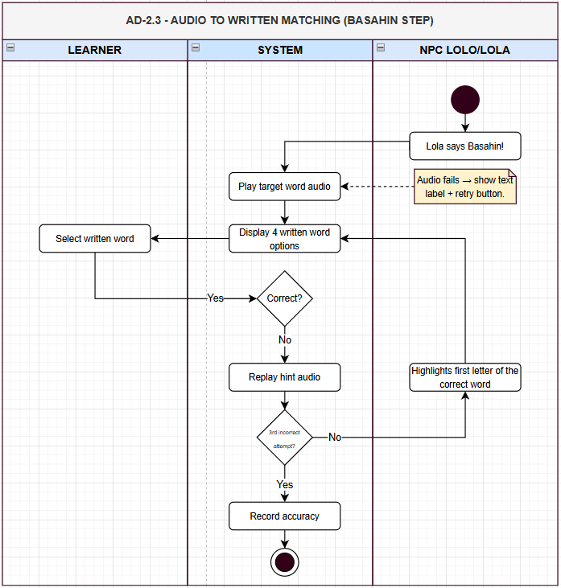

##### Wireframe

#### 2.4 NPC Dialogue Completion (Gamitin Step)

##### Use Case Diagram

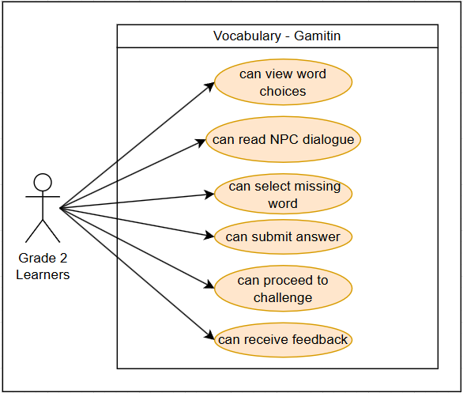

##### Use Case Description

| **Field**        | **Details**                                                                                                                                                                                                                                                                                                                                                                                                                                                       |
| ---------------- | ----------------------------------------------------------------------------------------------------------------------------------------------------------------------------------------------------------------------------------------------------------------------------------------------------------------------------------------------------------------------------------------------------------------------------------------------------------------- |
| Use Case ID      | UC-2.4                                                                                                                                                                                                                                                                                                                                                                                                                                                            |
| Transaction Name | NPC Dialogue Completion - Gamitin Step                                                                                                                                                                                                                                                                                                                                                                                                                            |
| Actor(s)         | Grade 2 Learner                                                                                                                                                                                                                                                                                                                                                                                                                                                   |
| Description      | Lola or Lolo presents Filipino dialogue with a blank. Learner selects correct word from 4 options. Step 4 of the spiral loop. If 4-step average ≥75%, word marked "mastered." If <75%, marked "needs_review." If 5 words mastered, triggers Hamon ng PAMANA.                                                                                                                                                                                                      |
| Precondition     | Step 3 (Basahin) complete for target word.                                                                                                                                                                                                                                                                                                                                                                                                                        |
| Normal Flow      | 1\. Lola/Lolo presents dialogue with blank  2\. Learner reads dialogue with blank  3\. System plays dialogue audio  4\. System displays 4 word options  5\. Learner selects correct word  6\. System shows full correct dialogue replay  7\. NPC reacts positively  8\. System auto-flags word as "mastered" (if 4- step average ≥75%) or "needs_review" (if <75%)  9\. If 5 words now mastered: System triggers Hamon ng PAMANA (UC-2.5) |
| Alternative Flow | A1. Learner selects wrong word → System shows hint, returns to step 4 (unlimited retry)  A2. Overall accuracy <75% → Word marked "needs_review" and re-queued for next session                                                                                                                                                                                                                                                                              |
| Postcondition    | word_mastery.gamitin_accuracy and overall_accuracy updated. Status set. If mastered_count mod 5 = 0, Hamon triggered.                                                                                                                                                                                                                                                                                                                                             |

##### Activity Diagram

##### Wireframe

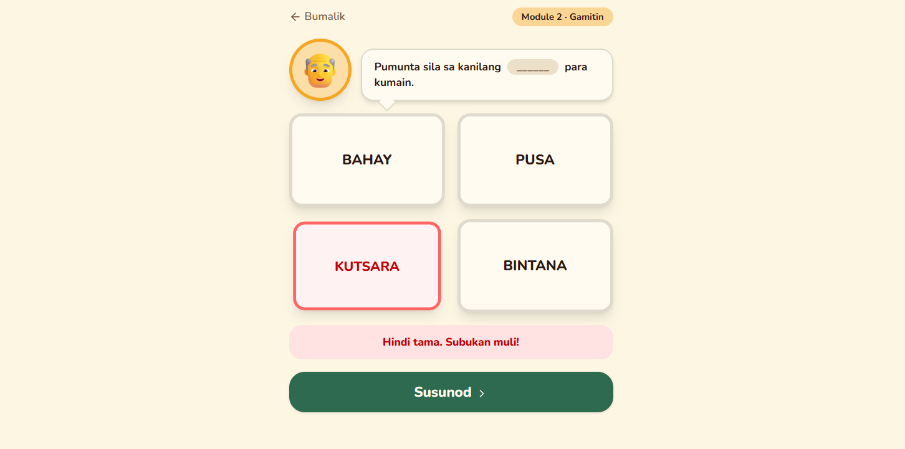

#### 2.5 Hamon ng Pamana (Vocabulary Review Challenge)

##### Use Case Diagram

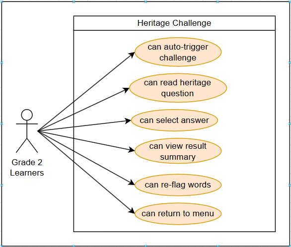

##### Use Case Description

| **Field**        | **Details**                                                                                                                                                                                                                                                                                                                                                                                                                                                                                                                                                                                                                                          |
| ---------------- | ---------------------------------------------------------------------------------------------------------------------------------------------------------------------------------------------------------------------------------------------------------------------------------------------------------------------------------------------------------------------------------------------------------------------------------------------------------------------------------------------------------------------------------------------------------------------------------------------------------------------------------------------------- |
| Use Case ID      | UC-2.5                                                                                                                                                                                                                                                                                                                                                                                                                                                                                                                                                                                                                                               |
| Transaction Name | Hamon ng Pamana - Vocabulary Review Challenge                                                                                                                                                                                                                                                                                                                                                                                                                                                                                                                                                                                                        |
| Actor(s)         | System (auto-trigger), Grade 2 Learner                                                                                                                                                                                                                                                                                                                                                                                                                                                                                                                                                                                                               |
| Description      | Every 5 words marked "mastered," system auto-triggers Hamon ng Pamana. All mastered words retested in shuffled Gamitin format. Words scoring <60% re-flagged as "needs_review." Core "repetition until better" mechanic.                                                                                                                                                                                                                                                                                                                                                                                                                             |
| Precondition     | Learner has just mastered their 5th, 10th, or any multiple-of-5 vocabulary word.                                                                                                                                                                                                                                                                                                                                                                                                                                                                                                                                                                     |
| Normal Flow      | 1\. System auto-triggers Hamon (when mastered_count mod 5 = 0)  2\. Lolo says "Handa ka na ba sa Hamon?"  3\. Learner views Lolo challenge  4\. System retrieves all mastered words  5\. System shuffles word order  6\. For each word: Learner selects answer in Gamitin format  7\. System records score per word (≥60% = pass, <60% = fail)  8\. After all words: System displays results summary  9\. System flags words <60% as "needs_review" (words ≥60% stay mastered)  10\. NPC shows reaction: Lolo celebrates if all pass, Lola says "Subukan ulit!" if any fail  11\. Learner returns to vocabulary module |
| Alternative Flow | A1. All words pass → Lolo celebration animation  A2. Some words fail → Lola says "Subukan ulit!" → Failed words reappear at next session start                                                                                                                                                                                                                                                                                                                                                                                                                                                                                                    |
| Postcondition    | hamon_sessions record created. word_mastery.status updated for re-flagged words. At-risk indicators refreshed.                                                                                                                                                                                                                                                                                                                                                                                                                                                                                                                                       |

##### Activity Diagram

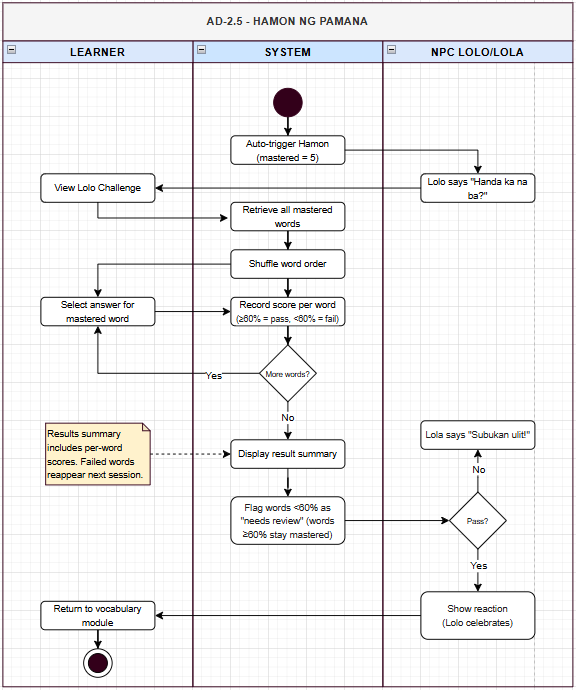

##### Wireframe

##### . .

### Module 4: Bumuo ng Pangungusap (Sentence Construction)

#### 4.1 Drag-and-Drop Word Arrangement

##### Use Case Diagram

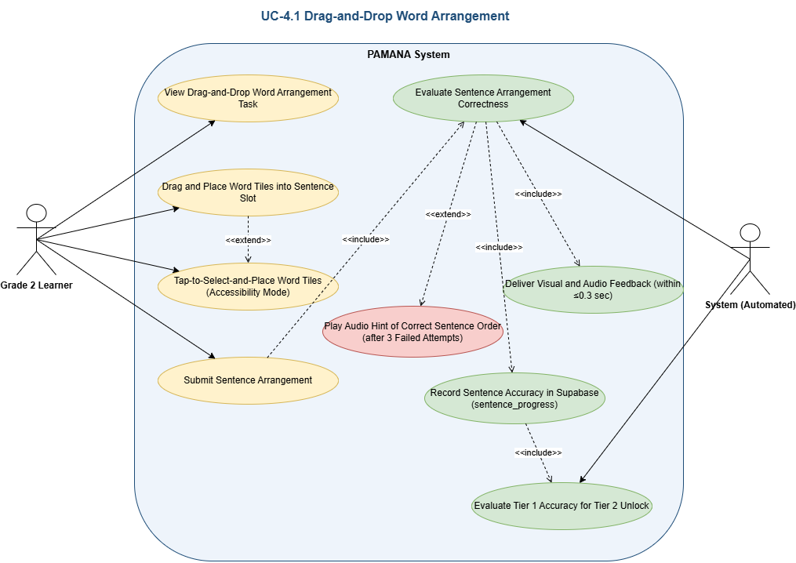

##### Use Case Description

| **Field**        | **Details**                                                                                                                                                                                                                                                                                                                                                                                                                                                                                                                                                                                                                                                                                                                                                                                                                                                                                                                                                                                                                                                                               |
| ---------------- | ----------------------------------------------------------------------------------------------------------------------------------------------------------------------------------------------------------------------------------------------------------------------------------------------------------------------------------------------------------------------------------------------------------------------------------------------------------------------------------------------------------------------------------------------------------------------------------------------------------------------------------------------------------------------------------------------------------------------------------------------------------------------------------------------------------------------------------------------------------------------------------------------------------------------------------------------------------------------------------------------------------------------------------------------------------------------------------------- |
| Use Case ID      | UC-4.1                                                                                                                                                                                                                                                                                                                                                                                                                                                                                                                                                                                                                                                                                                                                                                                                                                                                                                                                                                                                                                                                                    |
| Transaction Name | Drag-and-Drop Word Arrangement                                                                                                                                                                                                                                                                                                                                                                                                                                                                                                                                                                                                                                                                                                                                                                                                                                                                                                                                                                                                                                                            |
| Actor(s)         | Grade 2 Learner (Primary); Lolo NPC (Presenter); System - Supabase (Automated)                                                                                                                                                                                                                                                                                                                                                                                                                                                                                                                                                                                                                                                                                                                                                                                                                                                                                                                                                                                                            |
| Description      | Lolo NPC presents a sentence construction task. The system displays scrambled Filipino word tiles. The learner arranges the tiles into the correct sentence order by dragging and dropping them into a sentence slot. An accessibility tap-to-select-and-place mode is available for learners with motor difficulty. The sentence progresses across two tiers: Tier 1 - 2-to-3-word paturol (declarative) sentences using mastered vocabulary (e.g., Ako si \_**, Kumain si \_**); Tier 2 - simple patanong (interrogative) sentences with correct question mark punctuation (e.g., Saan si \_**?, Sino si \_**?). Tier 2 unlocks only after Tier 1 achieves ≥75% average accuracy as evaluated by Supabase at session end. Immediate visual and audio feedback is delivered within ≤0.3 seconds of each tile placement and submission. If a learner fails a single item 3 times, an audio hint reads the correct sentence order - no progress penalty is applied (Hint-First system). A minimum of 4 correct arrangements out of 5 items per set is required to advance to the next set. |
| Precondition     | Module 4 is unlocked in module_progress (Modules 2 and 3 complete, ≥75% mastery across ≥90% of vocabulary words). Active tier is Tier 1 or Tier 2. Learner is logged in with Grade 2 Learner role.                                                                                                                                                                                                                                                                                                                                                                                                                                                                                                                                                                                                                                                                                                                                                                                                                                                                                        |
| Normal Flow      | 1\. Lolo NPC appears on the Sala screen and presents the Pamanang Gawain sentence task.2. System displays scrambled word tiles for the current Tier 1 or Tier 2 sentence item.3. Learner drags word tiles into the sentence slot in the correct order.4. Learner submits the completed arrangement.5. System evaluates the sentence order correctness within ≤0.3 seconds.6. Correct: system shows green tile highlights, plays the complete sentence audio, and records accuracy in sentence_progress (Supabase).7. Incorrect: system shows red tile highlights and resets tiles to scrambled state for retry.8. After 4 out of 5 items correct in a set: system advances learner to the next word set in the current tier.9. After all Tier 1 sets are complete: system triggers UC-4.3 Tier Progression Lock Evaluation.                                                                                                                                                                                                                                                               |
| Alternative Flow | A1. Motor Difficulty - Tap Mode: learner taps a word tile to select it, then taps the target slot to place it. Drag-and-drop behavior is replaced by tap-to-select-and-place. All accuracy rules apply equally.A2. 3 Failed Attempts on Single Item: system plays an audio hint reading the correct sentence order. No score deduction or progress penalty. Learner may still attempt the item again after the hint.A3. Fewer than 4/5 Correct in Set: the set is not advanced; learner retries with reshuffled item order.                                                                                                                                                                                                                                                                                                                                                                                                                                                                                                                                                               |
| Postcondition    | Accuracy per sentence item is recorded in sentence_progress in Supabase for the active tier. If all Tier 1 sets are complete, UC-4.3 evaluates whether Tier 2 unlocks based on ≥75% average accuracy.                                                                                                                                                                                                                                                                                                                                                                                                                                                                                                                                                                                                                                                                                                                                                                                                                                                                                     |

##### Activity Diagram

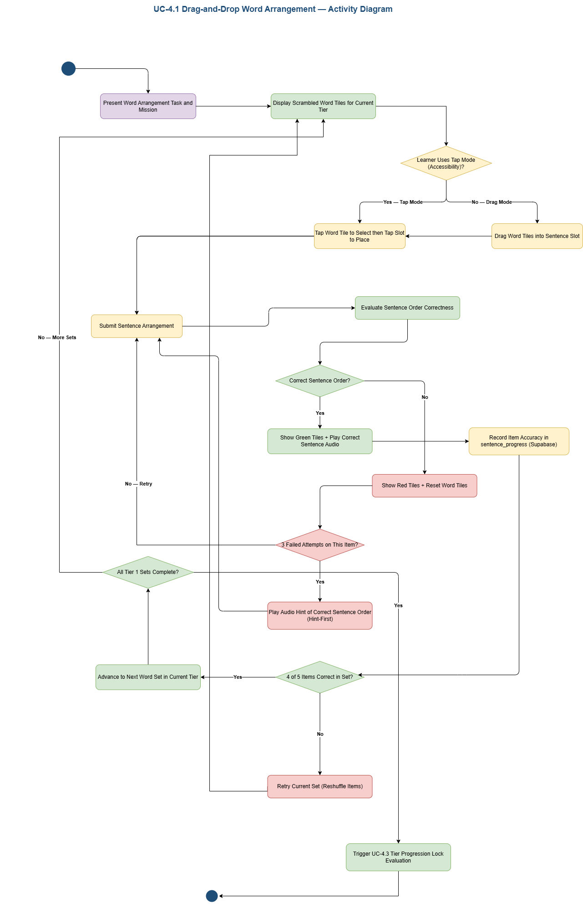

##### Wireframe

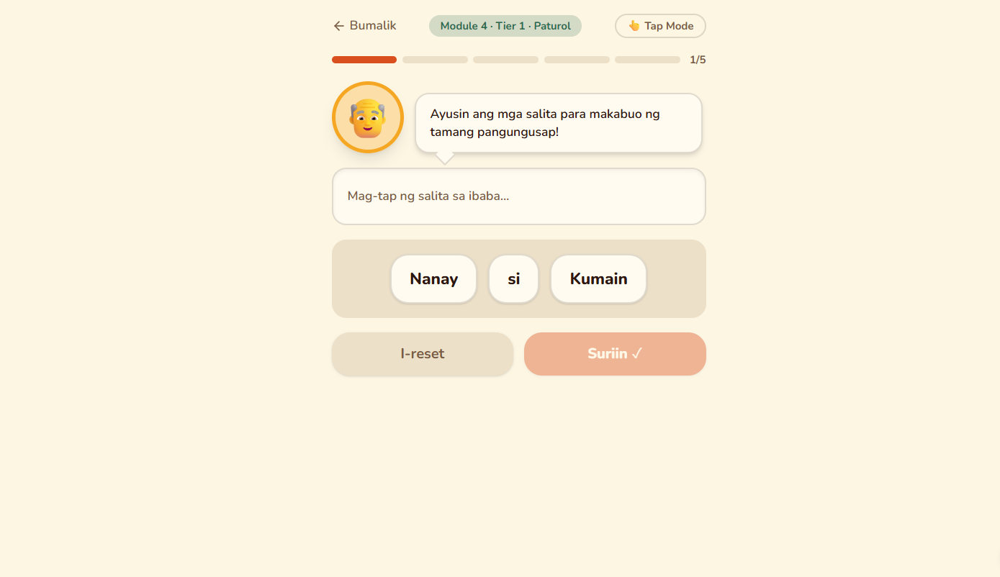

#### 4.2 NPC Dialogue Completion (Sentence Level)

##### Use Case Diagram

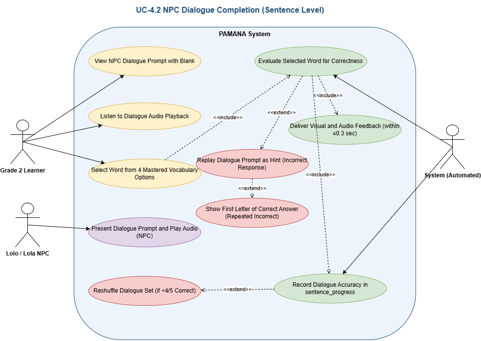

##### Use Case Description

| **Field**        | **Details**                                                                                                                                                                                                                                                                                                                                                                                                                                                                                                                                                                                                                                                                                                                                                                                                                                                                                                               |
| ---------------- | ------------------------------------------------------------------------------------------------------------------------------------------------------------------------------------------------------------------------------------------------------------------------------------------------------------------------------------------------------------------------------------------------------------------------------------------------------------------------------------------------------------------------------------------------------------------------------------------------------------------------------------------------------------------------------------------------------------------------------------------------------------------------------------------------------------------------------------------------------------------------------------------------------------------------- |
| Use Case ID      | UC-4.2                                                                                                                                                                                                                                                                                                                                                                                                                                                                                                                                                                                                                                                                                                                                                                                                                                                                                                                    |
| Transaction Name | NPC Dialogue Completion - Sentence Level                                                                                                                                                                                                                                                                                                                                                                                                                                                                                                                                                                                                                                                                                                                                                                                                                                                                                  |
| Actor(s)         | Grade 2 Learner (Primary); Lolo / Lola NPC (Presenter); System - Supabase (Automated)                                                                                                                                                                                                                                                                                                                                                                                                                                                                                                                                                                                                                                                                                                                                                                                                                                     |
| Description      | Lolo or Lola NPC presents a Filipino dialogue prompt with a blank that requires a correct word or phrase selection to form a grammatically complete sentence. The system displays 4 options drawn exclusively from the 25 mastered vocabulary items from Modules 2 and 3. The learner selects the correct word. Correct responses trigger a positive NPC reaction and play the full completed dialogue audio. Incorrect responses replay the dialogue prompt as an audio hint and allow unlimited retries with no progress penalty. If incorrect attempts continue, the NPC displays the first letter of the correct word as an additional hint. A minimum of ≥4 correct completions out of 5 dialogue tasks per set is required to advance to the next set. If a set scores below 4/5, it is replayed with reshuffled dialogue prompts. All visual and audio feedback is delivered within ≤0.3 seconds of learner input. |
| Precondition     | Module 4 is active. At least one drag-and-drop tier (UC-4.1) has been attempted. The word_mastery table contains at least the 25 vocabulary items from Modules 2 and 3 with mastered status. Learner is logged in with Grade 2 Learner role.                                                                                                                                                                                                                                                                                                                                                                                                                                                                                                                                                                                                                                                                              |
| Normal Flow      | 1\. Lolo or Lola NPC presents a Filipino dialogue prompt with a blank (e.g., "Gamitin ang iyong \_\_\_ para kumain.").2. NPC plays the dialogue audio automatically.3. System displays 4 mastered vocabulary word options as selectable tiles.4. Learner selects the word they believe correctly completes the dialogue.5. System evaluates the selection within ≤0.3 seconds.6. Correct: NPC reacts positively with audio-visual feedback; full completed dialogue audio plays with the correct word filled in. Accuracy is recorded in sentence_progress.7. Incorrect: NPC replays the dialogue prompt as an audio hint. Learner may retry with no limit.8. After ≥4 of 5 dialogue items correct in a set: system advances learner to the next dialogue set.9. After all dialogue sets complete: system triggers UC-4.3 Module 4 Completion evaluation.                                                                 |
| Alternative Flow | A1. Repeated Incorrect Attempts: after multiple incorrect responses on the same item, the NPC displays the first letter of the correct answer as an additional hint. Hint-First rule applies - no score deduction.A2. Fewer than 4/5 Correct in Set: the dialogue set is replayed with reshuffled prompts in new order. No advancement until ≥4/5 threshold is met.                                                                                                                                                                                                                                                                                                                                                                                                                                                                                                                                                       |
| Postcondition    | Dialogue accuracy per item is recorded in sentence_progress in Supabase. Module 4 is marked complete only when both Tier 2 drag-and-drop and dialogue tasks each achieve ≥75% average accuracy, as evaluated by UC-4.3.                                                                                                                                                                                                                                                                                                                                                                                                                                                                                                                                                                                                                                                                                                   |

##### Activity Diagram

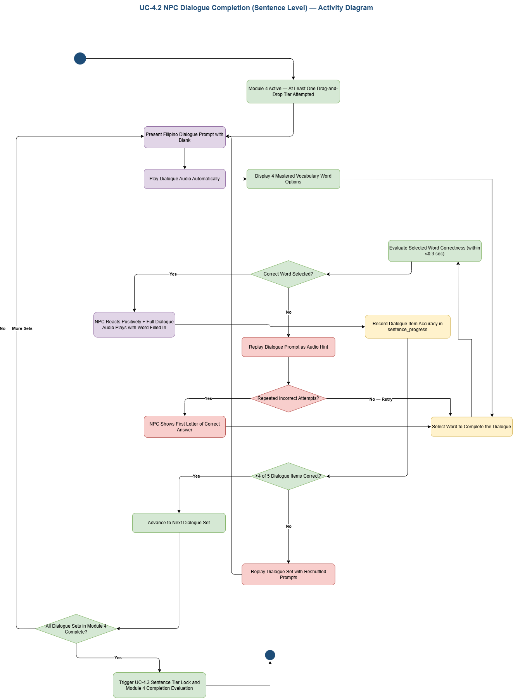

##### Wireframe

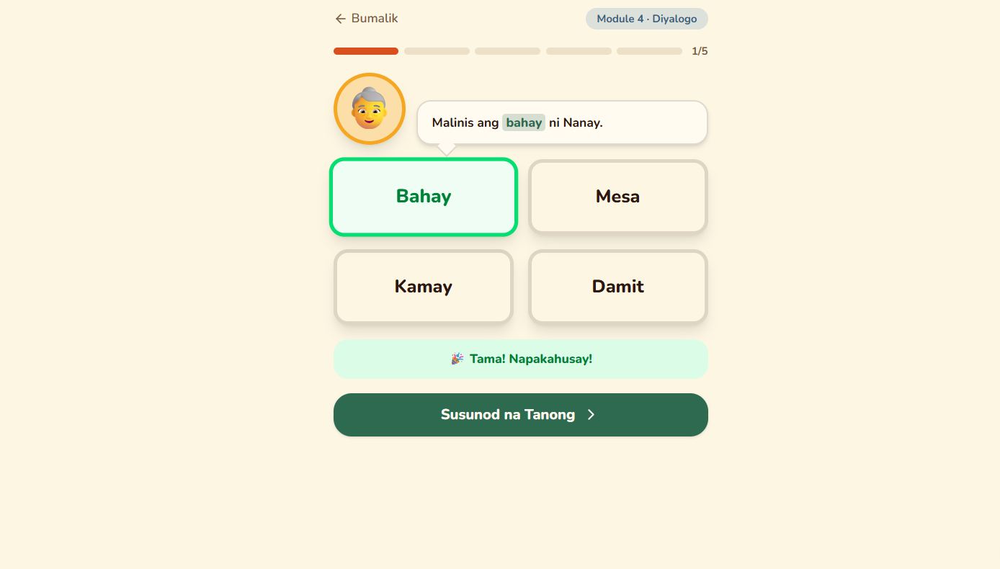

#### 4.3 Sentence Tier Progression Lock and Module 4 Completion

##### Use Case Diagram

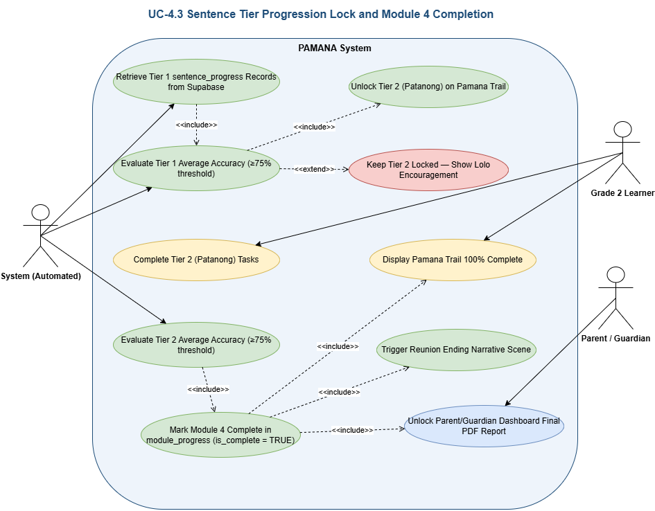

##### Use Case Description

| **Field**        | **Details**                                                                                                                                                                                                                                                                                                                                                                                                                                                                                                                                                                                                                                                                                                                                                                                                                                                                                                                                                                            |
| ---------------- | -------------------------------------------------------------------------------------------------------------------------------------------------------------------------------------------------------------------------------------------------------------------------------------------------------------------------------------------------------------------------------------------------------------------------------------------------------------------------------------------------------------------------------------------------------------------------------------------------------------------------------------------------------------------------------------------------------------------------------------------------------------------------------------------------------------------------------------------------------------------------------------------------------------------------------------------------------------------------------------- |
| Use Case ID      | UC-4.3                                                                                                                                                                                                                                                                                                                                                                                                                                                                                                                                                                                                                                                                                                                                                                                                                                                                                                                                                                                 |
| Transaction Name | Sentence Tier Progression Lock and Module 4 Completion                                                                                                                                                                                                                                                                                                                                                                                                                                                                                                                                                                                                                                                                                                                                                                                                                                                                                                                                 |
| Actor(s)         | System - Automated (Primary); Grade 2 Learner (Recipient); Parent / Guardian (Dashboard Access)                                                                                                                                                                                                                                                                                                                                                                                                                                                                                                                                                                                                                                                                                                                                                                                                                                                                                        |
| Description      | The system automatically evaluates sentence_progress records in Supabase after each set completion in UC-4.1 or UC-4.2. For Tier 1: if the learner's average accuracy across all Tier 1 (paturol) sets reaches ≥75%, the system sets Tier 2 (patanong) is_unlocked = TRUE in module_progress and Lolo NPC congratulates the learner. If below ≥75%, Tier 2 remains locked and Lolo encourages the learner to retry Tier 1 tasks. For Tier 2: once all Tier 2 sets are complete, the system evaluates Tier 2 average accuracy. If ≥75%, the system marks Module 4 is_complete = TRUE in module_progress, triggers the Pamana Reunion Ending narrative scene, displays Pamana Trail at 100% complete, and unlocks the Parent/Guardian Dashboard Final PDF Report. If Tier 2 accuracy is below ≥75%, Module 4 is not marked complete and the learner continues Tier 2 tasks. No manual teacher action is required - all evaluation is automated by Supabase records.                      |
| Precondition     | Learner has completed at least one Tier 1 (paturol) sentence set in UC-4.1. sentence_progress records exist in Supabase for the active learner. module_progress record exists with Module 4 as the active module.                                                                                                                                                                                                                                                                                                                                                                                                                                                                                                                                                                                                                                                                                                                                                                      |
| Normal Flow      | 1\. System retrieves all Tier 1 sentence_progress records from Supabase for the learner.2. System computes the average accuracy across all completed Tier 1 sets.3. If Tier 1 average ≥75%: system sets Tier 2 is_unlocked = TRUE in module_progress. Lolo NPC congratulates the learner. Tier 2 (patanong) tasks become available on Pamana Trail.4. Learner completes all Tier 2 tasks (UC-4.1 Tier 2 drag-and-drop and UC-4.2 dialogue).5. System retrieves all Tier 2 sentence_progress records from Supabase.6. System computes the average accuracy across all completed Tier 2 sets.7. If Tier 2 average ≥75%: system sets module_progress.is_complete = TRUE for Module 4 in Supabase.8. Pamana Reunion Ending narrative scene triggers: Parents NPC calls on the phone; learner speaks to them in Filipino using learned sentences.9. Pamana Trail displays 100% complete.10. Parent/Guardian Dashboard Final PDF Report for Module 4 is unlocked and available for download. |
| Alternative Flow | A1. Tier 1 average below ≥75%: Tier 2 remains locked. Lolo NPC encourages the learner to retry Tier 1 tasks. Learner is returned to active Tier 1 sets.A2. Tier 2 average below ≥75%: Module 4 is_complete remains FALSE. Module 4 is not marked complete. Learner continues Tier 2 tasks until ≥75% is achieved.                                                                                                                                                                                                                                                                                                                                                                                                                                                                                                                                                                                                                                                                      |
| Postcondition    | If Tier 2 average ≥75%: module_progress.is_complete = TRUE for Module 4. Reunion ending scene is unlocked. Pamana Trail shows 100%. Parent/Guardian Dashboard Final PDF Report is available for download via UC-5.3. If thresholds are not met, module_progress is unchanged and the learner continues active tier tasks.                                                                                                                                                                                                                                                                                                                                                                                                                                                                                                                                                                                                                                                              |

##### Activity Diagram

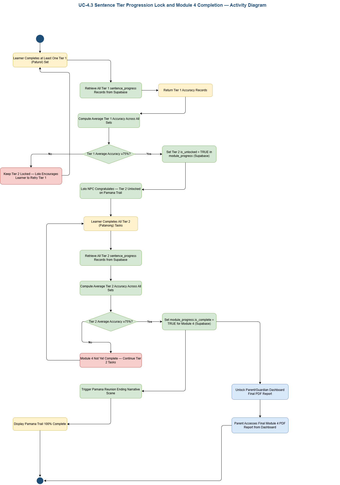

##### Wireframe

### SUPPORT FEATURES: Parent/Guardian Dashboard Access

