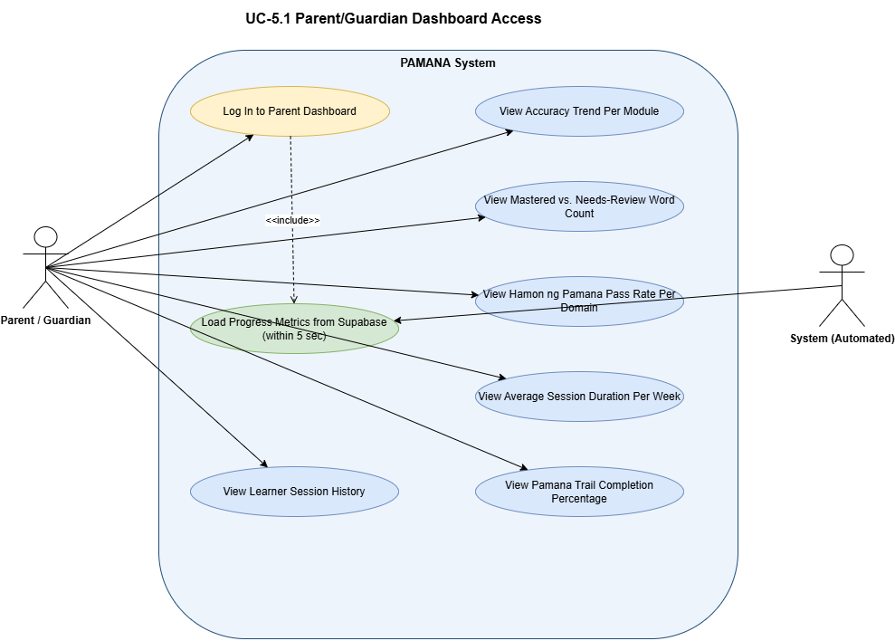
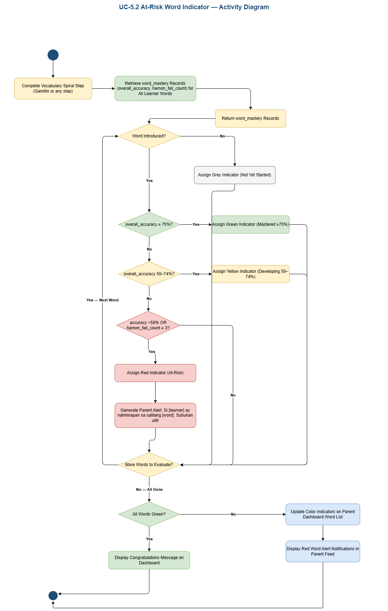
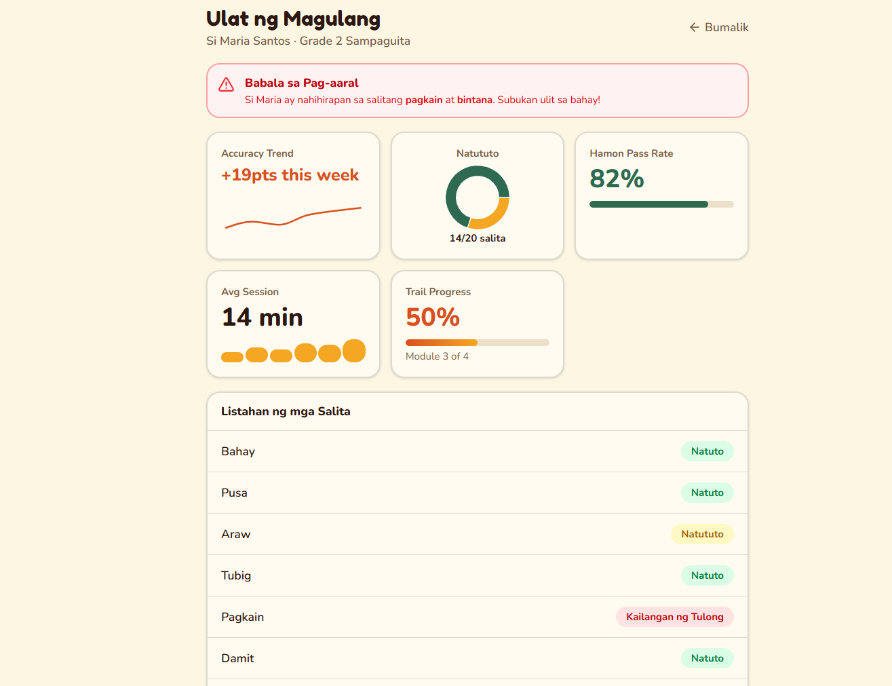
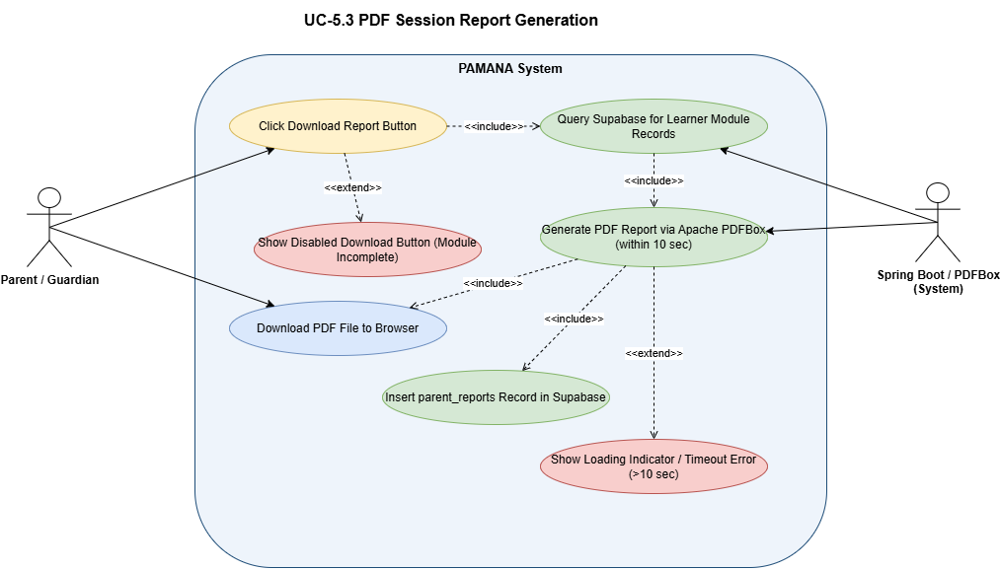
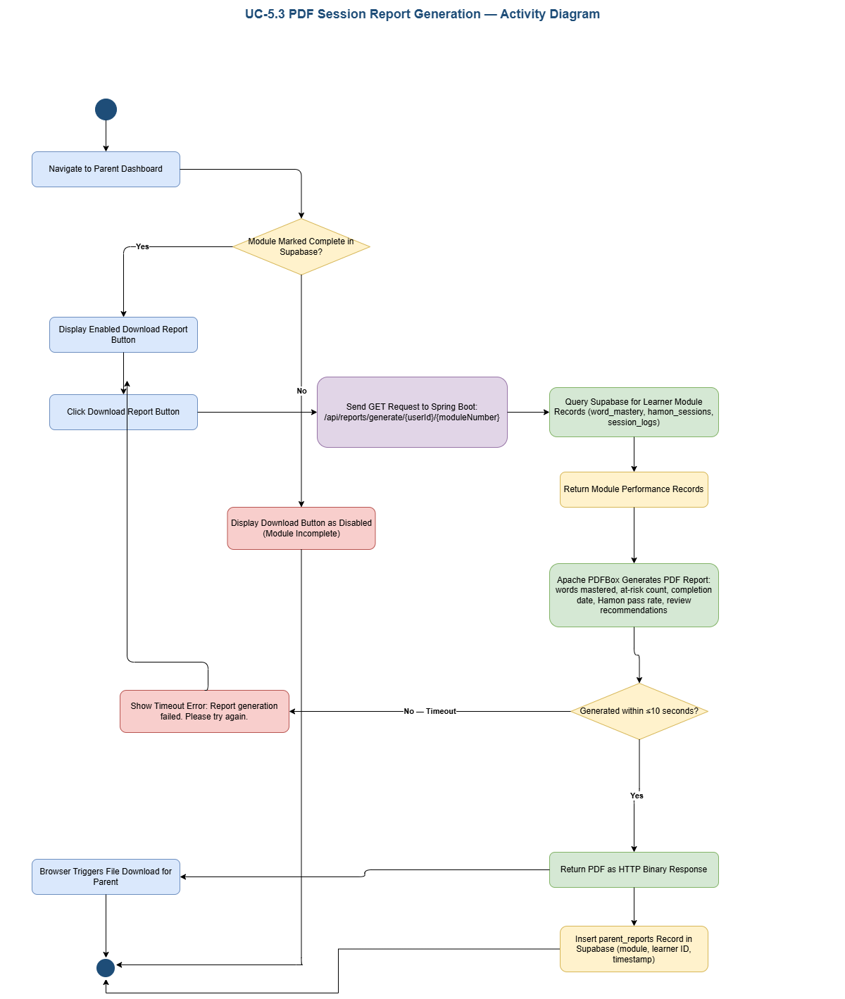
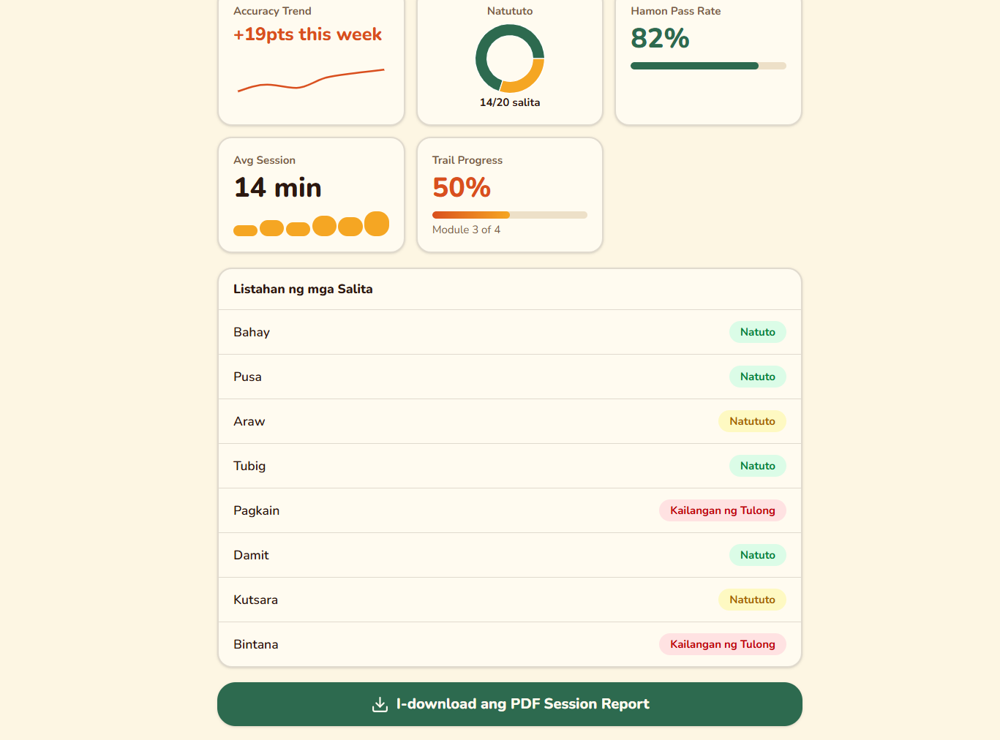
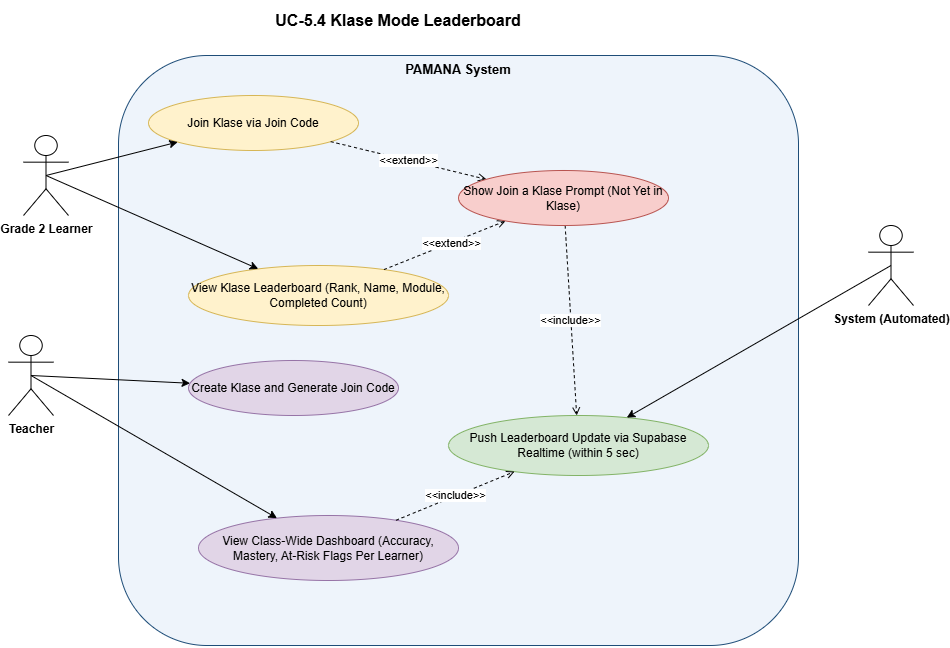
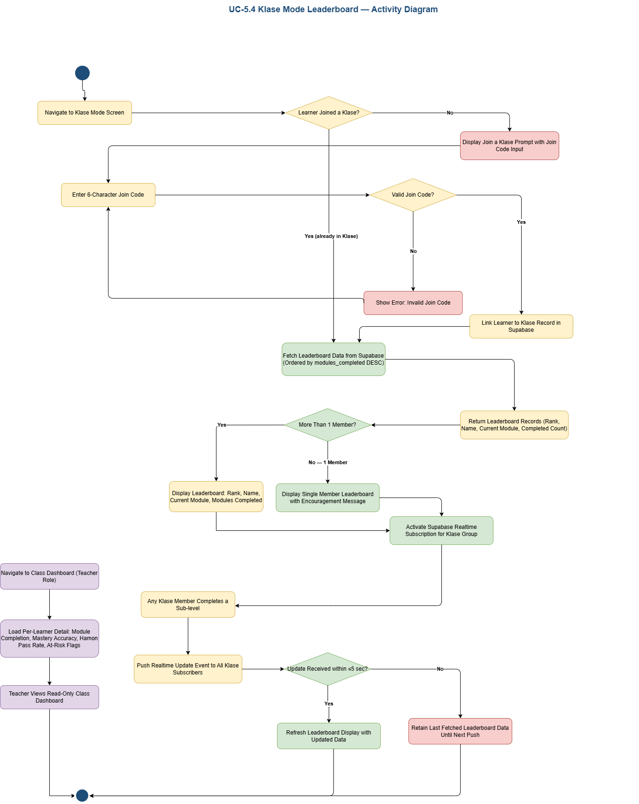

#### 5.1 Parent/Guardian Dashboard Access

##### Use Case Diagram

##### Use Case Description

| Use Case ID             | UC-5.1                                                                                                                                                                                                                                                                                                                                                                                                                                                                                                                                                                                                                                                                                                                                                                                                                                        |
| ----------------------- | --------------------------------------------------------------------------------------------------------------------------------------------------------------------------------------------------------------------------------------------------------------------------------------------------------------------------------------------------------------------------------------------------------------------------------------------------------------------------------------------------------------------------------------------------------------------------------------------------------------------------------------------------------------------------------------------------------------------------------------------------------------------------------------------------------------------------------------------- |
| Use Case Name           | Parent/Guardian Dashboard Access                                                                                                                                                                                                                                                                                                                                                                                                                                                                                                                                                                                                                                                                                                                                                                                                              |
| Actor(s)                | Parent or Guardian (Primary); System - local database (Secondary)                                                                                                                                                                                                                                                                                                                                                                                                                                                                                                                                                                                                                                                                                                                                                                                   |
| Description             | A registered parent or guardian logs in to the PAMANA web application using their Parent-role account and accesses the learner's progress dashboard. The dashboard loads five progress metric cards from local database within ≤5 seconds of login: (1) accuracy trend per module, (2) mastered vs. needs-review word count, (3) Hamon ng Pamana pass rate per domain, (4) average session duration per week, and (5) Pamana Trail completion percentage. A word-by-word mastery list with color-coded indicators (Green/Yellow/Red/Grey) and a session history log are also displayed. No data mutation occurs - the dashboard is read-only for parents.                                                                                                                                                                                           |
| Precondition            | Parent has an existing registered account with the Parent role. At least one linked learner account exists. The learner's account has been initialized with a module_progress record.                                                                                                                                                                                                                                                                                                                                                                                                                                                                                                                                                                                                                                                         |
| Normal Flow             | 1\. Parent navigates to the PAMANA login page.  2\. Parent enters registered email and password.  3\. Parent submits credentials.  4\. System authenticates via Spring Security JWT Authentication and returns a JWT token.  5\. System reads the role field from the user record - role = Parent.  6\. System redirects parent to the Parent Dashboard.  7\. System queries local database for all linked learner progress records (syllable_progress, word_mastery, sentence_progress, session_logs).  8\. System renders 5 metric cards on the dashboard within ≤5 seconds.  9\. System renders the word-by-word mastery list with color-coded at-risk indicators.  10\. System renders the session history log.11. PDF download buttons are displayed per completed module (disabled if module is incomplete). |
| Alternative Flow        | A1. Incorrect credentials - system displays: "Invalid email or password." Parent is returned to the login screen.A2. No sub-levels completed yet - dashboard loads with 0% progress on all metrics and displays an encouragement message.A3. No completed module - all PDF download buttons are shown as disabled.                                                                                                                                                                                                                                                                                                                                                                                                                                                                                                                            |
| Postcondition           | Parent views the current learner progress dashboard. No records are mutated. Dashboard reflects the most recent local database data.                                                                                                                                                                                                                                                                                                                                                                                                                                                                                                                                                                                                                                                                                                                |
| Performance Requirement | Dashboard must fully load all 5 metric cards within ≤5 seconds of any sub-level completion event.                                                                                                                                                                                                                                                                                                                                                                                                                                                                                                                                                                                                                                                                                                                                             |

##### Activity Diagram

- Wireframe

#### 5.2 At-Risk Word Indicator

##### Use Case Diagram

![](../../assets/images/srs_52_at_risk_word_indicator_dataimagepngbase64ivborw0kggoaaaansuheugaaa8kaaajcayaaacadelgaaanwhrfwhrtegzpbguajtndbxhmawxljtiwag9zdcuzrcuymmfwcc5kawfncmftcy5uzxqlmjilmjbzy2fszsuzrcuymjelmjilmjbib3jkzxilm0qlmjiwjtiyjtnfjtbbjtiwjtiwjtndzglhz3jhbsuymglkjtnejtiycexenezsaksztkhvzuo3wednueklmjilmjbuyw1ljtnejtiyugfnzs0xjtiyjtnfjtbbjtiwjtiwjtiwjtiwjtndbxhhcmfwae1vzgvsjtiwzhglm0qlmjixmtczjtiyjtiwzhklm0qlmji3mdqlmjilmjbncmlkjtnejtiymsuymiuymgdyawrtaxpljtnejtiymtalmjilmjbndwlkzxmlm0qlmjixjtiyjtiwdg9vbhrpchmlm0qlmjixjtiyjtiwy29ubmvjdcuzrcuymjelmjilmjbhcnjvd3mlm0qlmjixjtiyjtiwzm9szcuzrcuymjelmjilmjbwywdljtnejtiymsuymiuymhbhz2vty2fszsuzrcuymjelmjilmjbwywdlv2lkdgglm0qlmjixmty5jtiyjtiwcgfnzuhlawdodcuzrcuymjgynyuymiuymg1hdgglm0qlmjiwjtiyjtiwc2hhzg93jtnejtiymcuymiuzrsuwqsuymcuymcuymcuymcuymcuymcuzq3jvb3qlm0ulmeelmjalmjalmjalmjalmjalmjalmjalmjalm0nteenlbgwlmjbpzcuzrcuymjalmjilmjalmkylm0ulmeelmjalmjalmjalmjalmjalmjalmjalmjalm0nteenlbgwlmjbpzcuzrcuymjelmjilmjbwyxjlbnqlm0qlmjiwjtiyjtiwjtjgjtnfjtbbjtiwjtiwjtiwjtiwjtiwjtiwjtiwjtiwjtndbxhdzwxsjtiwawqlm0qlmjj0axrszsuymiuymhbhcmvudcuzrcuymjelmjilmjbzdhlszsuzrcuymnrlehqlm0jodg1sjtnemsuzqnn0cm9rzunvbg9yjtnebm9uzsuzqmzpbgxdb2xvciuzrg5vbmulm0jhbglnbiuzrgnlbnrlciuzqnzlcnrpy2fsqwxpz24lm0rtawrkbgulm0j3agl0zvnwywnljtned3jhccuzqnjvdw5kzwqlm0qwjtnczm9udfnpemulm0qxniuzqmzvbnrtdhlszsuzrdelm0ilmjilmjb2ywx1zsuzrcuymlvdltuumiuymef0lvjpc2slmjbxb3jkjtiwsw5kawnhdg9yjtiyjtiwdmvydgv4jtnejtiymsuymiuzrsuwqsuymcuymcuymcuymcuymcuymcuymcuymcuymcuymcuzq214r2vvbwv0cnklmjbozwlnahqlm0qlmji0mcuymiuymhdpzhrojtnejtiyntywjtiyjtiwecuzrcuymjiwmcuymiuymhklm0qlmjixnsuymiuymgfzjtnejtiyz2vvbwv0cnklmjilmjalmkylm0ulmeelmjalmjalmjalmjalmjalmjalmjalmjalm0mlmkzteenlbgwlm0ulmeelmjalmjalmjalmjalmjalmjalmjalmjalm0nteenlbgwlmjbpzcuzrcuymmjvdw5kyxj5jtiyjtiwcgfyzw50jtnejtiymsuymiuymhn0ewxljtnejtiydgv4dcuzqmh0bwwlm0qxjtncd2hpdgvtcgfjzsuzrhdyyxalm0jvdmvyzmxvdyuzrghpzgrlbiuzqnjvdgf0ywjszsuzrdalm0jzdhjva2vdb2xvciuzrcuymzflngq3ocuzqmzpbgxdb2xvciuzrcuym0vfrjrgqiuzqnzlcnrpy2fsqwxpz24lm0r0b3alm0jhbglnbiuzrgnlbnrlciuzqmzvbnrtaxpljtnemtmlm0jmb250u3r5bgulm0qxjtnccm91bmrlzcuzrdelm0ilmjilmjb2ywx1zsuzrcuymlbbtufoqsuymfn5c3rlbsuymiuymhzlcnrlecuzrcuymjelmjilm0ulmeelmjalmjalmjalmjalmjalmjalmjalmjalmjalmjalm0nteedlb21ldhj5jtiwagvpz2h0jtnejtiyntgwjtiyjtiwd2lkdgglm0qlmji2ndalmjilmjb4jtnejtiymjiwjtiyjtiwesuzrcuymjcwjtiyjtiwyxmlm0qlmjjnzw9tzxryesuymiuymcuyriuzrsuwqsuymcuymcuymcuymcuymcuymcuymcuymcuzqyuyrm14q2vsbcuzrsuwqsuymcuymcuymcuymcuymcuymcuymcuymcuzq214q2vsbcuymglkjtnejtiydwnfzxzhbcuymiuymhbhcmvudcuzrcuymjelmjilmjbzdhlszsuzrcuymmvsbglwc2ulm0j3agl0zvnwywnljtned3jhccuzqmh0bwwlm0qxjtnczmlsbenvbg9yjtnejtizzdvlogq0jtncc3ryb2tlq29sb3ilm0qlmjm4mmiznjylm0jmb250u2l6zsuzrdeyjtncjtiyjtiwdmfsdwulm0qlmjjfdmfsdwf0zsuymfdvcmqlmjbnyxn0zxj5jtiwu3rhdhvzjtiwznjvbsuymfn1cgfiyxnljtiwumvjb3jkcyuymiuymhzlcnrlecuzrcuymjelmjilm0ulmeelmjalmjalmjalmjalmjalmjalmjalmjalmjalmjalm0nteedlb21ldhj5jtiwagvpz2h0jtnejtiynjalmjilmjb3awr0acuzrcuymji0mcuymiuymhglm0qlmjiyntulmjilmjb5jtnejtiymtiwjtiyjtiwyxmlm0qlmjjnzw9tzxryesuymiuymcuyriuzrsuwqsuymcuymcuymcuymcuymcuymcuymcuymcuzqyuyrm14q2vsbcuzrsuwqsuymcuymcuymcuymcuymcuymcuymcuymcuzq214q2vsbcuymglkjtnejtiydwnfz3jlzw4lmjilmjbwyxjlbnqlm0qlmjixjtiyjtiwc3r5bgulm0qlmjjlbgxpchnljtncd2hpdgvtcgfjzsuzrhdyyxalm0jodg1sjtnemsuzqmzpbgxdb2xvciuzrcuym2q1zthkncuzqnn0cm9rzunvbg9yjtnejtizodjimzy2jtnczm9udfnpemulm0qxmiuzqiuymiuymhzhbhvljtnejtiyqxnzawdujtiwr3jlzw4lmjbjbmrpy2f0b3ilmjaotwfzdgvyzwqlmjalrtilodalotqlmjalrtilodklqtu3nsuynsklmjilmjb2zxj0zxglm0qlmjixjtiyjtnfjtbbjtiwjtiwjtiwjtiwjtiwjtiwjtiwjtiwjtiwjtiwjtndbxhhzw9tzxryesuymghlawdodcuzrcuymju1jtiyjtiwd2lkdgglm0qlmjiymzalmjilmjb4jtnejtiyntcwjtiyjtiwesuzrcuymjexmcuymiuymgfzjtnejtiyz2vvbwv0cnklmjilmjalmkylm0ulmeelmjalmjalmjalmjalmjalmjalmjalmjalm0mlmkzteenlbgwlm0ulmeelmjalmjalmjalmjalmjalmjalmjalmjalm0nteenlbgwlmjbpzcuzrcuymnvjx3llbgxvdyuymiuymhbhcmvudcuzrcuymjelmjilmjbzdhlszsuzrcuymmvsbglwc2ulm0j3agl0zvnwywnljtned3jhccuzqmh0bwwlm0qxjtnczmlsbenvbg9yjtnejtizzmzmmmnjjtncc3ryb2tlq29sb3ilm0qlmjnknmi2ntylm0jmb250u2l6zsuzrdeyjtncjtiyjtiwdmfsdwulm0qlmjjbc3npz24lmjbzzwxsb3clmjbjbmrpy2f0b3ilmjaorgv2zwxvcgluzyuymcvfmiu4mcu5ncuymduwjuuyjtgwjtkznzqlmjupjtiyjtiwdmvydgv4jtnejtiymsuymiuzrsuwqsuymcuymcuymcuymcuymcuymcuymcuymcuymcuymcuzq214r2vvbwv0cnklmjbozwlnahqlm0qlmji1nsuymiuymhdpzhrojtnejtiymjmwjtiyjtiwecuzrcuymju3mcuymiuymhklm0qlmjiymtulmjilmjbhcyuzrcuymmdlb21ldhj5jtiyjtiwjtjgjtnfjtbbjtiwjtiwjtiwjtiwjtiwjtiwjtiwjtiwjtndjtjgbxhdzwxsjtnfjtbbjtiwjtiwjtiwjtiwjtiwjtiwjtiwjtiwjtndbxhdzwxsjtiwawqlm0qlmjj1y19yzwqlmjilmjbwyxjlbnqlm0qlmjixjtiyjtiwc3r5bgulm0qlmjjlbgxpchnljtncd2hpdgvtcgfjzsuzrhdyyxalm0jodg1sjtnemsuzqmzpbgxdb2xvciuzrcuym2y4y2vjyyuzqnn0cm9rzunvbg9yjtnejtizyjg1nduwjtnczm9udfnpemulm0qxmiuzqiuymiuymhzhbhvljtnejtiyqxnzawdujtiwumvkjtiwsw5kawnhdg9yjtiwkef0lvjpc2slmjalrtilodalotqlmjalmjzsdcuzqjuwjti1jtiwb3ilmjazjtjcjtiwsgftb24lmjbgywlscyklmjilmjb2zxj0zxglm0qlmjixjtiyjtnfjtbbjtiwjtiwjtiwjtiwjtiwjtiwjtiwjtiwjtiwjtiwjtndbxhhzw9tzxryesuymghlawdodcuzrcuymjywjtiyjtiwd2lkdgglm0qlmjiymzalmjilmjb4jtnejtiyntcwjtiyjtiwesuzrcuymjmymcuymiuymgfzjtnejtiyz2vvbwv0cnklmjilmjalmkylm0ulmeelmjalmjalmjalmjalmjalmjalmjalmjalm0mlmkzteenlbgwlm0ulmeelmjalmjalmjalmjalmjalmjalmjalmjalm0nteenlbgwlmjbpzcuzrcuymnvjx2fszxj0jtiyjtiwcgfyzw50jtnejtiymsuymiuymhn0ewxljtnejtiyzwxsaxbzzsuzqndoaxrlu3bhy2ulm0r3cmfwjtncahrtbcuzrdelm0jmawxsq29sb3ilm0qlmjnmognly2mlm0jzdhjva2vdb2xvciuzrcuym2i4ntq1mcuzqmzvbnrtaxpljtnemtilm0ilmjilmjb2ywx1zsuzrcuymkdlbmvyyxrljtiwqxqtumlzayuymfbhcmvudcuymefszxj0jtiwtm90awzpy2f0aw9ujtiyjtiwdmvydgv4jtnejtiymsuymiuzrsuwqsuymcuymcuymcuymcuymcuymcuymcuymcuymcuymcuzq214r2vvbwv0cnklmjbozwlnahqlm0qlmji1nsuymiuymhdpzhrojtnejtiymjqwjtiyjtiwecuzrcuymji1nsuymiuymhklm0qlmjizodalmjilmjbhcyuzrcuymmdlb21ldhj5jtiyjtiwjtjgjtnfjtbbjtiwjtiwjtiwjtiwjtiwjtiwjtiwjtiwjtndjtjgbxhdzwxsjtnfjtbbjtiwjtiwjtiwjtiwjtiwjtiwjtiwjtiwjtndbxhdzwxsjtiwawqlm0qlmjj1y192awv3jtiyjtiwcgfyzw50jtnejtiymsuymiuymhn0ewxljtnejtiyzwxsaxbzzsuzqndoaxrlu3bhy2ulm0r3cmfwjtncahrtbcuzrdelm0jmawxsq29sb3ilm0qlmjnkywu4zmmlm0jzdhjva2vdb2xvciuzrcuymzzjogviziuzqmzvbnrtaxpljtnemtilm0ilmjilmjb2ywx1zsuzrcuymlzpzxclmjbbdc1saxnrjtiwv29yzcuymefszxj0cyuymg9ujtiwrgfzagjvyxjkjtiyjtiwdmvydgv4jtnejtiymsuymiuzrsuwqsuymcuymcuymcuymcuymcuymcuymcuymcuymcuymcuzq214r2vvbwv0cnklmjbozwlnahqlm0qlmji1nsuymiuymhdpzhrojtnejtiymjmwjtiyjtiwecuzrcuymju3mcuymiuymhklm0qlmji0ntalmjilmjbhcyuzrcuymmdlb21ldhj5jtiyjtiwjtjgjtnfjtbbjtiwjtiwjtiwjtiwjtiwjtiwjtiwjtiwjtndjtjgbxhdzwxsjtnfjtbbjtiwjtiwjtiwjtiwjtiwjtiwjtiwjtiwjtndbxhdzwxsjtiwawqlm0qlmjj1y19ncmv5jtiyjtiwcgfyzw50jtnejtiymsuymiuymhn0ewxljtnejtiyzwxsaxbzzsuzqndoaxrlu3bhy2ulm0r3cmfwjtncahrtbcuzrdelm0jmawxsq29sb3ilm0qlmjnmnwy1zjulm0jzdhjva2vdb2xvciuzrcuymzy2njy2niuzqmzvbnrdb2xvciuzrcuymzmzmzmzmyuzqmzvbnrtaxpljtnemtilm0ilmjilmjb2ywx1zsuzrcuymkrpc3bsyxklmjbhcmv5jtiwsw5kawnhdg9yjtiwkfdvcmqlmjbob3qlmjbzzxqlmjbtdgfydgvkksuymiuymhzlcnrlecuzrcuymjelmjilm0ulmeelmjalmjalmjalmjalmjalmjalmjalmjalmjalmjalm0nteedlb21ldhj5jtiwagvpz2h0jtnejtiyntulmjilmjb3awr0acuzrcuymji0mcuymiuymhglm0qlmjiyntulmjilmjb5jtnejtiyntmwjtiyjtiwyxmlm0qlmjjnzw9tzxryesuymiuymcuyriuzrsuwqsuymcuymcuymcuymcuymcuymcuymcuymcuzqyuyrm14q2vsbcuzrsuwqsuymcuymcuymcuymcuymcuymcuymcuymcuzq214q2vsbcuymglkjtnejtiyztelmjilmjblzgdljtnejtiymsuymiuymhbhcmvudcuzrcuymjelmjilmjbzdhlszsuzrcuymmvkz2vtdhlszsuzrg5vbmulm0jodg1sjtnemsuzqiuymiuymhrhcmdldcuzrcuymnvjx2v2ywwlmjilm0ulmeelmjalmjalmjalmjalmjalmjalmjalmjalmjalmjalm0nteedlb21ldhj5jtiwcmvsyxrpdmulm0qlmjixjtiyjtiwyxmlm0qlmjjnzw9tzxryesuymiuzrsuwqsuymcuymcuymcuymcuymcuymcuymcuymcuymcuymcuymcuymcuzq214ug9pbnqlmjb4jtnejtiymti1jtiyjtiwesuzrcuymji3mi43mjcynzi3mjcynzi3nsuymiuymgfzjtnejtiyc291cmnlug9pbnqlmjilmjalmkylm0ulmeelmjalmjalmjalmjalmjalmjalmjalmjalmjalmjalm0mlmkzteedlb21ldhj5jtnfjtbbjtiwjtiwjtiwjtiwjtiwjtiwjtiwjtiwjtndjtjgbxhdzwxsjtnfjtbbjtiwjtiwjtiwjtiwjtiwjtiwjtiwjtiwjtndbxhdzwxsjtiwawqlm0qlmjjlmiuymiuymgvkz2ulm0qlmjixjtiyjtiwcgfyzw50jtnejtiymsuymiuymhnvdxjjzsuzrcuymnvjx2v2ywwlmjilmjbzdhlszsuzrcuymmvkz2vtdhlszsuzrg5vbmulm0jodg1sjtnemsuzqmrhc2hlzcuzrdelm0jlbmrbcnjvdyuzrg9wzw4lm0jlbmrgawxsjtnemcuzqmzvbnrtaxpljtnemtelm0ilmjilmjb0yxjnzxqlm0qlmjj1y19ncmvlbiuymiuymhzhbhvljtnejtiyjti2yw1wjtncbhqlm0ilmjzhbxalm0jsdcuzqmv4dgvuzcuynmftccuzqmd0jtncjti2yw1wjtncz3qlm0ilmjilm0ulmeelmjalmjalmjalmjalmjalmjalmjalmjalmjalmjalm0nteedlb21ldhj5jtiwcmvsyxrpdmulm0qlmjixjtiyjtiwyxmlm0qlmjjnzw9tzxryesuymiuymcuyriuzrsuwqsuymcuymcuymcuymcuymcuymcuymcuymcuzqyuyrm14q2vsbcuzrsuwqsuymcuymcuymcuymcuymcuymcuymcuymcuzq214q2vsbcuymglkjtnejtiyztmlmjilmjblzgdljtnejtiymsuymiuymhbhcmvudcuzrcuymjelmjilmjbzb3vyy2ulm0qlmjj1y19ldmfsjtiyjtiwc3r5bgulm0qlmjjlzgdlu3r5bgulm0rub25ljtncahrtbcuzrdelm0jkyxnozwqlm0qxjtnczw5kqxjyb3clm0rvcgvujtnczw5krmlsbcuzrdalm0jmb250u2l6zsuzrdexjtncjtiyjtiwdgfyz2v0jtnejtiydwnfewvsbg93jtiyjtiwdmfsdwulm0qlmjilmjzhbxalm0jsdcuzqiuynmftccuzqmx0jtnczxh0zw5kjti2yw1wjtncz3qlm0ilmjzhbxalm0jndcuzqiuymiuzrsuwqsuymcuymcuymcuymcuymcuymcuymcuymcuymcuymcuzq214r2vvbwv0cnklmjbyzwxhdgl2zsuzrcuymjelmjilmjbhcyuzrcuymmdlb21ldhj5jtiyjtiwjtjgjtnfjtbbjtiwjtiwjtiwjtiwjtiwjtiwjtiwjtiwjtndjtjgbxhdzwxsjtnfjtbbjtiwjtiwjtiwjtiwjtiwjtiwjtiwjtiwjtndbxhdzwxsjtiwawqlm0qlmjjlncuymiuymgvkz2ulm0qlmjixjtiyjtiwcgfyzw50jtnejtiymsuymiuymhnvdxjjzsuzrcuymnvjx2v2ywwlmjilmjbzdhlszsuzrcuymmvkz2vtdhlszsuzrg5vbmulm0jodg1sjtnemsuzqmrhc2hlzcuzrdelm0jlbmrbcnjvdyuzrg9wzw4lm0jlbmrgawxsjtnemcuzqmzvbnrtaxpljtnemtelm0ilmjilmjb0yxjnzxqlm0qlmjj1y19yzwqlmjilmjb2ywx1zsuzrcuymiuynmftccuzqmx0jtncjti2yw1wjtncbhqlm0jlehrlbmqlmjzhbxalm0jndcuzqiuynmftccuzqmd0jtncjtiyjtnfjtbbjtiwjtiwjtiwjtiwjtiwjtiwjtiwjtiwjtiwjtiwjtndbxhhzw9tzxryesuymhjlbgf0axzljtnejtiymsuymiuymgfzjtnejtiyz2vvbwv0cnklmjilmjalmkylm0ulmeelmjalmjalmjalmjalmjalmjalmjalmjalm0mlmkzteenlbgwlm0ulmeelmjalmjalmjalmjalmjalmjalmjalmjalm0nteenlbgwlmjbpzcuzrcuymmu1jtiyjtiwzwrnzsuzrcuymjelmjilmjbwyxjlbnqlm0qlmjixjtiyjtiwc291cmnljtnejtiydwnfcmvkjtiyjtiwc3r5bgulm0qlmjjlzgdlu3r5bgulm0rub25ljtncahrtbcuzrdelm0jkyxnozwqlm0qxjtnczw5kqxjyb3clm0rvcgvujtnczw5krmlsbcuzrdalm0jmb250u2l6zsuzrdexjtncjtiyjtiwdgfyz2v0jtnejtiydwnfywxlcnqlmjilmjb2ywx1zsuzrcuymiuynmftccuzqmx0jtncjti2yw1wjtncbhqlm0jpbmnsdwrljti2yw1wjtncz3qlm0ilmjzhbxalm0jndcuzqiuymiuzrsuwqsuymcuymcuymcuymcuymcuymcuymcuymcuymcuymcuzq214r2vvbwv0cnklmjbyzwxhdgl2zsuzrcuymjelmjilmjbhcyuzrcuymmdlb21ldhj5jtiyjtiwjtjgjtnfjtbbjtiwjtiwjtiwjtiwjtiwjtiwjtiwjtiwjtndjtjgbxhdzwxsjtnfjtbbjtiwjtiwjtiwjtiwjtiwjtiwjtiwjtiwjtndbxhdzwxsjtiwawqlm0qlmjjlniuymiuymgvkz2ulm0qlmjixjtiyjtiwcgfyzw50jtnejtiymsuymiuymhnvdxjjzsuzrcuymnu2tufkmezqtkrstehdcddoqmtrltilmjilmjbzdhlszsuzrcuymmvkz2vtdhlszsuzrg5vbmulm0jodg1sjtnemsuzqmv4axryjtnemc41jtnczxhpdfklm0qwljulm0jlegl0rhglm0qwjtnczxhpder5jtnemcuzqmv4axrqzxjpbwv0zxilm0qwjtncjtiyjtiwdgfyz2v0jtnejtiydwnfdmlldyuymiuzrsuwqsuymcuymcuymcuymcuymcuymcuymcuymcuymcuymcuzq214r2vvbwv0cnklmjbyzwxhdgl2zsuzrcuymjelmjilmjbhcyuzrcuymmdlb21ldhj5jtiyjtnfjtbbjtiwjtiwjtiwjtiwjtiwjtiwjtiwjtiwjtiwjtiwjtiwjtiwjtndbxhqb2ludcuymhglm0qlmji5njalmjilmjb5jtnejtiymzaxlja0odeymzm1mja0ndulmjilmjbhcyuzrcuymnnvdxjjzvbvaw50jtiyjtiwjtjgjtnfjtbbjtiwjtiwjtiwjtiwjtiwjtiwjtiwjtiwjtiwjtiwjtndjtjgbxhhzw9tzxryesuzrsuwqsuymcuymcuymcuymcuymcuymcuymcuymcuzqyuyrm14q2vsbcuzrsuwqsuymcuymcuymcuymcuymcuymcuymcuymcuzq214q2vsbcuymglkjtnejtiyztclmjilmjblzgdljtnejtiymsuymiuymhbhcmvudcuzrcuymjelmjilmjbzb3vyy2ulm0qlmjj1y19hbgvydcuymiuymhn0ewxljtnejtiyzwrnzvn0ewxljtnebm9uzsuzqmh0bwwlm0qxjtncjtiyjtiwdgfyz2v0jtnejtiydwnfdmlldyuymiuzrsuwqsuymcuymcuymcuymcuymcuymcuymcuymcuymcuymcuzq214r2vvbwv0cnklmjbyzwxhdgl2zsuzrcuymjelmjilmjbhcyuzrcuymmdlb21ldhj5jtiyjtiwjtjgjtnfjtbbjtiwjtiwjtiwjtiwjtiwjtiwjtiwjtiwjtndjtjgbxhdzwxsjtnfjtbbjtiwjtiwjtiwjtiwjtiwjtiwjtiwjtiwjtndbxhdzwxsjtiwawqlm0qlmjjlocuymiuymgvkz2ulm0qlmjixjtiyjtiwcgfyzw50jtnejtiymsuymiuymhnvdxjjzsuzrcuymnvjx2v2ywwlmjilmjbzdhlszsuzrcuymmvkz2vtdhlszsuzrg5vbmulm0jodg1sjtnemsuzqmrhc2hlzcuzrdelm0jlbmrbcnjvdyuzrg9wzw4lm0jlbmrgawxsjtnemcuzqmzvbnrtaxpljtnemtelm0ilmjilmjb0yxjnzxqlm0qlmjj1y19ncmv5jtiyjtiwdmfsdwulm0qlmjilmjzsdcuzqiuynmx0jtnczxh0zw5kjti2z3qlm0ilmjzndcuzqiuymiuzrsuwqsuymcuymcuymcuymcuymcuymcuymcuymcuymcuymcuzq214r2vvbwv0cnklmjbyzwxhdgl2zsuzrcuymjelmjilmjbhcyuzrcuymmdlb21ldhj5jtiyjtiwjtjgjtnfjtbbjtiwjtiwjtiwjtiwjtiwjtiwjtiwjtiwjtndjtjgbxhdzwxsjtnfjtbbjtiwjtiwjtiwjtiwjtiwjtiwjtiwjtiwjtndbxhdzwxsjtiwawqlm0qlmjj1nk1bzdbgue5ebexiq3a3aejray0xjtiyjtiwcgfyzw50jtnejtiymsuymiuymhn0ewxljtnejtiyc2hhcgulm0r1bwxby3rvciuzqnzlcnrpy2fstgfizwxqb3npdglvbiuzrgjvdhrvbsuzqnzlcnrpy2fsqwxpz24lm0r0b3alm0jodg1sjtnemsuzqm91dgxpbmvdb25uzwn0jtnemcuzqiuymiuymhzhbhvljtnejtiyjti2bhqlm0jzcgfujtiwc3r5bgulm0qlmjzxdw90jtnczm9udc13zwlnahqlm0elmja3mdalm0ilmjzxdw90jtncjti2z3qlm0jtexn0zw0lmjaoqxv0b21hdgvkksuynmx0jtncjtjgc3bhbiuynmd0jtncjtiyjtiwdmvydgv4jtnejtiymsuymiuzrsuwqsuymcuymcuymcuymcuymcuymcuymcuymcuymcuymcuzq214r2vvbwv0cnklmjbozwlnahqlm0qlmji4mcuymiuymhdpzhrojtnejtiyndulmjilmjb4jtnejtiyotalmjilmjb5jtnejtiymjmwjtiyjtiwyxmlm0qlmjjnzw9tzxryesuymiuymcuyriuzrsuwqsuymcuymcuymcuymcuymcuymcuymcuymcuzqyuyrm14q2vsbcuzrsuwqsuymcuymcuymcuymcuymcuymcuymcuymcuzq214q2vsbcuymglkjtnejtiydtznqwqwrlborgxmsenwn2hca2stmiuymiuymhbhcmvudcuzrcuymjelmjilmjbzdhlszsuzrcuymnnoyxbljtnedw1sqwn0b3ilm0j2zxj0awnhbexhymvsug9zaxrpb24lm0rib3r0b20lm0j2zxj0awnhbefsawdujtnedg9wjtncahrtbcuzrdelm0jvdxrsaw5lq29ubmvjdcuzrdalm0ilmjilmjb2ywx1zsuzrcuymiuynmx0jtncc3bhbiuymhn0ewxljtnejti2cxvvdcuzqmzvbnqtd2vpz2h0jtnbjtiwnzawjtncjti2cxvvdcuzqiuynmd0jtncugfyzw50jtiwjtjgjtiwr3vhcmrpyw4lmjzsdcuzqiuyrnnwyw4lmjzndcuzqiuymiuymhzlcnrlecuzrcuymjelmjilm0ulmeelmjalmjalmjalmjalmjalmjalmjalmjalmjalmjalm0nteedlb21ldhj5jtiwagvpz2h0jtnejtiyodalmjilmjb3awr0acuzrcuymjq1jtiyjtiwecuzrcuymjk1mcuymiuymhklm0qlmjiyntalmjilmjbhcyuzrcuymmdlb21ldhj5jtiyjtiwjtjgjtnfjtbbjtiwjtiwjtiwjtiwjtiwjtiwjtiwjtiwjtndjtjgbxhdzwxsjtnfjtbbjtiwjtiwjtiwjtiwjtiwjtiwjtndjtjgcm9vdcuzrsuwqsuymcuymcuymcuymcuzqyuyrm14r3jhcghnb2rlbcuzrsuwqsuymcuymcuzqyuyrmrpywdyyw0lm0ulmeelm0mlmkztegzpbgulm0ulmegqhrtbaaaqaeleqvr4aeydbybvrrfh4gpbtdurseaceo7mduqlfexfpsuewew8dallruujcq7u7u7obvgbulh3yept7oudzrv3tpw55zdz9815m3dulkp2zwgyasngbiyaetacrsaigaejyasmgbfwblioavzyubacbgbi2aejiarmajgwagyasngbfjgwjzklpekj9ymhrewakbacbgbi2aejiarmajgwaikcwfzktmfqwlnlqerzwsmgbewakbacbgbi2aejiaryewc5irnjn2ro5yimk1gwagyasngbiyaetacrsairaabc5ijojfmrsmq3grmoyngbiyaetacrsaigaejed0ezemonry0s4yaeqg1aznnbiyaetacrsaigaejehmezemousy3g42aetackjewakbacbgbi2aejiarsjyaocmjc7fyi2aejiariewcprurmajgwagyasngbnjewjzknogzwkbacbgbi2aemoqa1wmejiarmajgwahkbafzkjocstvhbiyaetacrsaije3auoyaetacrsaihbebc5ldqdfmfsngbiyaetacric6cjg1rsaigaejehkezemovdyzjy2aetacrsaigaejknkerh4jyasmqnqsmcc5apvwddmcrsaigaejyasmgbfioqeryqsmqkwtmcc51nua2w8eopzatddeq0agii4jtsuueeg8rwfpnq5cibcipw4ymcchiesvv61apqovkssxcwqoy6crasciuxy5hyhykm9aoedtcrfxencrmmelhhykzztx379qpigys0j0qocwfu8jjlf1bteu3thlvk5ogd6ejgn7nghqxr8eag4dj4crarnqkbop99facbqphosknnsw5bjibdj4m7aobf21cbicqeb2y6x2sh3yxjg1mqycetacyuba1decribzbmxjthymy2qejecsemdzwtf48meh2nyx44de3w2e2zcuxkl1q9fnzd6mnc4ownr7nevx7lqabbjl79y5u4mhd469k9wpjs0aalnmzf7uak6ll26vc1atfbgo061atvyi5atejbtm1z57tvwied3tkfwrzmzjmjcepgkuepcpdujtjfljagb8vqlspininojhlnqjgwahkgggr2aiekoa5yagkabkmgbgieakdo3fw33rfllywtn99chqyjcc801zjycvxxod5hebvwvildwt07ds30ri4neohdnvpp30k6upixe4fjgsnccwli4gedd57lguoiaku0vcbdr7uhlelljjk48epd5k7du9exvhnzurj0mdrxuzfeap6sbzdnbilixzejbtr7aogjrolhtjnonabuomlfgbiyaetacuufadmoeauykzwj0q9iigihwjiazilokmbdd9pvkls8yozzznhgctz33hpj4xm7qqbxf198myfjbhxohe8cugz7kccra86pffyytzs21t333onmtplbzsbvl8esx2bbuf7bwegx758io7rlatkvapuyrwzoxomoyineaii2xffmcdx95cfbwkhl2kf74cfxw7lkoeb31ur15d2ijj68u7axk1fup3b7qgx3460l0u8a4hdoiwsy08nznnnwy3nopkow2x8ihc6lxjx04lmskivmakzqira4lbmgwbl8viha4fqffwxonmdzpxdbfhppavcbwufwgetpecwuhav8u4uyvhs6zf8qbesnra4fzspdbnur9uhs0akagxggeju4f5lfgbiyaetacrkakxwbmjidv25hmrsaizdabfyrzwynllh6hc1mkoniomskiyokabwgfnasebumqcmpknpbz1kmd3ai83eo75geeeazwbnad58z3jjevqodjjqooph5mfbaqex5dg4v8hxsmc5co7zz2hduvpefpzw8zbljupjte8a0dmlbartpq9qa2xtynpsn3ziqzwbhvlsjmpitri4zukpncrfyrhn4sehzz51l1n8pa6yoinfgaboytu6twntrutjmnd77bcrod9xiqv0rvzwgtdwji4x2crffvnlst7ptjobgejnur9gubt27f8swz8yzyoi5kptaepolrgbi2aejiarchccaxasw91a088igaejkfwcvtov3pyj5wn2mxgjsj8n2enx45i64mjeeeedlplzot9xdhfbhrjmtnroim4itjlxomk4ixyzpjozsa5b9u2rxumlziujxvwhgkbw05ibbwtjhogzjopvnkriviplikmllwznhwxzozth59wp33vwcdgzxs2da1btzytrpeueysh5mwhzs5brbttq8nsamaeccopz3nye6ijobm6xp1u3bvhltjfhii081mw1z5kvbcrjgzasltrg1xesc2rx48c6eydpfmndzn2riad7mugzsnhktk9evvylhzzycmddrdfzzzow00scpeojyzo3sp556clhyy8kaodzmaizftn3vq3hw0dyngbiyaetaceudanoskg8lsjiaribecofmhmhwhiqgtieobfn9j4typgppnz8tiophle8upi4nzqj5mscmd48u1m77mbixyodtg8oiq56yxjbmmvukxpwzg4gnitlkogxbcxo7reczopcho4bp0jgozzik7b7aehggm2ahsrzjt7krrdkebp06fkfzdreuwdpnbocy8oxoh64uoooozhnvqiua1n8goil4scnwca6icdnorgbs6tcvquok4j9k4ptch4cfwfxawjvhzp1hbjkzprxvnonbgbviacf8cmd57cn3joijva9cwjiarmajgwahecgfzkiolpukqpwkzakygmqipczzxzhbsaofz1pzioqjt2phdvkocfx4zg2og04mcykfhazfqcajsvhcdmiyowhdg6otiaqcjtucy2jhfotsezwnq5sipcvlwhpmq40wfo5bhm23hcxvrrbfixaclrxt84hmsngalm5ujoo6ra6olzljj420axwypj6l5jaem2amw6bm89m8r0lsxjtyptu3pmsx9jqeze8mmlnisw5scdr33ix5luqobwuwcvisctoyefpncobxwpl613y0akbacbgbixdpbmxjjvqwnp2pjmbxriabgaqcgzxchnng7p5gnxnkhlow5mcho5ajhyzsa4gub1see6dorlntpktnd9jgxhunqm3nhnukfziorm1r6cuozcctrjz9langyoe8qdoxonjmwvoovgiz6cjfccfhfeonn5is6ejxhmkdlnznzm9fndawmiphn53mmnjye5ibznkw5wrsmcp5vxywe8xcfmkxyfnwcy51imi5owl7pjq8l44gufr3bc8dn94ewxx3zrzpqiew70orezjaugt4wskpdajkbacbgbi2aeip2aocmr3okmf8wqmentr8b3gncqgp27iuogufc9idxpwywwy34z8f944yxuu3scswvzymi30nekcfjxrh0a84kz8difjkxoihl3cxmgukw0vcwudlpzxzpapiojtjwbnbrfb46kisdyb8oqcljwjdjnovhy4fr4hmlollurrpovrctrjwfybwibisthympu541rh8cunt18xlhsmyczwtdifjemjhv61iozy8oscepwvfsxwbfciugj4jtt1sxamxnnxgkbnqptkio5me2nh7o0yp4tlahdvehdamd50kfdivlcnszq89u2osri0ekpkb5lkntjkvscknbjny7lffvttrlhnuekpxpadbj9kcg7bcbgbi2aejeakezanozjbz3q3atfbif2t4jlizsyojhgjks6ji408nbn8zxcnaycjedh6wsoohtol5e0s4btiajnghyfawg1mxtxlkheicaqdgud8a5nwylgtb6cnpy6qobwvtg2pjmwhpz8itkmohw4fut383fo8o1kulsatgmf9ez8ucau4s18ebljd16wket3wc53qltg58jm2vvocbiscsbj951hznfcaspocxddgeycz85pc5apoxkihgblofmoe2ercomf4pi42yhav8vae8sfijj6gbyec6tu48lorpbhx5fv2zvqpx8jdtsylfzkuz5rtshg7zoeggexbjwgo6cuqzseigaejyasmqkqtmcc50lvq9dccrucybhbmphf6uiyktjsyoon4rcxndsxatp6b5rttwxqr5ks36mrnmknguehcyztf3scywurvcgu7jvwtsielxpytjzunvan0lmsgmwwy3fizjt1zzz8jrdpzn3ehcenc8f85momvwupwzed8tijdhknghi4b7cu5gxpioeokdplz4wptjhpboqcb1k7qiud4t6prii4qlc4bw0aphi109cvo3bv3uddfmijs9yv9lhtzz8fvf5qcqaf39rbwf7scceohrarnkd46exywzm4towff2bgsmgbewakygugmykxyplwd6gwejkcicdo79zcxkbikhoaufn8i05iuvktxipbl8cxucznxploy2j1ku5gezaclmd5ocm48qrtnjjnpyeedpkrnhgntgnlmegl2uoi54j0ylh2o4do9wz0349vi3kxxhjmnxobxpbozblglnxawxsaxe8hcc9quwsrqbooqkfmqs5wfqok7scdijvitp5cgvh8ffvspixnnnlgnncuhkwqsikit8aufeeuhhfkeuceigjsqtbrvtnrchhocijzzzeyfgjwnwf6qrni8vmhyhjki9vo3kj84pwwnu75dlgeabsngbiyaetackudanoriacxt0qgyasngbdkmgfvkbiyaetacrsaixdybc5jju3neingbiyaeygdamapetacrsaigaejkawc5iqna5jlmqjgwagyasngbmkzgolmbiyaetacrib0bmxjdh1lk2qejiarmajgwagygdasmglgwagyasoq4qtmsc5w5fahetacrsaigaejyasmgbewakbaciqraxosw7vltc8jyasmgbewakbacbibscrgohsbixdhbmxjjvagnpwngbewakbacbgbi2aejedgelbajebsedanotba2aw0akbacbgbi2aejiarmajgickcfm8eggiykxwew06ngbewakbacbgbi2aejiarmalrrmbsstkbc5jtzsxkgaejyasmgbewakbacbgbi2aejedmeki32s1jtje0jtgigaejyasmgbewakbacbgbi2aeio1a5jvjkubm9ducrsaigaejyasmgbewakbacbibqcvgtni6nq2jngjgwagyasngbiyaetacrsaigihiimbocms1v7hoa3oyasngbiyaetacrsaigaejyasikoa5yvhzrgzu6glyssnglvbdcaaaeabjrefubiyaetacrsaigaejyarimya5ybhcmz7bbewa42aetacrsaigaejyasmgbe4lgfzkolydiyasmq7grmpyngbiyaetacrsaigaejecoc5ishiqtjmqjgwaienobjnajgwagyasngbiyaechgauykzzbwq84igaejyaqgymeigaejyasmgbewaufjwjzk8gwx08oigaejyaqilydpbqsmgbewakbaceq0axosi7r5thkjyasmgbewahlhwgoyakbacbgbixalbmxjjovwnhungbewakbacbibyxgwncngbiyaetac8qtmsy5hysdgwagyasngbiyaeyg2amapetacrsaipjsaockpjwb5jyarmajgwagyasngbdkfgglgbiyaeugnauykpxnye2sejiarmajgwagyasngbfjdwmoyasoquqtmsc5cla7etacrsaigaejyasmgbgifqjmpxgicalmjedem5msrsaigaejyasmgbewakbaciqvadmsmgiykxxnrwm2gaejyasmgbewakbacbgbi2aeqkkgbmwzkxydjw4mrwb3xv3afas1ro0dpb6pypnuszuf1fvrxpp6xzr33bbw99wu1uuzz1brscvw58ffvpo8hvehowrhyh7ayh3aod1gbt0ab5pv7l5xvwb5vd7l5fvyb6pv7m5nvab6vo2f0yzyygeghkjql5iqnrcbijucyeviyeonhjfvlt7xdc1vetb35rds5up1f6k9pfh2jmuvwkkeongpqo6iupa25ul93jl54cp99dwdgttrfv3z8f808bonnbmbwngfcd6gpub6wpwb9lsbg5xuv71ezm5xux71hk5nuz72epm5nub72xk53s9ziyapo4rmajhcesbk3zeejsygsgjmg3cn3w4wjd0untnbm2hy576h19n3skdiqlzmntsg89ei3gffkevnnhlr11v6yhokbzivjtq2aahwdaqpduuyqlcyiiouzkc8uxiqe7ascgsidjkzywsmgbewakygewjwfcr3ktvfmyfcv3ltfazfcz3mtpfezfc33ntffizfc73otvfmzfc3fiayyluaasoqcafzkhobejzrpkhmediyfzdhuy7n7lk7dep5xv9k8zevvrmkt9xvyfg186z693lwtbr3ozlvvwtm5wdefyiw1akbacbgbixdbbhckf7me5zvc77xx7ne57ve773wbrnoidxaooccdbxvdcceu3anosibr7ivd40p0xg49aduy3se4z4sbxpkufhk9t3srlnvpml88pxnozjyxnkovk3i4gh0aasngbiyaetacuuoa73e5m53sfp5lxaombxgu848w4gffc1bhthhibccbgtnienjkpgfeekquszyldownanzdd42yuldntm3knhnmlwlojrrmekfkixhmhkbi2aejiarmalrq4dvf8ybjad45pnxaemexgumgxgri1zokrcf8c5ishb9uyzlfgyogkdw73azzsffrbolvqwemjpnxeptpfrfoa13bpdie3yaadetacrsaigaejkfeeeoaz8qhjbmyljbsypzcoek7pqdguychdrb4jegsezemotry3ezocwlbj89zmwxfc4727dkd53o3odk3oa9tqoxnkz3b9rmjecfiuetacrsaigiewjsb4gxed4wfgeywngfew6rfjjdbw3vqzahfjwjzkigw2uzosclak6qih39uzhw9uk1qvnes9h3r3p9nuqxtrsfdfdiwsamagetacrsairbcbxhgmjxhxml5gnmf4g3fhdflq1hibzcngtnlmsbeao5tagoftde69bvdn7r5ae10jfp3afltm1qr1k0vy2szknqhzfd9xygwrnzf6f8nuvp8fn2bfju849o4plq74bo8kok1m8qkapgmif3v49dfedgvqt7nh2mpf3jnfl2albvm9ardkucbtgushdxvsgzinzxtlxyaro76cndiqff0qbgtis3ocbib6cpaa6gyxzdoylzbuipxboq6lpwldicguvanosm5w21rtgbiepnif9ypxppk7r2eyfpx6te9y4ik0204xa2bdinsephorhu379oynzvuqnub3xjdlfeo77y5czvx4nin74jhfhqxuj3seuntu1etvk70zoer38x2upoehjq2ftnzzuk2aocfhfnf94wfxuvgihl5k9uqxlj9w8udvgxn3iz76plfb82z8jnkm8odcm5wwghknggexwbcwfidcqjjecylma2x1w8eipwaocmr2nkmd9gqmlv4txvmjmpf9vf7zvo4ydudu8xdhsftrejegme4ulyqnoxrslhxvin856jlxffsxvwqn94vnpxxxihz98j2l3r5tm5yswazadeq66ap37hfgs9brrzefunv51qh5gcov30p2jppfosilu5j8ze5b4uabkqdlc1ggakva7eoqcngjkc64cadjdqs6frikwyqgygxql0l5pttcoytzcuirnlhmnpguljtwircebc5kjsfhnpiwhcodaqbdb9uup9fadkuxew3pbfuyyq3woyaeug2axwf2f21jvuekdmgykpfki8tuypuucu8vsma513xongro5c9xxrlvfvjbn0un4wse3ymhdfmw8emid28cu6oat1h0u3w7nct5pvv0k8zs42jyxjsfzyyszlzpk3y70jnjohwdlx5pcd5csuvuas56y2lp6zbj28bpirtxnkivuqyykx5l7fopitjyevz8lin2ypyzgxaiwhiecqnje8yp7ibnucwcddrdjea4ezanozxbx3qlwwjsjth2tpe1dvnoftqpbr67fzhq6spzgrijqcoito7zla2pbmdcf5zao0zw79bq3hkmviebgrvrhpv8djjipatfmlo7ih33dsgzzqri7nx3jurhvw5m4ppormfdfn44dwunuhb3qbz2op5sr4h3ccvudtiaocvutmjunfj28jf1xvxurwbnjxyfomspftky4qtbpml3xl0zdswoizjjrhd3vaxxjluxu99jbxkhphzzrilwmnpxgjo5nrb7ujzh5shr5hefcld7yux6g291jlm2nviwiigbkrjabxiemuxivmg5hblb5pjqriddcjitnggorajoilbx6051ffvrvf7fx3rwurp12m3nqujbfnfgmtlgbckago8wmntzrkqh5j8vsqtwtznxt6dmzgfm9rs0kndqto5xkfv0y4afhcfeoufh58h99jyd0pfn2jenoft9zduk8j8znmumbbx8vs8nv9xrtizn65to5pdkwfxeqbodm0wcsls2qecurxhhg7ueue8snp7hjnkuxds9cs08yhjj5hsfiwhxziqzxhqpeirvwqvcnlzzdpfspuddrxw4ftr4lrib8ccsgzoxthvpgk4xbgl8wjme8exvwm5vgihuesqsumjuyarfhymdwqtrlzldvifcvup5p1o1qbz7emxiixcmbhbszqycrebdh84uzitok8mquj84b6ohvkj5504vxqqnqz4fjxzpleien1ymlnkgefh6yoik4pt7tnfvatxuqfet55jjqltmqr7o777zyz0p7sdsndsnvzshewd46qwfbjyyw3b80zk09oj6lchzteplupqpopzdx8qmasba6tcn4zq2xmxl2pyocv7pqfav7wgejecyeehedcytjf8keomyxjmdvhfnitksyggyayaockebpvfcbypwkpvqrxvphp0vfu8mpf5szccria8coc04uzindj7ilpoo3vekx6sacmsjd1y7bxll7nzzmadg9n9x5y433lk5przxbxihgjsggmo7y033xyc5c6pgx2sq5srlocdhwi7ppzubengzv2m7osruym8voqcby8wmcpyswfjq4f55riyt5jyxwpjr8vshqznnxmpanbewaufhghem4xngnyxvwkdy2tkquygiwiyk5wrlk2oicuwbf4knd31le3ytu8h7b5ncora4spbgrikqbok84rdqhv5hhkmnjse3lxhepggvgjyug21mxyzoi7y9vfpszxwagcat9p7xpltvd6l8q85ujc6oasyma18astlzj4g2axarbnppkzu77eomq4xr6j3himnp0ylmtvzd996vy642s2cs2tal49mgjj7jfziwzpzlyzlzqswaeipsa4xngnyxvgocw3olsi6jcezmijaiykxxgjwgqhbebrwzp0lnd3tifjzdxzx5nz5y1vbq0byyaetgmazxcnfacvxy4mxce06jgqbavlpis0lxnhfgwuzdlxc3nirx1tytd7oxbrg56do6kyh6otp8e64jp70htu2ezho8dpgjicbfhz4wdjd7p3jbl7lerwp3zeodvtr4ytvf1sfchxll3xh2v7ovhvxbpozcpxpbok5bvlghfmpdnxwpv5v9r8rmairsobxdc8qm85hvmo4j0jnmbxdnkdkkwhocus1mwmcaqr69bmod78fpn5p3aqlojtjgbqtcingbfjlgowlcfmkxgwdjzcab9qctsyes86cwllxbhnvhfwqxoqwzoibo8zlwspnj1exno6yfj3pkupdfjzpqn5hi9fek46iqso6iiuypidsopzofmkjpfv0yecv1y1en9pjppl0se8pjghj8dgxn9forl3pkiyfhnwusgaejej4egocw3mhcwgnplu0ryxaxhjitpocswpzbuygcwjs3rtptt4vpoxrcc5ftut0rzzfheajucrsaipigav0tan1fogygragsmqawqylzt76lb3pihcrdjorgw20w0akksmcdzshkojcqwgswrnisb99t8cif9hlxtsqtk2dsatbrjyarihgcpkfmm8dffp6je944qrnmidfuddacridkbbj3mp5hhmr4ihfrycsxguygqgiykxwhdzu6na1ucglmmrtmlz38vk5tuufdrj4zucusnxewakygraiw1jklzyypzhl6wclnyhgbixarbbghmr5ixmt4kckuniwnqigjmjmcyqamlomihlcayzpm6cphp9dtl3tq1we3cqfke2uejiarmajgwagygcgjwhiicrhji8zjkwebawwe0kbanos08bpseu5g0nhzuvrxjt0hrery5ugywgnkweejiarmajgwagygcwmwlii8rhjjmzlma2p1w8empkaockzsdvqciscv4eoduf0y9hrxg7zvwdcvdolqzm8sigaejyasmgbgiiakmjxgnmv5i3brbqpuqribnbmxjthmkxypbphftpmlfvw96t1yv2qkccv13saabaasurbvgqg6r02bewri2aejiarmalrsybxeumlxk2mn6ltsrpkcbxnwjzko3nyvqwq4nmam57pp9fvu1ln61soayvnrcoqbgjw1agyasngbgkeaomlxk2mnxhhxtwqaxd1bmxjjvomngodcbbl423pfapx7r3czpcdwdi5eyhbamayetacrsaijj8am8qmnxhhmz5kfknlaqqij4a5yzhxzqzxkgnwvjeqeltn2dhiqgvoxi2aeiokakwkejiarsbccpkpmoirxfooqdknehbqbmcbgtniynikpkp4edudpztfejxnnhsdrfof9xwgxewakygnqiywcngbdkbaltem55ixmx4krp1sfqnqhoqmcc5paiazlaj0owll1wwnl7d3lytywpzasmgbewao6afribccjw9dmt3lik8vueqw2qgofkezanodmolgokeujrz6d2hzykblefgakmmn5gwagyasngbckwgckenqqyvzgypwvnraavbfmwjzkwg79gld9q8et9oe42xr69gtjwfoz0qgyasngbiyaechaajfffemrxlmmt2iehggikglmjedvc5oxwqsmzvhb978rofcohy5mozngtnrsaigaejyasmgbewakkssf4c4yvgwyy3ghclr5tlmglht8cc5pbvi9mwlqqefpt7pxrjeapbpwwqjvgxi2aejiarmajgwagygwmryjzfeitx17hyhu2akwiekkhanorkqliskufg0xdurukpxrrhyarp7xpbasmgbewakbacbibcclaeitxfovcfi76lq1g0jhwjzk0le0swfcymdwqro5zyeeuv6cmnhi1dacrsaigaejyasmqhqtynzfitxwhrbatzlaoemr9kc5axhbhwmj4gnw3fq8fchqpu1zyl7tqzpwzxjngjgwagyasngbiyaethcghex4ygyyzhjktbwqhejigmc5ijeo8phwkenv7wf3vs01dn61sonnvnxyngbiyaetacqszwsn5hw7qyfa45j17samwaqwnqeojmp5ihmz4lkvllb8rcccc5ishodvmrhgqhneve1fsej3dzotpbqylyyaetacribmcecc7tmu9t2b9t67su0cst8lv4txpxjnomlsm1edmfgrvof42y52gzu2vqbp6aed09zvg6tv6fvlrmbcipyhp6foztmt04r7z6p6aordmdexpvh16d9i9eufve9t77y7qnfqu9rpyl94eeuscay4ayedpk94wnhowrgzzkip96qobisq0mvoz0gzvja6yv6im6i32ie92iv92im92b2zjw6gowkmwxipms5zefzhbckqgdnjedhogahyxfr14mbbpd3d3oqi6bftfejyasmqgqrohbwv3n4125dosubpmvmqtgauhsq5rq0ezzqn8mvpsf10zbp6coqdnvn6tqmfetetbjfq2f7umlbuk2wtga8mm6vq7fbf27nugdqj7nmyk1ucpwoltkfkmiysvrq0azzqpxiq1rnskwly5wyfvofta12qutcptprxauzgtyojo1u1xmn7tafte7uhu3v0kuudpgofrjlxznopvjtjvliqr5yku891fejddnvllhb6vesfymnfqhjqinpjbzgfzhjb2vtuzz8cimpph8id86xncdhxxxroeawt3bte0oarxlxmwmz5kt3iygxajye5yulwi6zmqai988rua1j5brrpus2z5y2yejiarmajg4dcbfqd2aoovvq6czzmrrrlznjnp2pfpr6lvqpe9zzro7pfrcs9o0kymrdkny1ap1ebdy7xae1vvjz5vbzwzduq01tnk5pupcqqsad1bhxrfpzprxqupttmpt80kdwpvsnt3hndws0e51y7vwjdlnvb1ki51qvk4qfk2pmowqqfsbiiqwv5yk5c2pgnmkkxuworlvuc5crtzux5lcnblmxlmkpzsmrtijbfgubayfkxcas8vflcocrn8oqgd7nipx7qo17qrw0qs0q00rw0xw7sws7sw07sxw7shwm84aifomelbvcdizwpo9xdpc49hg4m2nno9aetmvebtkyklqctvpma4jpfzzglu2hqbwwsyhd7ypxgixakzfqwj7ovudl2keueahu3gqzasngbizafwhs3bvbyzbn0cyvifdlpcrftipd0d01sjhtdp03p7zvealdowwdv2blcenhlurkhv59c2r9xjzc6ewf96ta99mu6sdq4aveqg2mvpvdxpya1qtjzkfqykwnllkwugsqrndd6olcoyhazxkelzgayd4wq1citnru27cl4nk7r1voeof9ph7kibrl0gnndtrptrbv9sah1460j0as2wjyvbgzyzpgkdfkt6mqxgagdnjulaq0qrexywbru4vyouzbfrdpjyxydgoyyaetacxylajpdabus0euyjvr4owzoe0fj33gpbvls7blpheizzo9ezd6livhlezg8ln8vl7oep3uxvqrnqwhf9l58c1usvlslvvndanmkklf23meq1tlssacciy33guvae7agfagxwgfzqtrlwnh2m3por2uhwlp2vwdv9x7ux7060p2apbg1ax4gggwlmn8xjgtdwksqbhifajzmqvwq9qihijakpfztgdfol19dqsqstqxribtcfilrsaipjdaxh2rnxdri1ejnmfaoo1to8nf0cdzvbr3lxjtovavhutufqnkp6scxrelgyt29s4wf1xl9ly5qpx82zsyqnocapjj852wmnwnllunarubkja0fak3alfwln2pt2p3pbqhgx9g35cf6hfzi4fsvkr4zpgayzxypoawr2pbmxjjtswm70dgbegaobz2vjzu3dcbibccrgohmbtbpysgovmx3e6xnbiy25n55mvqnpk4zp56tklmwvnvc6simndw9uvqeskpqlmqmcowripmklnmyzz2juxc2bkgfwln2pt2p3pbqhniwjfzcv8x1fono3ztj6e96xrvsvsduuchrjnmz4lqpmmrniiecwgllvti0yagogtxw7jp7zqn6uwwbmgaejebeetml0icbrhjzsmkexi37wj5pfck88yofkuwvhkha4qgqlgrpz4dprxqpmvc5uzdjnvbpqzfcscloozeijmgdprtmapzu5volybzzorylrf6ymt9rrr7h9moinjymlgecxnincvsyqwwqgifjejanzh4ldgccbz3xbdfxbrcfbrddmcrsaircsbjfr694dwrhuiobp1pfjnoc4of1jjfp2v7vo0qx7satq17lu6ve7u3o3yaqpzqpkl5yih71hwzqalvfwue6d0o6olg7lrfin9hftud4prfbymedp1xlyvxfkn0yzhgw1hea47ymrdqqmwjpigbochrgwdhmidziknkli2r2jetmxlkwm0rsdqoum6doigdgyfrg958rfrlclubckiwirn8zrq4u6zsklmjkq5q4fjaohnqromvbiiwyj1ux7vknxc7i7ntcghnm1fgifec9dp6g5ud0fohthg9rnif9lp7ks83030sfwgssbbivmw5jjzkjkswamfewjzkmgomuyx5bd7ezsuoknl8gtyzransofalm3dtvhrt6qis3ztxj9nm1do14zvo7upkvivdmjljwnybo6a9bspp4iz3xrk57ye95gbax4x7tppevqfjh5cff951a28pxz5gn4bfp97fphdt3v3uw9ht7lwttdz0nlviafo8fy8rr3nkmebclvkphoymfeeqapeg2d84vgzpo6yve6i8d2ind2ied2bv2jwikgoeqedi9b4fmrbmr32d86m0up6chc7qjn2bvk10i13qulnavt1x1us1ueg8pujuyyykmztdtydwk1uy9c6af0votfedeq94fkj1693e071hvhozzgbyzfote2syn6cjithh1tgvuwdzs0t9t27tepzwthva2raucbgu1bdcgrd26ris3tnfmvam1cekgz3n8vonm9nxo7dfednkny54qdmgvz3ntmjh8sqp3zznd8t8rzvx2sdnxj1kszzo17odi7vt73pvpmmpsmxppnx58qtovliqu6skkpeooxqlm6pehdzqxpkutax6tk6qcyha17pup9s5umfwu1znn7hj5za6rec1vkmxnlltfza9sxe50mu7ueuf096x0z3upyuozxykidc5fmp9dxw6qv9ciav5ttk1v2rdqgpu5f9f7q6t97jwezw92yr92yi92yz8c4igzdz8r878vvoagpzjce66r2idm79gjwpjufiqamlwxc4xnrhqpflklevfmzv64vlxltfcxfgvjd4xznhicyvkcspmm98h7wtd5vxnat7320jxvnnm1fip9mkgbdmowbmp8xjgu7jqzhyxaagjzelzbpreiewkfdhyji9s3dxs9o1xbvd6m78ydq8tgjgyaexbwz9mf6mcpb6n2gf1wcjuemfypfp64ov6c3yz9n7xqvxt9sghcs953gvcytlfq6swmwbqxnlm3vk7st1vue8dmx0m86sf517z2mbghc6z7fpcaepycv2qluutriyvcvzsjwl11ofijxdrrwlclrusfzlvmrzmavlka78uqorlmcb5c6rvzmz5xhl57jlzagswbiqsycrat5ywmxligay085yufimsvjqy7yqyf6qjf60ansoapclrdtrf7waek0rnersws7e9ymd2ivd2a8hemcfhwaoak827fzuue1crvjce4whfo8p7t4w52oh2of1oh9ki5cjbbasm6rfpr2rd0d01x1e1siydnvx6noalhllfuqxsfdn5monlvtbejcgo8djp9oimnv0n7duvov39p8f3n2qnipilqjn8zxswa32rt5bljensqmcswtwlhinczmx6slt2kayxjs1fzdoqtnu9zp6czzmr5yujv9xx6e24dkw9g3k8phzodyb7a9ysx7v441tt2ltjuxpgqxzrqmrkoysn1o6kc5vc5tm816udn5vbsuo5alypgquo1e4jxwk1nlpgraokl2o82rlzfnugbs1azwfr7wlmfvlkkch4lc1ysfobupyjjhv84hhmesdvg2qniy4w13nmo4732gvab9ctnox458t7cbs72leoy712pn2px3dlyfpfbkenuxy6f2tm495saqiej5i6tjo9vvrplp7r22egvudaz5kbg2ato3ukv3p9nx5pc4dedgzzfxxbqlsmjmou47cx3jio8vyigszsciqjaxosw6qhti3kefhy0hgddmbsaaaqaeleqvrd0l6xvim5bwwxeks2lvvu1zumazkrypnf6mfpwwlzb79b3k17v2mudtgzttlgztrecpcwskltntkdremuvw1jp5t3f41szdtpwk1vbjarexpu1q5svosk5lsdsbobpu8txhjv8g1vsrxo99mbzoo1do9fetnubq3u03gvhsytdu1k9lop0r5dqd9qcf0bsrp1jiducszbo8h40e0fftxpfudvvevq57lqqvgtzcusldzwml1gwpv7r9lzev83dhz9p7s3ul1hhxpincrzjuchlyzrhagfzkmohlapixqmqiobrtfkuxpb8qbau0zusszvo1sspmfa3vj7uj0crh6jhtowuv9q0cyp2q9klwwgvsvlxgdimeteqvbxz1kbco1ur1ugsjs4uv9wtx05ja2gtbjgetjtrbvrfrrjk8jpl1px2b3shws6nqd9qcf0bofqpxnlcf6hf0hsqovjz4c89dodhsijjj3rzg1o6fbzapdtqxy5soufcaaruyglqs4h2qxbshuj8l5s4j7hq0fux9sktiqijgoyzwxfczemxfmtzwbc5ljudhjubpgtqhvypdupdjfw13vtnnv74hdbnz4yrihmnmh309mn1hnapbsqowxrjlq4iaqfa2ptjuvusdgt3rhi91smmt7sxeq7a1wc4vnctpnaks43qnqvvlyfrbttbs38mah29a8ehumj1j4nep1no9rf6df3n87hpajdxnhxzdrtz9jduasglakwebthjc1bslavfrmi9vxvkyvitvovnedo3bquguu08ndhk40pbmrq8y6uqgl7lljpdvxtszalypiwqxromc58qdr1x6pfpvhr0u0ro161ikso3pnrc1q9b745wspgai5ltwr4kcd0imatjjsshtxjlxpjhnqmljvkbcanglu7xrh1man6ru8kyqnkpfa4v7pwlxwu7xbiyze7s8w4jvec47qkefm8eqg1gztkmyc5pcqsf6yrphvktrjxhqzvn84vsxztsz4txnmuf96zeh3afvzmh1dtm68uforyyv2bvfm9ruv9waehvstzeovkfhbbdgsjvaytpllgh5b6cfnkruwrvqxe76t8mkbrxn9sf6ff2lftzxar7h9mpm1dxqt28cw3av128zphsvoctbtiraetslclu5zjvjh051qwvxlbsor7uihuf7u5rpz7f91geudypkp3fijgl552qv59yxnwd3dbc7vvv7unon535oyjizpnjyod5wypsbea8f5ntxijpd38llkfioolzs2apfcxa7az44j440rmmxcn9w5qtusxdt9xx3fxxolxhoo6wlpb7i0cahhkjecovnm09aq2bt2pirpm6iywduivpiikrtmywjowdrbpnn04ort37oxnee9ujuw5vl8selvrnz51ifxs3ufiwrhkhwmarhsobxgwhyrrtrx76163esuph5ai3ovpu3tr4tlbopgqy2mv8ojtf0vp3hpkuc2xpqtlpxqxyrgsks8sfpfi6269t6xkl9dpxp8wx8wctvlczh5jtcoep5bzr9kzbwwwj7lemaoic0bgndjscjrdbnbarpefxtvo10v7fq2a9vmzcux0ywpm0qe5fzqki3y4wcpw65boj8udtnzcjx6iaopjehnqikkye8pcuvscc9voggbwpfeiquhlpidowp2jpgnfwjbk4ck086ct5gwvshfgzow56ntwfe5hanrapvksluq6btvb9cmqjyincpn33wqs664sl4hzmkfcqgji2aapswux4wd04cax4kelcxh7gmdfnu48ftt9kql7j9ecimjor13xbuslea4n7klt2xu7mlbua7nwguwwm5xjxmb4lj71mfypgezan2sermuer7gebv4zxae2qkocobifn280zwcgjghqr9pe1fsj7tog2x20zusifs9ytifxuswbsf7tdvhoea8dkhrxippmn1vcnad9jx7hzuwn1b3a9uf65dpti1wpbsb6eugcr6czibyolqudawx36febhmrx6h7wtcafqle7wwvwzphbrl2tq686srh0pkosfpzvhmvncovogapifw51zllr8sgqvpvuqmrvq6mztpwkpysxbkfzdlxyd3v0o7cgfbr9dmxk7lsyxk1anpsj3jhzqmzrq52ngvwqehqie6zh56j1ntfmp2633cwcso3eymymmxntdyflrxfns0v0ujvswvnub1bgopkvwgb9j2uf91ev9w6cp0zzvljahgoqlkefe8tp3un6ywuzyj794dp66ovxdwesanlmcxv4dvwvxv39f3cicoeo7rd7viltgfzps3q92mwqpmrod3aqevb3lprvk8i2he9cpsdvu1oje9psiyjtyfkjiyvknxd9axtvcz0b7iol2dj8tzw86qfauizpbqvxqtd3nxvoppjvr9x3gvjxjlfcei5xheo7tfbfqjcciriwjzlrlbyzkgkhkvp7qblq36rmqmsfrzz9bdr8fppgjr3c30ynh9ooutrdgyr0ullnapda5sh9qdvl9cg5urxfw5c8sfrr2mwowrodslmf9fp6k12ey5rhtn4fo7e6n089ghflsxbdmud5ne1afdb9smxkvinufklgbglhnkyiwkqvlliq4otoo7cfoghyely1c0ue4yv37tes32zjxxusnb8zkoqnbcbu5dyamv7yeds5pli6xd2yxi3t6kyzzx2ypp7vibcxxhmrvknnwdvzykepky2twgyd33eq1wk4y8wmar3tbunwbdmzfwavklskl0naocebd5hekrkdqixpghm5dqfiypnzpjuhog9xjjr6qxawpw42b2j923jpdisxbnoqvmf2yjxx5veau14ukf5lpjmsuc5fgfzc6fbjonztdhj1fzx8gzwqvcljhetqlvhqmdxafry4x2uqplxx0ehy80w3r3gsd9mlzsgpsmc9xf32cfd919t233hgyrozmrylzhc4zdbc6jubsbmxjtoqmxycngs3bdmfaqvutngnsnfjush02b1h2atgq1fz7ynd4bfp7flfluw785swvl0nvnvwrfddlnc1csrf0jwqqkyaulmgp5kv21yoz3rxtnlfkcrntz3dp7r9tdfbfxkeqaa7yt1n7qvibct6pcielspth7cy1vgrn4tz2brym3121cssevx40jaqswwhkdvdxphhwek7xl0xzoew3bzmigy5eigonjkucr8etbrlzu2afifndqkey8zv3xtszbtr4lzi7wgvl1rfdzndgs86mxpsy2cjd0lh0ru6xkdsdvj1haoocks3bt6aaby2uim3avssy5swpa4xvh5k7khconnbbcrxuzwdpyuga798xpg78c25ezlf7h6w9ztwp93ojz6d5utxib9foprykjog60n54wwxycll7h4uvpunhvvvtpam9xhyawj5rigncxvmocf012ms3rqcabikehiwzf9biymmgo2jsqruzzskankfsp7nxsvwp087tenmp8goaugapceyvrrpo36ktq56tqyyyqkltijtlr1rqb0bogp9ov6d088l5imvu2rgui3qfcd9wxoazjkauwb8zp1azqpvuvwsjlbz1vlco2be2pilvsxdzpnvl9kmzuyctsjvfdpwzrgz3ffgwofu9asejffeywezfswkw2s4mw57c8vm92vvsqgce4cs44s0xjjywahz9jm1z5ycmx0glpreyxksxdthdcnbw2zsphjz4s2u6yhue5xh2vgbtgmfyjgtnfgezucfw7tya8a8x9mrqx4slcmlpkhbpv9wa8k5suwd8jb8tm7nzxxs97vcpl9botc7w43jracd9ely8kz7oui7xheo8slff9i8auykr1brp1fqybm1yn1qkafxcs3zdbgwx31wyjumrxmhxxnv1oxnomszlxouiuinb0fanjghz1ha4qpfhyesmfl6fp7s8qnu5fxlspub4lwz59wf3svgogonkdj3txlmyk3qpvk3bqhfecuh9rhyiwkm5wsj2vglnhzc78dws3qtifrlfpse5ru3q8c1shkys7zenkolkdlwe0rz7wqhdsdofmfpvxwudmm4prxafnyyvkskyzwcixr3byxi6wbsbgtlset5cf08s8szxqllbnmmdx3yogrp7j1cupbuwrl98rdlmmeoe7yl8qkd5zhjzll1wjt0njvtludeecj0zqhxsfrd5rdhnktw5lpx4qtrfvmw4zyl8pbeb2qx40x8zgxup5d7sfm0igj6mv8xzgvoqzeoxacgmyk5xcupyv0wgmnzxpleoefjys05riq8w791wo7yrtlhc7ybqc5deb9a9wiylmqulsgsgsiz4y8dzisabojrgpxj3afcd90wuhlk0bo7x4n6zuhsquh8i1bzi03v99hwauxqu6pvl3rjr7mxjykmmna4cuuiiojpsaoujclvx29t4yc8mswkeo0kt71ka6jxlpedqzo3kck7t65rofp5ps5znekrkzlsfeehzj6d2ytpuiy5miv3z4yqyhn3uufhcknlzun1ht9ufhprmiyk21ckt18u93uzyxceukdzrzlihf0ulwtlcqhkj5suqyix5anwb84vvvoiaawssp7pdptdob5z4lnl3fqcxd5aaptwvc4wzthduybnewd29jlsvbbvtydzo8gczlcc8rutfutlzid539js0wv2hr90yn0v58kpm9ypp88ef1s0hzkdbet05lvvckwptjjfbcamxlofthz9whxx2akahlukem7xnkzvj1vywsstccc5gsjsoyzqwdabuqlcpyhqvlbnvp6nojttwixekfvzpw1q5zz7qlj9rj9etfvknldni9ne1gphkwgeyboln2pe5wbv1vj752hvpuov7qdotttc7bq7bdvkd5q2bpmslvkofnsujwys8lyvdlkvyovlrn6y1vxnqkqbyqxeniphzgpoysjhoh04qd9n2f37onv5avxibrhcfydnoel5gmhupdhlojymvidg6qy88ry5phzlkunzrikda86dal93yppyznqbtfuqjyybe92ecnfs1wvnrdgmwqgr7kgse2ogn5icptsmsvlv8n6eqjcj5yeeqihxni4jphyjmvllxzqwkyfpnkp5xvo3wqrh47vh6kuagfuqkplosoeconpghi9fkiz1ugfxbolirdle08e8hlpea7kjs2zavdhleinxh2zwtpkrl2m7xjnmd7lrqjboaaaeabjrefuipqsdioqxalmjcexloxlfajjzixsk5r7oszkuqksnj125ajz4mmfiidmqfzqx3nrpxaqiecukujjlnwkxs4d7pvhf9u7oaj94n7ivulih4q4wxj2q1lvlpgp69xfliesyzgarmd5n1xfekl5kxqq3oaymm9cwrm2ktqoitllp4bk3btjj0gsnmium8xnthppapemezemo8q4q7uapnbfy9auxd3c1nx5bdqx4nn99mou15uzey6d0aw1sztzdvp49ltwwgygzqtyjk9j7upuj4r7ium431iuzuoci8dea7tvmk7ysbikpy0dcgbp9jhjfzxrma7vmchuegc2njckolykeqifchfvnr17e0mjrijgeyz3ossqsybsczithoktgox6t5yzva2qlg97k8csgqbprzhligazqp3o6qvaqraijaivdlghdmrhihnrvik6ehmnie5smnf8bvjholo9ognzyipnoqwii9lkouxqfeg9kqrdzppsifgsycu5wwxmqxgljvg75frpploflxkjtsjbdiyknipyqut4pypto05oie3hzj0qtbyylowbokp2yo8wqcaxdfcx9lzrjw99vohqpsxe2hugykleddonjwoh969pfgyv5mhv04dq7muioqoqsyhmrq6jkjmsz5jpcyo26r0wgkrccc5ktiwhyme1iyeooyzcmiusukzroussmwbnns9r3rnzuw6iz6l3rzryyedonlf948qlfzcfsif8c1hkhkm6zwaib68n4yjtum3rdh06dejhi7esqfowlebkd9ugwce2whxl0edk8dpucnsjf2osdvi3mlff5ummwixndqznvpefxr6uae5d8hm9vn5fonxf9uo3czdbu2l3h3hehn27hyxpo8h7qnfcwt33zbnavwrluzlz5mihlbvwhxvnfzffwiwnmwkbd6xtjqy5wkyr0kvdoixhuo0es3iuygdqtmsu4dnyuvaqtyxkfw5fb9jnf0op08ypvlleftu54vtlyze3agwo8csjrozvmj1h0anunlshmdg5q4j458fsdrco5nrhknjhtykszsiyhz9evw67b7tecgxn0zxnxuhrisxnyejbbxhdg2ubelei7qiswhh6windtvhzhy4ru6lywqs7ocym09fpgvyxirrq34jgt0om1q4br2wimmdhl8pwrvq8wlc7bknhp5bprwcd4h58qroecodqbzia5w5cggo1fusajtcmi9z7fcykcwj5yashgr2ogvjkfe834edcjfy83oaxlvdofmd6aconkc86e7ccgjnxynhzrm4ce8ccfh0hnf13kuw7cmincjokfn37ozzt7czsn3mcf7ihikm81enbofsqrly2b437rkrxeu45h5mi7z0lnuzz09de21aa5ibtateunqymsp0mnu33qyfbg7wpo0bvbfgcbrnrts0zfik8a94vopasxehpxamqjqriexzvm5epol5k0sm8inumvee474ufrpsriddcjitng5otxbaccxcuervyoffzbp7f069r2t3lxap9suuukv02rqcctztgezeopxvldf5cmvfdmppsp36o3v08vrtylfgxlcwv6gxmppnzrdvpajeu3q6vdjpgw4etgydhtyswnrwjbkfjehpum8ql5i5wceizl39edtjrfdgjjkpm2xcxn845j7yga70tk1mzto34wuz0rcj18yqqvstwczlokfgqpfyswyhfoczpz0mzdkeaeud0drrciefuv33z2ktbyd1otdyevjah5723ecqq8z2zzs2i1enshtqx0s6ilfiuccb5533dakhh3cmczbxgneoxhwerb4xo8fgu59tks4d64bdn6bkxacz5et8ihdebpn4xdrfaag9evd8vm8fyxeqgxp2uq7currsfnuvv5u3dhtdseq17vafbtjgl7epx9xnxx8dtacr09qf47zx98spaqhljfqrn7kpur5l7myscqyhk5syzizswdle1atbsc68otmlvqhcuqq64tilxng5p7fmr52kfqf2pr0skxbyavx94ucmfmwkdvxtpjkowfh35lgcvx9iybatocdy7d13xretn2klmeuanl92sppvppvyikrjkum9xn1ryo6zequezemogkamvhnmlv6tqmhmjocu0utnlt2blnumuqzylnttaugxo3aryavm6m4ieogxqckbwyzhvpb444vctjrbgixhknzocjzdqlkdpmozemlr8veacbzwfghxhaovrk4znsz0dhi6intjdnphpxnyvhyomdbywbal0kz8hiqv6vmqdsp44pzjm28wxpnzsum8lgivhexo42tttmejikynzfxzmcfgezeifcbtg9kpcpv4ggw3actuhcyxvx6fo3qr1rh9cfcxuuhdj3z8yzqcd4nwenpsbbxehf7ludxdpf6s9cfwn1wakjtdqnf4yptykl9ol51dh7eybyvp5l2zll8t9m4dttrrdlxbakk89vu85dfbgpurzecl9yf3awplt5gwqexllxfhybmrvq1shqov4mdxmr0obaju7wflpgjgxlm9sbfxenvv19vv379xcconpieaoflioc4jswsu0cgedhq5tnp37p1a23evjnstgyopeloplhzzyj70huohyi8lp14cihan9rc7z6u7ly5lshqoxv5ay7vktks01dnjwn52edwhdk1ynn79kmuptvyivapmqfh7klnjbggshg8gpui5l7wcprrnwib7twmnfu9vuvu3vvpko5tlnixmi8b9wktki5h5mwbjpcz9wctt3ahkjoesmvm51w0ejkvg3rk1qlyulgyzgja3go79fo0d1q0xynvldcqxerg8wp2kggoh5jrozicmhzfjquxocfun43kv39dgehg0ebmknksnptkfvwleml0fzwnpwamuuk6pfcw4vtczjzpdflc5ojgvwlhbesse4ppgjxengmlsanha8c3jhcooymqumsxzchh8fffva1t9zccud3jjxscq9ekaf9odacmtykbfu2ez6ach9uvdueqhdmbqrltejavysavs80pf0aponvn5i2s1gh19tz9ktpu6x06m9yatqdtgofyltoy62bt8znx17syiebenhpextrlw7v7kpuvtuldviparvs3mfpbuhfjvxxnmxaiqewlfho9ertopfdc56aohdhq27ztc2hjkiuu7u2339awlvs0dohqffjhhxo2bji6du2qa665xgxkigbpkecuvk9efp94hx7rokatjpjxgjjkiivhsuyeeze5b948ijs90ae9aogafll58z19zmpeag4x953pg46vaixyjlk0cfqnnu35kgp6dvlklsv09q6ksql2jp3l2as2q8y2cfguah8cix6qz7vp7z569llhxp3mnx8vet53xlmahhtuee3bdkqp6ycosc5qnrgdhnlvy0eody628wwmwp3hfcj9mmfvz1p1jpcy92waahlbsduwaqtmsy6aropffxfv3afvg7aoqskiywphzp6qfbcmduo1trtdmlz3lp1m0yphyocujxrbkavpv5cjjxhcsc7emp6dtzks3pzauonb8myrgnaawdo8atgomthjppn0nnape6dykmwhh86jizjy4et15dlgiyy5vp2fdp1mgj84ysf3kxy8gcqwzrnhnpwvj3m4dlb6vfirco2wppzfhxqp80movql1cml4fyfnrweduzwuk4o3nqr8cvy5hhwyxczkkti28uxma7oyhbsd8rrt3pppsmnzvzrwbdmpazm7o8zdmwzltjtyfhekkis1msw2bnmsvz5dugdpe2boku4kmzixnzxxw6dorxshe1rhyzolq4wqvklelsodf238uxl5wln33zzjsjxu3dvnwvcsmvly62k3tkawecmevaikdsputrypqpgjx4seutvkmsk0d84ckfxrxy27vrjquxr26mjb998pceiffmqmh3pz3r17d2ep70jjbj92xlkkubbyxqo93p1evf7ki7rz7q76fsbvatw6jus7rdb1wrfpkeasnuiu7snjcfb3lb8zibfsoyhmtjzrul2vn3tdhfsb8peevym4vfyoxt2ar0bn0vm35vo13ei6h8cdfmd438slcjdcmz17jvup7ddkkwtcphvme4jffmkhkaqskqpqumic5etoyqixzvgqdkpqqejy2tvr2p3bv3646zdnnbjk5hulksyt4qe5pcseuwuccgycmnfmgm1tmnt3vjybk5jr44j6j9hrdd7kfh56skryuycjw0zdmisg7whlnmmix8mpuppnkp5sel5yhy4ufrexqh6zozy7ygcntocqsp6k9awuqx044z99lkskxmcl1kvfyyzm4jncrhuontwfmttfixjjb7dmc1pzjkmhyd91rrzyhahhzeicw7iq9dxn301phomsiflfgqij8djgznpmzgtveric9zog7wrhgkpvw95ggozuswkw454wpjpyxodmafo2ro1fsnq1a1dubwrvvsv8ixj1eh1r6e0aywwht9103octrxbknbalyhu0cxhxmcgycr8iesfsmm6phr27uu0vnqzwvxr3eotiti5op55593dqxffoc2kwzhjfideag4pkil3pzwcxyihd0ddjxk5yv071336hlluqo1m3aacsysbrgoktjig5chvwx3p3an2wzzqyxjzex4pjwbnwtpddg4fqxvl3wtouz5wwfkicdjd9yfhjscdd0censbnflzhjhl1o9q77m8gpyzjhechtoqqipus7n7gdi4j3kl6e5iydljwbl3m7juwsvmbxqynzhc8tdjtypxaf5zkwavhdocxgwvrnqlmsujhodtea7s0bvfaz0fume764kcydjebixcbza4e7ly55k1brnkygsvwyaxzuilzgmblgxdxdpglp12qtmddoznpp9klh6t8xn44svkyayuckmzjcetqjxjdmkic4isfoaubtuytcgof87hti1brz1dsojb3noxizq6oqnbx9wqqz4dyoz2wcmjnlmtjn6bgfake10exyz12yhal75jnitt7scjpq8kcufpbg1juhj0efe1rvupptn3yyq8nwfyh68tsedfus4bjj09hgbgplbrz4761ht7ufd2e6sfcxe4wdzgt7qwyw5wlzhj1ubeodcfpbupjbscm1z9xwzghoyx3g8vbg6wlh3jlruqfa0rt1gn3xqr3qqntzsel5dnbgxmxa9zkmrrq6ewn4otizlz88jpex6aaabaasurbvmuqvauwwpmgg4s8cezsqtjvppcmjo3ony4pzwfttbpk1zzm95rgcknurvy83g07uynl88swwz106fcxf86coro37vapxjrhqtv6or96ugyd0idz4vkbgblnrgllypytdcbpmkfb7rilqeqdaqlg3zvijbvw2zq8071iaazylthwbcxtxailulwrgmqzuoc55hirvrcf17in5w4wbzjg2o87mgeacsxaoramrchyorzfi7ptb7gzq0c5ldgpulyygrlqwqvdxykgzhuywxg6abywfiijac5ddebyolrwdf2k0qwaxguskzgj9u8s8qu6iycuqpmq714gwxa5awsmgu73jgqdlqyddjk0ocxwzhi4as8nz357fyb1bek4b1im9hhbxyeiqphvsd3b9leeggxpkjxaok3qq7af78tdnjoihoqrdqb2llyydebz5q8hpyepydnnogt6kuxdxnhnefqhlg12etot5mognki8frzpw78md8hpl5a7zzkbyjmz8cn4hil6icspgyycs58rzrk3mczqjej8yh3dhppnj5ngbni4147ceofcpn5ayxctbaxnuq32ud9ahopoheuldt9i5t89qvhaz1adrmv3tlabasnw8is6avll4pjsh44mkuwlhhpavns8woppaymtzq45des17cubpooeccfshqwjxt0qwlimorxjfmitwolc4stixlqgl33hghkxlcva5dfn5b7zxrlwtwtule486ouijnwwk4xttt1hov5zn8tzyhpxnx4hngzm2sxafxul41s56ov2dp9krdzvocfpzdwgjsjkfx2igtxmnuningmugb0nwmncvrucnc8qndech4akz4uuujc91wyy7dzxovxp2ymghvz2h9ccwzv4d3vkhgiu9479k1vcsgxef47w1m60ijuc5irhrythnxgr1m9riul5w8kwlzsxqxshe8jcf1mi8ggwi3rgizpfzk3vkeaefzgpcencj2jl5oxpojxokdo1bgahfeeucyreyfadbt8vji1p5kecgttioolcigfhdlkyc7zjs3ptxzbl0naror6zdupunhtgffhv0x7vmt3fdvzhxg1bldsrcvrs83bqhlhujwvx41cn41rhocejhmr9fzb7zhhpwkuqe8nh2xegguw89as4d7iftq9b7e7vqxaxfacijqgumxn8rqlqphiuezemowkanbppwbtquooxyswfgzo5921u8f4uw0mruieqcombmtiacdypewyjnz5b7t9i0zsc9s2qq6joqh2j2lwxmvxz9fqwd9oxab54ahqxovesgtwzwqhf6ugzwnzmedcj5lvhzzo0ftikwtjwymhpgzkmtvnldkzxxdwhemp3koz5hayzs82so5hdat4l7hlmyb67n7ivul9cx1pkswtcxgv8jq3jaorgdnj0diquwdths3bvst8zcdzospxivupba4y1xqlmfyticrib9cxdfcvmby2xjb1c4dq6qhe3na1wphavm6mznypreumxxaetlqwb7fp93386gjkvfdno9yk4e8xbm4jy7ygfadcy7kiqtpnnntixqefq2f4e6xxwtnuvvnokbdxp0uuhoixxljpszkwjwranbljegxfmqqr2lrtpwrmcw8nedvuttp46fd0qu4i0yyeqglaty33lhumbtjv2klxasdilnq1k8ks5udl9av71im7av08t39em5an0pn4prcfyzxwbzpvfeeudsqm2tnxg1ry9nxezfg2t0fg7eucfflxy3vfdp9fqdessy9zhs70ek2keqkfanotqstrjisswdcdu5y3lfukjqrevk3terd26jpucrgquetbtioka922uhhkjsewi05wzslpr3qylg96rxnnya8sch11y5m0y7z4plsiwwfcyzz4il2lhmia220p69kctbpndnfpvdps5pg5cxn2m46tzzknqiyqmcc5qzbbjsklsg2x5ytnyphsyumsv1sbslq5awg6yi5koezyzgyyvkkewdlx6wetswatvtc3pepjkjndzretopbafvrjmde9r2elyzbosze6oldoys0lvspxsi0lpxmkhjxwq2rxkgbwj2nruvp9wax1qnib01dshvwrzxrg4eohbsptgribebojf9hp6o10a17j7gfuc4p4iuvvrlsavn5jbfvrppxeupanosiaaryunt3nn3k7f2xdaerm1u6wys2ldcwnevdqz2w0aghjfctd7rcvekep6d45w40sjcyrapwxunsc8pvmuzdxbymhiikkxmohdgfl2xcygavtph6sderb6dqovidxv23vt1yueqlkssdzsxqbvx7t0fn1ak107vr7zjllykixazbojh9gf6nf2bfl61wbpx7n3aeryun4amm4jffghkmsqyaxosy7n1w9j2vfv2k3u2bgghyy6sudw04umavnxuwogtdkqsxbnohw4duvb7fzte0tgpnmpkddhtgjzzyyn3osyu67qigvpmr33hmipxxboyyxvcj3y89r7rkzc2dwp3rqxvmmoi26icmgfmiwsffhij5cmoqgbt27d5t4zsn5spu7kbnermi36qjd46imwy8njfml2lobcgph0e27n6lxatbeezipt7atr4d7twnfm8t96yki8yosrcqvlu61s7fsufxu0e2tx1ctuq20bddmtxzsy98prkrrmvdtuvhbympzwsccdbfz3r99qzx3l9evxnnx9g6ea3sj4ph1zgzpnpghef47kl7ccrid9cjitnh5stxiacowcedzsmzng4tqfm1y7ltviyv5yipdk3gcjvwqxjflatqvpeedqlw5jcjwili4julwbunep9y4b2gdzrud7pqzvo11avpviocqhxbzqsztf3qj680zsry53ajy8ncjz5jut2vcz7npf7h3hovogulttzz1nvcmuhinnm8kochd7k9f4qopfpqmypdrrtl3at9tt1vvi63ezjvexetgo5cft3f540qdd19t159yunc1uwavti1x6nfj1cgvx17iq4f6qhfcgrgujvrxj95hzto1xh44vhku7267rqxsovhxxzxvfcpif3nksu0t7cpdp7mx51bdckuyjtajkyh6n6iwa6ftanzqhuv21yxwxvzdmrpyo7ye8rzhzbmjoqvhaup1wh5fcrhfti6yj0bnrprgif9lp5kv6x4hjtnnx9oybhui4xn3mf4lktgtywtsrmcc5dths8lprccbpfs4vxxptnrxadoodzq9clx6mr0xctnghdej4oh1vuzomztjwgfnjhglyprsxymzz1fedjvmz5jjoca7hexey4km4p7txabqau5dkfioomjlbwwzzv20ylfwjnhocdjjsjuoiiycxgvi4dou7e0cbtwqmug3qan3qtwt7tjxq5i7cnghpix33lrmgdwnak169fm4prdrx3bd4g0ngluccr16y4levdfvrlzjwftfndrdyl9xg0cyrjjx5m7zsgqijamm22c6sgz7jhb36am1rs30s7cjkczglxv8osoyqffg3ioueypyhri4f3amurfjx9bwf8ojkrx2j15kxae2b32omfjowscfgsojr35gppvrd1mrkkxz1cjrnrtmslr9sf2xqk6acrjv5alnofgibuezelobtqrepsecmtnpxpq3qb13kzhtgu2o0wvwefllpbajo3tdz6j5mxoli1fxs3eiim44gtjibla1t9zzb776tjmom7txemwszmmuirzzzqkvcax761ad1zxnxocexpor1id6h79w3rdxmzgwvmlvai3v4zyczy4qqyi41spyezuhk3cysozpl0zoslzcwmniyl8wvy9ovpomo7186yr4oatuju4sshowy3dw4pvbpusxb1vp7lpu11jlegl2szz1hgl1dvkvs3rzk4e8mebn1bziocqbvbcwrprqdm1etptg4hx9o3qqjwr9thfyd2btpzsaevpfijp2hfjrv9utxrhf9dp6w94crvzu6n1864nlt1ete6aeryppaqsmqnojmjocdoymiyyi5mlrqofvv0v79u3v6hmas3tfkbm4swmfa6wgvowycc2i5vqmct5wwleivm3bt6qdes36jmhnhwz0zjdljuceifsriwzdmw4xxywzfrzlnczbenlnl3ptqvsxd4lcmerepd8mwcymceesbf45ti1jpfd8zyusqkppixvfjb9tr5d7cfj8bjrnfn7koj3p9z9fp5x8txvv2nkexcjjgxyc8oi1uffwp4cfpvpcvnfzx3ibjxuy5p7lpo93malyvz7y8qlcktppxokfnnejioc0v6tx6nvwtedmdoprfc1dn0saph3uocznmt9qs1ao08pnc7r99zoxmk2pziaylmwvlwndffpwzufhh9ix5f7qp9yuuv9hv6h0w6aq7dqigieyi2bocow1ujmbdglmuj1d7zavklhfg2d8puub5qzdairjyhkxs4sdncwxi8dq2utpymyuc5hrzckxs7c4cct5gdlx0rj4cxlo8ryow4ti8pwwmvyizzs2iebueaiq45jzrufwerncmiumdgsmnfio5rag4qs8a1ald3zy0trz423gq2hfjeas4vz0p36d3hpumnbxxbcfh299khzljgsw7jclaknjr8vcmtditkwqrb2fy1elgzxaaccx5508pgfgw8yuayocfkk5anjvxsrswefcf9yh34znefcn9guv2x4qtrejkqubj5mpb7tjd1kibbm3zijrwu0t1yrrrnmz5txrzuo2a4tbqv3xjc82cfbmrvqrjzvnofethda3tkc1v2f9mvhe9qbdh3cjdobyyzplqpjkkd6c2gkmalv1mtev6f9rdeiyxlmietacirewjzkxkhznbjjboewlc3v6rrs0f00jfekhfu3zqmutgrpvijyur6du5pflvgq2o2ktqtr1aomam8ms5ppqtfgj5o2omrx67epiuy3k8dzto889kmsyljkyxdptxdfowwfmlvevxoowtumi88fd7yko3buwxrc6awrdhoxm4vmhoizlzhlljohpvo13dyelafeaihjdloyhjml3icd78zrdrfwpx3cbfyglwwauiyfb55vmgnjfqol3g2sjodky64jkmdl65mnzbn9ge5efeoqhlzq2quous4yrd437rsf3v3hfcj9gcomm5lhcbsok6kqxrqjz0tprnubrmnxlg456qwdwus6b9zx6veaaaqaeleqvs5qxjnza1w1zq4uihnns272cnjs7931nnut3pubn25frt37dh2raidwjka70v68j3j26vguhwlpvhxqvrqz7u27vyve1pudgp9gv5bp6g0gc2u7tlyqetjqrsambc5ltamkgofyhwqou9ohvtxvrf02ta9mrrirgwcpxgqyhee2zjqxerpbzuwvman95cde9lws7q830ft9kv6fnz59onp33iygxh2wq6zfbecubo7pbvij4ddgeqlfmrx5joyhc79tl4uollbdfdlc3xlcgqd1kja5tteyljfr8muigjcjhylwfh92jj1af9zkwwdxp5cgnpaqzizp833ezlwfgkbpqjtod9xfljrnfiuwt4o47snot9vssx6b7flzqxicm52souj5nmurfoimap6ra2rnirvfrxmoxqflhesqh3nqwby1mrhitp2f0dztsd5rmubovgtfvlxyr4nuzthrlyjctvdsc6eq1qcpzwzezyhjdfeakma4drs79ubqlo0vttjo99qldcgbixdvsnrqr7us70960o6so6af0h1sqzmwmqfgtmoxsn0cw9kcajac0ugqnn6kowtjgoup6deqhmrt6kg5559fvuvlobdkgapct9xx318gdh9z91ukeczomcqslkgjkz11e5qpvfypbhkbtqz9k26phf33di6p25q1vpn1l1dzsqdq0pfgihfjilauwenlm2yp0lltzfmvr23fvunnov2z8qxmdtderx9qxvjvl3e7vkuyt3rzivckkz2d3xvio3ngpb16hbbf4zf090fgcgzgycwwxoelz3jdhf60q7ok57p2ubn1c66daca7ctk57t2pd1p16joogaeetaceaibye5y2dsfkrlpbarkkqptalyj8vfrt17dnnye95sxfjtwffzkg3lat6m1pa5tz5vdktyerr0b7pzy8e64n7ivul4z7leqmnymyjucobllvok6uyheuqzqlwnro8tnquomqdax3p1utckpnrne9nxpqx5ap9a8vo0rnkfkrrupcj6yyurns2buvxlny7wuap05gfazxym5vm9vonce94jnufn1s9bnz3mfelxq38ap8r6qactgapbkmzrjoy8l107zho1zwrfpvlztwax1w5dpwbv2rxznbbu2qgdu7do195t7vtk77d2n9gryf3o9ghvqc4eunh80hto0efxjvli4f5clvkphqolrra32wrj8l9enp9exvsuugojuwb7uy5r04pywf7uxhw4zv4xzxoct1emel7jbd46xnh5aciuvq7lgdfdmlc527ub70c42iyz7zwsmqaytcl2tnmegwhvginwifmtxtqfvut4t7cuqbbo4ty8mlp5l67evcddvtr8jelyeuf8medn13d9za9nccr9xf0vtkqbylfniguwbmqxq7ck56gikxqqfapfmpuls1rnkrtq11rdub5lg9uq5koxlyvoofvulbpeo71tqj9s06qdolalzuvnuo0uivcturjnezsifuvk1l797rt11at27jskzbm14k1mzr7xvhnxtpcexyndpusdz9gzejzugtfu17pq18nf6ifjr6rhyf20vfj39j34970zrsjb3hhp7zp4kknhkpn3bqxyfnr5lfcblsbku91dd75vgtwdpd6bfu6yqnfplu06hl3qjp3zgd3zhh7zj72gn9wxhgbhz63v2foael7jbd47whgtudxwzzggygygkkcuitc4kpa1ai5asavz63a56j11ygvzl9v05boyezvtk81zo0zuliiyveygjghwx3bcj9wv5quum3dp9xh3e8xacgmjbocaqwum1se51gxzvtgpqtuucwidvwtrfpvlt1kdcp1cdpwratcqhbvonkz1nfozdo3o2f7ggz362lp4b6syuo6otndhwlj3xticohlbpuvdi3xlss2khzp7fvb3tg7qj3zvqfpjbutoft72jh95y8ast77a2r7lyloevr8hdlvkphp4xvechnc7pvjafgrna5x6mkml3qjp3zgd3zhhw4v9mj31dsigwiejedmesgss5ab4cee7dwdcetkhufnnpzidxqevrtvjmhvvj36fupfjz7q5asn62dhw6ky0m2gienwh6pfbko9m27l7gueuapaou24f8lbatpocbgbi2aejiaridyc5irhw4uapqkihndl2ui1derna90gjdvlnqj121bpfvayc37rkwyzt278nvbq2byxaohcgn9pf6ff0f6dwt79cfprnu74d5jh2pnpbewakbacbgbi2aekkxanorkybjmric0bljlzefeuxjo3dt000kvqfrx5tq4by1nfkrhs5ws3j3rjrw7ertvqjeeee6m8spaz0883bl2jaswau7pfcarw7gvisgku9uigaejyasmgbgiuglmjedpw5pzkumgv7y41szvqmfvuvu3nssmpyuwcpsumwo42z5m0ekiwbzwbu88xr07rmazjeed5yvotucysrd9mbeinatwlucyv6sz6t6qmqvbip6flaylnwjgwagyasngbixazhawjzkzqfudriajauzywalypbwrdrnbqow8neqbkhqwrdlhdujlndstfkyzhoa52nx3h1jslhomcyqtarrh5dtncf6j2uhxjxb12psgwri37mxkbtq14unvrjliwb7j8rmajgwagyasngbmkvgdnj4doyppcr8aguisutemxa6ey6tnm1ip1brxqusezynebmgzppsf0z7xl0ezmhakdq0y41xwv43ahldgp5gvo1mftdibodp2skkpbyoolszogk2sfingbiyaetacrsaipj2aoclpz2gsjecgeshrokialugnoybwxuofxuuowijbr33z5nwtrcvq9z6kyv3fmidto0ecfadnpnkopeavqjhn9jp517xwx6o6b79ag74eqsjytxdkpjjdv2tfhpvnmwyi2aejiarmajgikyimjmcu81txkybawboapzqqfbvr1snpoo5jyvqw21y1uqx2xt2lvvk5b8rwhvagznyhiyv1jzve7vm8xlt2rs92lcypsegqlgf8z1sker7qbg9cp6e2kvxbazq2ou6aphedtq0oaoh1qyo0dhyiiicpagsmgbewakbacpyxgdnj2vimuygygnkyjplpqtuuf1yjvuwte5dzpf3uy1nvlzop1qtkgyhmymxetn6e9z3qnie648tffwmnaowmbdq2e6mosrtsxbiwxy9hgpalnwlv2n2i17byhefd6swwvv9bv6d8s5jrlif5uvw0lxxxu9n72pu5sdvj8ldd0ulhng9tsqd31aqj4pj7cqizaibq9iigaejyasmqkojmjocanrw0ahebogswborrp4kysa5tbvldh6du3v9qx66puvtalptuluqxfzleorvbnmsfn148tem3qx01cu6pmrr0qoaumqdlmzp04612ntgd2qyhena0k60f02d9verx2hupakxwnfsqtd1nu9p9ap6a2ckeobqbgycu5ydocfdsvv4qxkkmgjzvifzj321ds1q9korsaipimaftycrsaigih0jmbocnotnvlgiewj5m6e1806f89rvz1a36shln5bl1zfteqteveklpxvvbz1wuq9d36gl1m9zqwnlrmjqte1whegjz9m0z9ydnxdxes1aofcrrt6ywft3rrdxvavzenqjtjdg7wnjnbtmetavtqzvrxrrb1kaols9yw80qnqslgnbv7w1f11xnn9a5dw9xqyoxqvbpe10odeqvw69eqr633d40x9oeh3tx4d2gubboorvdflydgaejyatq8aijiarmajhqscc5dbpcfpdcgqwgyacatioitzs2kdly5zp2dilwr50mrewawk1spvoqzorhollmvykg5qajupol5ne05we0qnkwkhesqlkch7dqzq0vxzoc5qhi9tfjx9ta6d8rcezv9koet756gnl9hlo9dsn6mvm9epi07vmv77s3au33dnnzzb9mvkvdmmhocx2umchzjbifi4qdhepz89whdcsn1gjblv8cb7nmzflaoz5od9qf9qgdacarbxncncpfzlkf66pgrmlea0dyfcto5x6uj7s5mwrnqgx98jl7un36qqc20vpardh48gb9vj0bacbibacrgnhkbixbzbmxjjqz2mm2nqmgjfclavdokgpppsismxldpt8xlly6fovfzgqlkfw3cocv0ovitrw7dkt1lzioepq42r3ltxozr7rja166ry2rmsrvfrlbrxqfh501wpacmvyvnwwzvd23zu0fknczrjrinwtbqg2d8ph8m9njpe9xhoszskenuc7z7nremwddlkjupfrojmfaodk71g7vqt2tdlkzfpq7zz63vbl2ndtlxathottu7eqb17trinyfbs2ymwhe8sfchdh7qwumhpff8kjlz75cxkyuozxykmfgvsinhuqjxuphjub5zm90a8nf33rg3hlfrd2tns9nfovoftjh7srv7x8wf6hjabt5wghfc4adhel7c9vudwptmvxdtr9onzj3qzsoa4daicxrvqpsmxmtpynnzh1phqt6hcrwxllddbr7ihk8hhauwkhm7mqjgwagygbanyaoagagkye5yvdargwueukzg4c8d9nfgqspqogc8o4ydm4hfvwhyswucfnyz82stflyf1hxbvusugd1srvwnowt1xrkhe7dcxorddzlzzwc37vbhvc7qj7ru6rlupxew51mfuvlmtk1iruvovy0slvsub0vi6uofdmkeu52tu3fd8bztldqvecyr9iwqavwzndsvem0dckitvg42dmjw2dr78wwywhwc2letp5aayapx89zz78w5v2v9o5ntp3nv2vdueuvpisccfslheeqgd7mj5v3i6qgoavgufpxbjjv6bpa6yv2qi5px2lor3rv0ajls6e1luuefzhjzinzf1eijxwmubjdv2upuqpypjhv84ahpud7x9hpq19rndyg0c6cvvvbuouns9tz8nhkw77ron3pcnhn9up7vvrreee8y24qnyidgwagyasoq8qssxlgmkcwwjtfbjucsexjw0c67st9vlpz3x1dtfo3gceuicqrbnz5nhnt3xwor3pzzbeob0z6vy5c6to3jiqu7ckkhatq2rfm7hz0oblo6hzpbm8jtctatuu6tey3o9jzpcvdoqsa3u2c68ubpqqrmv1pteglxaaaeabjrefuv7d4uteeixuapwcn6v9gm456sxd2uyv3db2nd3uoen3thttnu9s3e68lag9jgnbthbdcponku83ltznk48gid7nipx7qu8hz6qnxmpp7p2tu4v9gtvujp37of3rw92xbswb7swj7sxn7uwm15ymuvllpwfv5yrne7f2wo4uj8kfi8sr3vv9jxo409r27atcmt59yukh3l27t0bn89ojiarmajgwagygvqssglhjfdvcos4ws2detac0ulgh1ukdttkbr72sm269xx8og61llrtcontiggjzsrcefet5azi1qozzu3oie672w45mannvkvnjapu3jerrhc2rqsjh8f95pwsuk1fqv152owbpmulh29eigaejyasmgbewaveeqnvitnkosjocixabbl79gt1ants7byzlk7dnuff43qbrddgq5zbntltvrvrfrunxklj90fhew1hnbr19o2pvqms85rnl9m6fuff9fcxst14cwxqkbnwq7nduapeeffvljx45x1zhbiyaetacrsaigifqeahdjzkuzpkmi2aeggl82f9ttwvvvh0ff33vegbg7weed2fwfnfzu31ezr1wizcl3hqsf3r9lcrmvow2zminadyf0yo90j5sgz8xddcnm8prmmjnoepxvutcvtorl1sh4nof4czsxakbacbgbi2aejeakczitnejgacpuhy1abhp47jooqlfi33x2sd66nennoc3p3x2uecdu4tttzzmomwgp4epv0n6678ji9uid4a9sgjrs1bqnhnqh4apnqgpnwwl4ln7sdx98f5vlv60kd7etoyaetacrsaigaejkbwc5iqnh5llos4byxbebpp9kfanqmn779suygzflv0888o7yudbntevz4kkw0cz0av1x1juznmkqng9a7vyyftnl4sqpcpwq8cmeefa4uviqtzk0qtxi4cemhjxsp7wjetacrsaigaejyassjgbocpjolmeioair9fhrbqaynauxnhx8i6qmx9owojbkqzk0hk9uzxdabvllhvfclsvg2kb33n1vfmxsgb1ecunefpm0kxxuls7baqgw9n7zddwoxe533x6t2lwupsfojiarmajgwagyasmqrmcc5caydmoeipxa2uqo61ftnon16pu99ew3p6ntycd7j26kwmt6p4barzpban6mbrqnpnhulon7vf6bfaw1wywlxr1iu36z1eb2rbhnx13zibiyaetacrsaixdybc5jju3nggn0pvtn1svzmwnhuo3n73i3325xdqfvlbclcqboqnqesk726dxfppoqejer33kd541v1vvxg5balunwvk1xstbfcrqrvqjvbdu7yovkzp6vjwae65exllni4u3dcbgbi2aejiarif0c5ithbtub5rfk4mcba4509rvkmrcmnh6sm9nyoas5ymti9sizfu70na3tguttu3aa8iisxrimefsiiaqyuaji9prb72rgxmx65xxe6l8hqrovg0b1uv2m693zzrv2blzxdmhetacrsaigaejebsezemojxy2k6oaak6ee3lf1sragvnntjznbrh11xnm7eiauvmhiwkukxycvfdokulxs7qc2bpctezjep1rekyyynnadfx5lfil9cxnnim665sxdjf4p9vjf4zbtavqkrmajgwagygqgkye5ybdaaqrxbbfgovilz6m25xzjzhz9c9676nati4swybscdro3xjrutgqltpbj3upp1obfpfb7z6unkkwj5uebbcrsaigaejyasmqcqrmcc5klrldi0palu3bheohdphixct0idllv9z9wvfonyopdehvbmwpfazuszp27dnwyidptr5euqeth3p49eraa69nyanztfbvatwunaqmgdcxs2ksxingbiyaetacuujanoqobfqzkbijbnq0ut2eftyboa6ovatw6pehrtx2dsuuzeydtptw5zalarv3iyyrcztz3mn9oxbarmzpwzaikmiqmjwh1gwagyasmquwtmsy7dtjflw4zaunvr9dtjj7hnjjdu2kchi8fqttffufuancnm0hsj1z2t05uq61zvurs8nymzwmnxnqcotftb4jeyaofpny4hhs1kpvq1shqox4wvxmhwobgakbqpwsmbpfbmox2xsxf6dxx31vfr1c4e40sgtcbwuixziodjltb2bwl8ysfpzt27dwps3bybk6ufe9hirrz782wbkhymygxfismcujyarmajg4dgezekdiblnglptwd1qpv67jhu3sxxbe3yvl2jxk3vs69pcpvqqz31sbfixblu1t75h73xilsndduq633dnxfunopmj5ymviparvs3mfpbuhfjzxroziaquiswltr69gide65zkedohcgtm3b5sksjutc3ntvv60tw7zo6nchvdddzvs2db17dpv11xzjquurr6cdx06pjurv6p7xdvmirytchephj9eqiuncpi418silzhnzdrpgvnog16bqec3lx587r6qsmqcdjhpqejtzofixcdbmwqi2aejebocjithbqojsuipjja8mvl9cid97mz4wp792vitdnqflrqlipuoplwqejegocf1x0qw69c54st98g38etsd4eayi3vxxrclxxwhfeftn5hfvujxheuvkswlc6lvtv5cuxzwxovnmg1gudebma5zcuw8h1tvjibw44m8ubqecls5fwlcltnhjwyjdaybv3kul84ckfxrxy27vrjquxr26mjzt6ul5ia690i9r8qe35927d3f2i40zjbxfoyaeyhqaqa2etacguranoqmxw2vgqfpstdb9ob996hr3erkmjwrezrsz1fvtly5q1pjhdo2epptkg1sqocmdvbho5zrfekb4licztj62t72jijaycafmojg4vdjola4hzsgyo4xz6oeffus1c0or13jnslikrjeff945sh5zhnpesh03ynfwa4gay4u6m0fm8ubwnez4mrbmajgwaiegwhtxwieiwfzksoxvuynqcswymf83xfpnwrzpk7yxmu55ipz3uqvokyuwlvpbjvm8z3t05oo51y2hkaoxayspqs6tavs06zsmudk4vtvlll6twrvpuqtm24mashzwjszponc8tm3oly41tyvnttztllltnrhzw8r26tvlolgezrety0d5ajpcolkntnnjsang0e0w97numv0qj0jaed0idz4plp5ocari0yasngbixahhkwyikygdnjedx4pnpkejg7z7buues2tt2xiqoxkaiz85bossefvbhijsldanpscbwhql998pnnj1xjcxcuidplhowsc9duvqs6vxnhe4eray8nhjj6ljkyzuutwobufonxxooeeoqiecrmyxll1ehi40jjflrhggcwzxyllstbjjjjvcc85j8amupnn96oqlup71vappqgv3bzzpjxqqknon7ojyarmajgwaiejkd0szinofrb2czmjaizz0zxxxfcrnnobq1spuprpuccpyj1w4cjfm0siqtyya7w6dgjwk4lnlasfgnzeo66v32g461j5wqpmpjtal7tunnmmi2nn28lykkyeyhfii44jzi1ychwnt57sng3spzeexw5pfkwakbacbgbi2aeqkjgichzkoasimrcbwbqvmm645bbldhm09rhqqvvjnjxwihzd5cfu9jic0bgib0eiklsnvqtfqx8ph6m9bvucc06plepnwingbiyaetacricqcusjkxzvdwbghsbsrpg65ybrtel558thigzcxfrvu4pky4ubgqbzozgtqqqf2nrr754rc9ojjazbiry2aetacrsaigaejef4ezekory4jjawhi4exo8doxuuuujxxn6r6tvv4m0cl9e93r5qzly5wlfd0ykbgz62u3uciimbn7ixphchdq21ijhf8dfhvjph37fu1hzmtpbqf8a24sz00ybtu2ntyc28l0mwjgwagyasmqlgtmsq6xloh1pslqtgjruraky7vdddeoabnmrtnju815ly5ytaq2jxzv72u7wiw38w27rrbuvvvlegbhtx4mksytdjxcbck5fsbv6l6jvr6ovplsxl4a5kzmnacnixccxydmmgbewakbacbgbhf72nbbgwagkmwczzfd5s8z33hk9wrvpq6mzfuj2o9osrwlgifyinbzp6s0zui0va5cnd5biyx7w8hwklwr6fboxdt386i1rn8x2867erwan9s86h9jve8sxzibiyaetacricnbmxjtinakx47bp4e8qcuvg8db3rdru5trnndzxzjrfdohwboveba7deibswdbqrruxpvjbfmktk1bt8rf20ngej2weoas2ifnu35sqpwqx6vwlnppaaffvhwo3fsiizeyngbiyaetacsu7anory7wfm3ejdx4d118tnqft89ouvsjho3eazuuonw45azdjfbiphdrsnd90jqcvw7zuuan6uqrlz6lbjwjwsewj7bwjzddew9jseil9gmpipboqagpr9flydgaejyasmgbgizqlmjmdy65vtxytwx2ulfbppzid11w4suapwgarrnxmowsuqjepyemlhbntf9vmx9o6hftvh3ngmrt2qox4bvsn89d0alvzwaeeekz89jytgupxxrpyohx8fzirewakbacbibwcfgtnkstltzmwwcv78k3jhcynh9dlv1ylewmm6cprrkt2ecsywqr62u7wgdjgbdqerj4vvx5f14fvvxnhqotk5n6anni4pqrd54as99pbbhpdrbljpels1dwyirmajgwaheowfzkqo9hc2zbmy8on3ouvudnr5xefcjphqken0rvxj7u8zyxmaj1tdsmb7ipuybrp1auxnqtzm2dkep0rwgggq9yseus9l8n9dfwmff1t540uvxkl9sfhc9u77fcejpoodgaejyasmgbgiegjzosqom8mipjra999pdpat9abr7iw27vrdhqwll2uanlw0agygwmt4h3ip46so1o7qah77vn2jktnwwingjysmvwbnann9muxnnxvf6cgdxsaf52ye8ttbiyaetacrid8cjithh5tyhpleifvvuqvdm1a6p13eumue7rpj79g6pwll8mg2q2accfgu1tnxkvccdc9euxn3vekjb0zkv7ctsktqm6coxx2uefp1tfbbehzlnluxk6e2mk8pdxpbk2ssingbiyaeyhyauykr2ztmekpjfdf55o7yln1prpirkaabaasurbvojd9xtgyf166chorfjbakvzuinidtbp25dvi5chwnaltg33hz9xr6iufdtx1edgfabo0zksgjrqvu087m17xr7p301uvv6lzs2bgx9ljehi4jb066iudxgg6yospcbumzggyasmq7qtmsy72fjb74gl81qpwjdvqc7f6zhhntkpw0crlpo6rifbidgwahkhgf2weyhq5urvrj7dmog9zmnjnwckgjlypzzs8x4zpanqzfixaq0yxn6c9bvvryt7ixgzsjnzcmv4yed3l9db3av14ds7v3y2zt2tbju9ao1k5vq7rjaatuq7bv0ubbn1bb5twllmvacumf7r52jpanplxbzz0kdzmeedrx3xvjf3eagz1o66vwvuulrr97oheu1zss1wj38gq0edrxckfphqedh4sm3dut1xhmv3d9eeuojgdpzmexe89vaf9vllukvoh3qc2cnkudxqjp3zgd3zhh3zirehk4lmepgwagyaufangshwt6imudfjz5qi8z19cp33ipz3vqwg6bqzzopmk822fbcwjbtsacudsxyvuvk939y93vwewkfhw17d61yx3tiiinhhwowkx7ent56ndqafhg1cvzmxddn1vylxpunvr4mtnvbidjuervq5imfsplwforhpbd4du2hdqzczj2rh6mhcsganvctz0ht5c2zipjzppw3ju2ndqns85uarr99lzzoz2zn5noxf11d6vprghrlbroufc985dfq5cm6xfnyzfobavm9fl9arutuufey9vsqunovqdxe5aqfrgq1z1ffupepuv2rvkxxdara9fzvbxahqrxoohotu6pmq26q2frieb7ihi3feovnitznkv2l0g5ohxortdvrluxlvnf6yne6ieeebtg6y32ie92iv92im9a0zc4yhazzgsnvol8dpx7kfhtf47fc4whoumdkgmvepgwwejebkcjitnbjaljeichz0wbtqwrmbv46qlx65uvvf1b7u06lkbtm2fqn0nneazxkfnyqdeadffclvo7rfeqw7ofmyncqetq5skamvpklaselyq06dnjtn5nhhn9bz55zndtoep28uuekwdh3c7c32ltfetvo1axf2uhnmg6d995hx3fig1rrnn7rhdo3bv4v7vno7r5lhlsw6y4bdtv0hnwi5woqtkvtlt5mueocuprvepe1t9xltvreltqtzwwlwqd7nk175azaufrdjvtlwjsm1vtfwrfsnbxivknvdb4nwur2h15s1cwxefkyh3vjlklbe4cuypqhy5cip7rnzkliopsmblpsxzc3ghmwibbxgxccspi5epfmyzhpls2bpjeqhfnuq33ugfvjx7og17oh57oi97ojx3yg12vpfuwe3trehzjpxzgarf4wcnhvkuet9gohxzhuwbe9y7vrozc6g97vcnhwiptuw6cbxcmz0xlfjggz2gikawhvr2s6sdwrriatcbz3zttqwkeqhr8h1596x198c2patuufszqzfubasoqwglx3xczxurzq7ff7a2k16xorrgrf0yespqspsuvuu59psyxqtrg7xdvdeqqbed5sp3d81pv7exutv4fuoi8szrl8qt4nschni9tns3z3blnbcvnwtjd446vgtg3271v5zq7boffg7lnkygwzo5yh1qhaxc4vk1lnzap2uovg13qzsd7m7i36yqgv6tcnqtuptozkl6xjxnycxsv65zb3plkk0fuws6rty2o0vigrx4o8mdzhg9onrzkvpnmxj1ckzqybq05sbh2zkh0cb7jnplhg8tqb9tjitqsz87qt7bvl1utuitplvmlp2jvaujkdriahabvopajzmq9qq9kihjya71kgdi4cpu0vslb9x6plahrcskrr0bnh2koqoiyccw6y4ym0llypyvy7gjydqzjyjaia1o0vipsxrj18c1c782jkvbz7dctsduqjjmrr1z4iguv89dtpc2xzq15rh2r74c8xfvu8a8uzujumpk5dizxto5xnqzbvlhwkzuozvzemucek8qn75bfetcrnjvt1ex8q1usgr95s10gnlffve27hnw5nfhiwafjnfhjfci1vo5dqb9mb5oe1zgvfjbo1vuhbj5cmyzbuj7um70r6089azr7h2p1zzk1cjmsjsgigifqegh7weykh30tmylhiscoug9rjqva2g8epg6qon7vzirytwx2rmkuzgxgc3r9lp7ctskxwkoppx2vxinh9ecfpir0kegjurvdfxerhmqmjwr9defgtcc8quzomuvdcmtpj31cv6dk7rnwjtwpylnyv8ktapvudrr94slvee3dhcubrfhyquvtmqp6pa87u8webbvbhepspd9tqvkddcyvvedod2xleoxn2ed4eacfai3ajwhh2ppnq2lf2rlqktku3wnbxn7uf5av9gy6yxxtgv9jvwtts0mwjgibwipn5jdgfttyeyjbbn9269ljp1fac42ltpizl7th30u5nmzwowirlubgkfqj48cw4zvl5vvhyrjsecndu2bdxymao0d89efstwtpxq1tkyucovk2dwrzztef83kjn057xvjwdpkdoo4ouraakdc5xjvb3uznhstxp8maddzvczfagsmsnoyaxzddtszvjqbcr30k0wknr3b9gx5b8iljdrr9rf6dtudb57yplyt6cm367xjeszhmlungbfiboesycgtc1nm4palsgphdvd8yi3poz43d46ffxvfdrpzvs1dh8ltbnwppazx5phbvptxcdzt7qengzvbq4f8d9ei4l4am91lm1tiijh7reofgd3lerwdjdckfrf11z80f87k6d7tdvzvdpqpnb1k5mh1vtpyjylekmnlkkhtxtpsbosdav6b0eke2ffkpkvgsflk2c9mnbfm6km1o27xfnjpoz1lvtaejvn0hvwodfhjbobixazbmxjjox2cpwwestn69ytwpmpvawclixzpagale730kluzfrfgmefgq6gm7w4dfo6ruizq1auur7wbefv26iz0ksggc3l9ne9ap17afn2jtpefuroqozrzcrb9dpcflo7nn72fv1z6xnqeoklklqmqfiukod2z44sk03bccla7t70ipt2epnquqtm1sl8y0qvqqgchxcp93lvnkvsai0ipnttcllbddecrib9czitnl58txoacwzcuehppvwymdlevxqvbg0dqtd7va9ateskkgyxrsaixcqbntt26oefflt7k5pr2n9dyhvdrnm9d8ss94zopimpad3oztqzaodyzn2tupva6rln1tfupekzzvygzmdkipkofm2ignqzhv9dv6h0v36y0sonxttlme1y8mxov9gpjgmtbewaskmye5yslfzxowkcgdpdj352mpimepnmzbp73g69u3eqta9rozquz41gvapcsb2906xffmipa8cxfut4lbondxr4riedymqdgqstabgu3a9fakdo601vhu5w7zjkbj7m3ylyzdvjro7qultc1w0xdplzl862titoxfibwl0rolznwrj8e2usm7133wjbnx9mx5n05vxuyetacguvanosm5w21hyfaihurdp992vfole0adojz4wxsqyqv65ynjkwhikewkfn2906hfohndpcevmvmfczoxll98jnd1rpjvaryqwhhyteovbzngtbc6v2r1tfmv0aknrtejda9siyonkub8pmjnnvqbfjbgp5kv6x0oz5ygjx9m35of6ffp0k0ftecridmcjithgyneqvqlfmyrf27dlw5cuv04mablelwu556tvvqfgxvpgy3zfnwltpjaifchsmrnxrx9ul863anomjffxdplbpash6mtm1r2lg36ccmuspcrikbls5f6zwvklvf2xlmtx8lrayjkm4e6mefstyxzpzzvo5z1tnpkhnfuy8etac6ujanor0hguij09g4ckfuuuuu1slshvlz55dy5cv1yuvvkksuqpbb1fguuwamkj0nn2t04hwmjj3vrh1tac5pbnk7nxicuozphnqb7dyzxjowfat3oo7r7xc8qwkiyqrfoqni1zlhyjxek3oizyrt2agkjwd9m35of6ff05d7gfuc4p5inyxizasmqlgrixkkdoiqcoecptb1mdt3rm6xbvrl1bflle8usx3jhbzuubcjxxrfygj7e9ru1hmnpmpqy5ili57u8yj7xrlz85bhr9dypjja3o1tvfnjl7rx6lpkrs2qupcsvax7sqqwqkcswbpjhmbwcnav6fcx9wp3bfch9smfgsuf9ijyfzawqiluduosmjr4wi488orzt26pyswlkmjwrc5wtrxp5irxhilxvmtnn6uabb1bjxo1vtghr5xz36nfdxysxj1sttg8jyatcnedrk9rgajex7sb1jrolznq27l73rhtnpyydizrpkllvd15p3dm8y5cxcodvumzwhelahub55h5v7gptnh3scn9wewuukw4eyoralmiz87ffflo7du10ww03kbai6lhhhtomgtn08obbfzgnlhaiudzkpuy0cqg3e6zonep4t2rvsmxllnxo8dnpp63chw1afw5tfwv62o7wsdxif1x0qx756qddfp7zmjljemwzhwjrmqnbnouj7v72vyqvrqmtglytwt6s8ycbwxrxorumtj6v6lq279ipdmfdimslqeiiwzgrmd5jxftc0l9bqyu0avv6pwf6ojefntyjcpfppsmrhd4vap2tzr1sw39iumldz26ct7x3vq4avmbhbwis6xcwuooj3abswpkpbv8auqktogs9dz9wn2ze9l34j7ifilnghewaufhikqc5hvuuuddunrxm5xmwd7zzdpq0khdubouzfgsrxp5mnwkzd1e2fbrnsjxankksbrmmmtco1suxnk9cz4448rf3575jjywzc6llddraojhznrrf0gdfx9z7rw6mnq1btosktfvp5duxeqy2zx9e2brpsmkaqtsgkixre644hr82o9hndquqypgeviuvorny6phv76ns49s01qih9vbhmppxizuj38qnpismrbvlpbcqitw81blctqdapiauhbxccvi50jwnn65wf6xeb5otxtaezdwjrebe2rrqmjctwkb0c5bryil7wg2na5ks2lpdnpqzxqlb3h3ecv9xf6vwnpuzakygfqhejzn84yuxat26dzofbquvplkznmil2uoi4xkf7smxyqwbtw4xxhfftrzzdpdc8dxhczaaaaqaeleqvrsymus97i4ugows0qjyasmqeyqul1zlhqvvj8e40entl2k6ojrbr1eaml674nllupxgn6hasamdzdnzlrgc99xxhfp87ub7xqr3gezff4moz8t6kw7wdqe8the7yjmkopl4myrrh7omcfkphgzfjxyg0pnwy5xl297u79uvi9qd1ng54cihhouj1ouyjfgrwh4zilmdhg9oz5at8kjmo57hapnqgco4xykbwtgbh70ox07ylekzshlaediomhaxqhjkae8ne64wfnmtzxbu62c36e4cs8hd88trdvtbziiahecj1w5bh41ugf94kf2zaex25r1cngt7e1um5zpr2vdgyk7x79frxvciecvanqsjqzgkjhc0illgfok5x07kee86zrlzp9r8hcipzwbpyhdbtakfhqhilefct9fjc7l7uum9ciddkgaejebocueek33tttspyskawz5ciri8vkkenzzcarxqksqdybuang6djll9uff1zgnjtmq67u3bsrz86c8xnsxaiee4getrt1odvhpuhyyp8bxxxzrxrysyczpf6wrftgpm2d85b2rb6qcvu6qvj5fomqotibpw7zrj5zqovxqarxk2a6fdhw3vmhy0f9ombxbzj5kueo5puvct05im8zpr9our8mcljys5w6qpczryg9o9rgjm4xt5hkcpnduut11lxq97vzlhhgn3ylpej8709vafckacxdvx3cpxzpzlkocdeshi5fhwfoplwvzs5erji7vqpywitxr3mo8jat23xkyc1c2remhh15x7jocmtjs9ypzrcemx9yjac2dmkyvc84ostb87wnr9wmxcg4e3h46yibpeqh3woa9vv7zsfnzc7qp74ng7bo7ze7a8nmn1wqzfgi4gn6xnxhjrxe6qv62geyqw0cpv6ltyryfnfixah0pb0pkcb5t205t3nkyg3p07tbtttf8spf15zxapwnm5mvfesb97xetrd063zw8tejpirmm79u6eaezsnffvnt137ub7x7n66wv0uamkjngr0uhi5vq42vp6ihanudtybvvuird8hsbixb6ahhvjopc8rzrrx99lgy6yeawmtmslmyedb8xbdddje6deqke0880s2r7tatm9sslczqmlkrrqcn7w4dys0wenwvvoy6jzowvwvxrngepxtcx0eesjywe73bstphlv2qvp9y5cpbilercezgjz0a7wziopkot8ic3btek0jy4ng0cthpbtpeleff2q0uhzoe44yj1rrxrecko85zukvejpfdq04xn6cpryrocmncf3jtb3iwjnjomhyswoxwzqmdjjefv7b3o8dtwpu0sbbiwuhwuuxne6cqhxs5kafx2mfhdtknmlys1wrlhdzcbqlfcovndyiutxubjm3aord2hy0b1ntkkzrygnlxhjin3xpksvuufabv1j8ex1x0bozi0xfihrq6vlfod0qui4fabjloypj0axtysu2csqenggcyhjshrqlqowycu4wrcnm3p4ocf6yjcycilxwrh4hxz5cuwpirhlonzthrnborgbz0f8zwwzjisef1mt9mebf40ch4tmjch9vqt9j2bpsdfcd91961jngmvbccmqugsyrbm2phj3e88whsgnzyayvvgixm2tiej133nm6vrrdfljj2vx4sw65557ot1ss88igieoi1cswhg9e6h8atepk6zrj07dkszlckzhwh65hk9vabwbzwqfpixcgmdpprjjq0udpt2oqz6js8obyfvv0t7sxjassacxbsioucjdjy4lvi8vo0tgipey5dxuyp73d6mdevvfkvainmhjoqc9v2nvq0ekvfzdntzeit4tt9c73zykxlvqtgtyr648rzleukdvy0uywwcxitpooybnm1ngh3uduk9ghnzmoxthnlvzhczpchpnoogjmux6tjwonicbwfklv66kjgq0xpybctfuny10awd6cohjmlq34a4pwbbybd9eaobql7umz2gt52e0aisen9evv0gj80jivxx5okwzkp1zcddnnl0wy9z9rzptzio1yqnpfafqucislvurwkfkoj7jvwslqd0p2avwaeksgop3kp74qwukfnbpp532x8tsgymszci7lsjiotjgwyn19tln67bbbnpphcfp1933nlntnhurkyxadvdorram1twfp5jh7voukfftvqergjbywwbcoulvfyzy9rs5v9p7czciyvnupznyyrjrczg7uwdpclwvgfgxyyyvtxlcyo4j8aekogustz15ujpvcasi1epkpusxr8ni4m5pelcpzvhvrvdhy8toup1cmwhdum2h2mgsefasvckjznki47hkjntlz8um7j3dxhdlwrfr5dzf4meotwccr6tsov0pallkpyvlvryfdxo7yederyq2bz1i7fsgp0i9av6aqxzpv9gcfihtqf1aump2yq1w8ss5zoghjlia7mbn1bty0xaxx4zzqbts5dt9cbdrodw8u45gp5pwqg7y4et3vcmzmykh6ki0uprck1vogg196hdohks0gikhidlttwblkkugqyfrrleghvqvm888u8gotdxokpfbb7p9nnp1913360llrhacbmcy5ynnhmnsqmadvdojbbxhwpsa3r9rxf06ks9nxnsxonlj5r0hqv7erppevssfhmd7xoglpgcz1bnauwaq8fnulsikqxxzpzl4lfun4cjsig4ozxrjlpkckpghcl5thooppprhnpdzv64thri43o75zxraf3tiowjfmstbpor6finocibz3nzlm3chosyknvnemowhfsnqbrqgfp1sbbyvudjbrlttz8zjmj4gg1nbigjjzhrzignzderbp85ui5zcmzx5n4jajo7czul1eghdezon5al5g2lxtr969swpbddsjw6peunxvyzava7s25r8hjrzodhgo3kgdmjfcu4hyu4zvaajdycw4kfcikdboktcsh104d5tj2pvkgol1aumbspt3v3y6hlmzwjec0e0tuoihaseyvtvxr1qs4imcgoueaifvjzzz71zixcdfll1ugtnmydy5iagndwngbe4logto5yqyammqehdri7v3r173tfapbtwkqdq4apvov2ytlrdz5wgiil4fzgrg7evm09bwvsr04akq633kje8az08wnxy99eodzebsvvxya2kjbykttlprlg2ck9n8vyr3d1zxiyrzekvg2txhjsgslpgkt0yknqjhfja57n23egv9cns4yzic2kj6agcpk7tbppfw8ao4x086vlrc9mtx073n65u07v0fi8p4uexgbvkpm9fmaun8tzmyuzxlkzwyxcqnfxbqctqd03fuqyapbj0ffdjlwuw333otggjxts4pp4mtcheh6y1qbythx8syf2oqwyldxgd8oke6gphkqf5zhl8eyezyziw1ovr2upv6gs43xoejwjrjp1pcvtryy7xp3b6dyhu7z7cd2pchrdm4ejeagechejzntfm7dulufcxzmu6aeepcj7atrmxn5ww8qf27dnr88cd13xxxacquke7545ieyuzhjqhbucsqmzvdjhri0qd1xauxan7coekip7of7lzyrqqwaaoswxmmsxwcspa4qgef8c5yakq6sxh9pegdv31vfhndbolx7ehdwqx5gyyfq2fi2bzsupjhflycn1cbniegb0yuoryd39csgnpkc81issll4jy8bnl8eiizdoyvzvkndlnoyhncga7oqhlfpi8roi1y5mf26nvzpqdeeqhpeuj3bohgjpleuhrgnpo8ov5y0pz9yke9fk49ahsqthp7ux3xcwozlw7zuj98rhhsphxyicy6htoold0euxtqoshtxhex3itycdfl7opjehocglzkm8gr8ervzxgvvudyfkejinpgwd7ssonpjqhn2qo2pcv5o2c75ycuf8rgtuw4jlmmjn0m8zojqrwwgygqqeitpjzp8vzzv3pzaplrfihpzqzyubqwfzbtw7dws8995xuvfvwtzgwqvdffxuuwgymgigjcfs0v0addcsukitq44vx1kjlk7vsuk9puxzl5itdi7fahyfu7hljpasdlbfkczqwgiawzgompm8mw7hjf91v0tm9pxblq6orccvv6xsef2ycpzkjbc1full2b1uukvvaxubacbwhenfocq1atcqrm47yeridmpedmoerjojll79uixyt9plll7vnjsemgene6sbyecjyasmqcwt6nl1po0co1mdrrwm6jac2r9lufmwdwu7gjeokx92kjm84nm9sfdqlhaz5z0f9k5zogiigscep1pdx9zw8jz8ztki81xn59oba4c3hktnestjbixa6gletjpcvn17drw4mpxwj1esmchoijkqo3k3djmmtft222l547ecfxxljjvfpaxjgwxsmerddrwo04dngdvuanenlf9lniz37ohnlumj7cqigaejyasmgbgiaair7ssfdtpp2rjli0l5uizkirpzed2yyvsb9atiwot788em99thjgjzsmnu1opnflvteedalj0xadrcfp3otssul02hcf0636kepz4oiaxq6joyjos2ypasebr79rkzrd8rsaipdobxd79mcvb7nsuxcqbasoqgigidpix6oghh9ajjz7kaugcspazemfhlasnug7dumigdlnn3wvvoryswmya2yqgyfecfiuetacisoqpv8lbd24mgtytjarmajpi7bt4wjlz3tc2oryasngbfjfiokd5cuvvfk8sumgg25ifydgqshafjkd46ppl333lpnmjx1ztffuoeomtk66yzosles8uipihazzdductfrljmsctqs2dpxxvttwnwbfv27e4tawmgdeizrgmjyfphim1emu4hdw5vjzlcxgbnq2da93ymmowrw3ph4veclkwfi3lguoj8q4cshlorrhjnbwbkuxvsf2pc2peualttl8spq7v1o3qn2ky7czni7ch5txjbf3ztjpzboygvghepfomg31wqcfuf2ucw5t8x5lylcwxa2rhcxoc7169vlvqlxfiivnjnnuolawledbw5o9osxqs8ftorvo0o5higbsz86cgvg2zo8rr9yl2mjvgqerpxekkjtz9ki9rd7vveba7lbwy1avv6xxjffqitw9twzvm7oyne3wso9l1grlukbt2br4a5ucy2hltqd3v4vw3ysmvfcf1hvx81ftgnrq43enh4ngieb3tyw2augs2eitzbn6evu9r7m0kaeeuazepcj92ugk8u1uqaaeabjrefuvgdvgaejkibavdjj2ptdd9pwlfiqlonjltctfxyasunkunzzcsntctleeonn1spuiungjriacakxxrm5jfunuzrkbacgqoav5zv758efe6u2anvq1apqovkrgfgilndjgqccgqcmtpejnbtjdk8sxfxenvv19vv379xodvlmxjewgclosc4ji2a9fo1reicutnd8rpjr1zikiu6mw1hzzzut5cak55j3hwu3zs1prlo5jtxerk0wcokg4v7vqvpppizwr16lqofxq0rcw2zn6zfnbaecgkcmexcxjntj9nnpag4xj4byske9fihrw0du27dtmldtuumqxls5vtdjg6iwzfom157m6xcyjhzje6ietfytkduleyn2yse4jppux3sqwsqaasnwhajr4yrj52uvvsacwvfff18wonni880txbuwzbc4j4408pcxmpr1galg49chq3rllvdu3hvwdr8xj9qm57tw3bngqsmxomqggj2o7woeuzadj8r7rbt25i5rdx48bobjznqcdgxok3evronxvuuc4bzhxotm3brfiyzimly3xoli1bnhtoulcjihsgdu3avddcc40lleuegvn7vhllsvxv3zeiv0ajgoyz48royziilxxlghnnzq2levhkud3qql1f1bqibxlz5s3r6idtibbwtndcr5q05it81eulg3zth75uhz21licecgllq8uh0vu9ctua5q6xz5zufkvetusebe5cuxx9wji01eyrii43zg5ha6hsvklk0pieoc9vfhforxjike04xttp0f8ufvnhllld9fnhj9kzppykvqrlsgj8pslzipphyph7bsv6ueijbsdtu8j4bpgo47gx0fymaqczbrijdpoeaoljz76sdtsu089pdq1a7tfqobgdsnjjtykjcyli30sgfpr344osqu6amxo0bp6tqfvq1arbpppr8rsdcctrt1uqena8e4kmzixnzxxe67gu8che1rhblz7aes5vqhsxzonpeclnwucs78d5xr37u1mllu2bcnf0xafjnzggdozhagevlp0au2zmkwdbw92qaz2yzcvn4svxliwifcdt4mm3vxr15dtzs2jdof4talyggh3pzziv8ipcdazxt4lmssuyqqok1u2vlxivatwbisopgzn7mubrh9jaouaxoljfud1jjdbrhytgto3p2iqx2h84ws8jmgblwhfthb3iyxh583lo9zmpu0uvp3dntbjz5wo57uyeuoqd2p11i3peetbzz8xvo0tlbb9kgehaqkrfvzp7jvup7dphnaiheidwj81zzyycnuio5vuvmzzhwbcybnscnpegibmi2ypcx75otmv3z2bwyqs27doj3omuce4caesjhius1nt37t167rnnnhpmwitbebmuzzs3t7qqprgbi2aeypia72jijaycafmojg4vdjnoaohzsgyo4wt6oeffusvcz4rl3jnslikrjeff15oy44tilko26u7ahaggxf33rm4uepxu6h4x5fmngwiw28skndnal13tmw5l16ipx2j39jupfwh5j0gaz3yxzvwlpnhlrdfrowlv7izxgaoeyt69wmvocevtbmcqas9oahy1wtlvftmj8tfgsmx2mdic9cuzf9bsuyvfbpk27tvejdhpq7meg8fbcbkpdcpabvosntpzhd3hfcflwmqk2aieg8ntvv7nvtty9dgqceuyxxzrjxgwdphjqbc6jcwqcigfszqjqduzjijqneqmi5ijftfz8pttt7vzhzlz5rjnjllandgsriaqavubgbam0nn2tw7r9klv5xbycvhffvll95gozyztjw4s8tiaojz8mgjojjv5ohvl16okwc87eyzdaujsh4ebznldewsuwi51ypr8mm9w4vtl7zurg0ijdpqgfqhjhogd6ce89mmz8ecj3qkcw78lxrrjwl22nj1p5at3r0qkvzwemtkfyogpzngzdv2s5etuzt5uqltzhvrl3qlx9ypolgshwywmmeg2barulzvfvhtfr4hxszo2xlvjnqffhldnxkpyyzeoovux4wxm804zszfjk94hejrzt2y0e7ylny5mnlrl37lnqsm0uikca999yjll266oabb3yddzzdpq0kgdihcvhm8u58srxkoq8llmhq9sfkywp8ks5vqzeokq2lx5s5svz1k1ayegzn369fh9vutyw1rrsaihitat9vdlh4yianhxexll36n6xsojr8nwvglsav402anhhlrxf0o3furhpooucfchrwzrkeeicjjwpmemscw5xznfiwwhpuuomo93xxuocpy894403urctkjd49eevrv3atplqounfpx5cqi65s52uik16asfu3zo4sntwtcrvkjjvs6agcpckmacuycwhnqfaczr3rrpq3v2l3qcxzbvwmklb1ibpxrnmk24gvowa7bvulotdbmyjtts9fjz7hjo2tyeoeqm8pntpbm2qvd0m9mkopleu86zsykjcbm7z7iftqxa7e7v7jpnet7majhtodccy8uq3knt58u3gyuxfxjsxnkiio55tiznznjmukhxwzli1tjha9as0zgxy9yo1ezonujrlt0igaejyarsqqanljlaarpqvnpkoekcnw0l44taeshhie04jji3cihx3fy5mno2sbnz08cwzddwkahrlmkq0cnu5wv8g3ashq2fk3ur63r52s0glfth8uccxzzlwrjznjz6frtv7o75gvu7zf3x5dql9arlsolxplney3zwndpjonkckxvymoxz7wjzpepw6uf0ie6ee1t4wy1ixybixhprtsuwj5sryd7zthkz7xru44n7ivul9sjszccpm6ku3gpptuusgcbd1bhhlkyjfiyyjdw4wqgawuc8jgauykzzdw1fs3evvqpfjgg6zy2aree74nxfeuy0anvijzsoyasmqrmb2tw6cyadg4dgechsur0l1n1cuchdo3crpwjj5e21cmu4psw5mqi4vv4m79bf3zvqluunpcd0x5orbnk1m8gjlu8yr5njiz86nnkxpiepwtnok455sjpntpw6inu6egcgsxbopbk59pcyghsxd3v3scn7nkxejui6nlemx3gfkiorvwrmdonwq2pq4rcyia1nitkus9cwfdk4yz3ulr2a9pce9zcmzprppxyovuu5xzvgvxlvfcgq8aqvklsnpuzzknqewssn2ty7lzzeg0eshvrlkkn3hkcrwv1tznazrnzntas3i49uzamebjvjwccbb516ixu9x5lkvcub2w1yn7gfuc4p7hpuf4b7j2yvnswmwfeedl06nfdpf98crtn8hcztolpzeshoswa5zdfktsbxdyiozalphqozrpxvbkptpcvx97thlp48wk9vrrqlixyiirmvlgwagygzglsgnhfovjwlnpp27v3evlypbtb30dymo6dniziqvqhwf25f3nwpqybsvtxjan9rszs4fplbf9i86cddlepl4a7y4oy0jvbf2es99wp2w71abd38uqh2fuf9cx6njnalpscpp4q26cdtppiasiwchedsiepltqcfkhnzp8xbnp6ouvvw55uosss0rid9nofbzoyupesgcb7rzztrdbs86cobv8xkx42q5cuwsvd4ygqejkhicpw1365rdsxlprobntnq88irefucdnwjyon3qcbxgbhflfxfcvsrwopdyltlhmzet05zrr2rz7j1dd1shtp4inrvmjwjedye6n0co7z7z33arbxwpxf4snsqaieughgbktnnnlmcksdpzsykx38njmtiyc5brgijqslkofbbvbduxfdldcusea0im7hejzfmibeiuwi9bxfrmg2z2far7ckdvllkvqdh48yn6vph48ej5yfm2uarxuvfgw7yhrozbaug6jzvzspbofgbvk3rj3bi8em09eihjmaxjt6imux9o6ef0do9z74jgclneiragbhletv69eylvfjrjdljheas1jdhhi1ihhtfvdwvatkmkfssmnonnn31wxyovs404k2mejiarmajrsgdxwox69usv1oms8zv3zuyistbltrzkxaq9ctr5qmvpfffzinfq1m1bthbypy2c9kl7hnnnlqury48pagtor2swd3f9l368desw16p3rzjv93kgzgwgishxrvhuswddkjiet2sexhckb5ishcgrkxlcj2xxx6ttjpjlkxgox7qqaduqfchliijzlymtreimwk2u3wynyip8x8cjzo01ydflsr1m00z86s6rhqgsoq7irzsxl0q1vjdxvw5qfuyfnpqpepdlposgd9pbkx2rv1zssyyzrgcah6i2sslsmf11x9zirvsjnp9gv6d4wgmtnjkedpm1efpmkfuotgshxhcibjqthckqyrezcejexx311erqoyn77phnjh977dhly5cvocutt5gtmpuik4dtbh2z7ralwt959706tmf8azpgdc2jzstniuqkm4ipepup0nvazf28pz6lztpjblqxan0oyrl2nxtk0bslibd4qaf2744080zfccrap6o0eofrdip9kv5jp6wxlw4tptfcdtrvdycqsjqq1ytmcgxqslhkirmzb8js6ymmzocafjhjh2rtp066eyzz3bphtnzpdddytpnjwzultvyqtstmaegaejegyen70gs467yz1eprxmnms5epkyzzpoys2ub4trlahhsqwmt3lkvcpdrrztsvwzvb8yd8qpnjp9dyob9qypx2rllmq4e2jvyiqyeethcgp5dp6i0aoxqztveqfhxih9ef6jf2tfnqkub2mqewranvqyohbhym5gj7jaldpfac5jdbdixmf8848uvfrsxxtrrwrspil75vibbx4qu5cmltijiaryggcukb3trjovunaszw7q03afseqvqyelfeeo4zrdolnnillnwfewpcikk1n1yxvupwk1uytl4dbauseb1iydohlj39g8cr9o2ayfth7jp9q2ya727t4utrjmlharofqpgns73qrh9cpdu7n5vovytrnlufs1ohyfswcqygygmwouatmzzolcrglzyer2umixjzkdwmb48og68mildewvv6pvq1zatmyzunxrpixzdhc64darribnbhpg67waajihsobqmlspfxuh331weopxqu7z8epnoouevorllnkr8va5twfqpq3irdz0hkfll3gqdgcka8p6jvoyqe3vhvh5ecrpo6papd66d2b5gpwv4aabaasurbvf9rr6ckps6qic28gol23rputmh3zocxtvre9qf6bf2dfpld6y8f6z54up94shf5etev6jjslwooyaethcgbwwjz7673fnkehuh5cfzfqlyicc5rwfepkqiupuswnh3xddde6540wlfunuu8oyq0myggyasngbixa4gsgjvylzvu1yafv0s8q5tfzsttrjmltndpnheoezknnvnc37ev76qd7jzwd0qoe0bvmr5vegaoznbb5xs2epvwzvtdg5yddqb3bvupxt3rbmz6dshdqk9cirpp9qr9pw37l3xvrtzpg0rrluz6ibftttcf6bf0d94bj6n11on9fjykwyaulhgikxtmej5pwwpcblgsmvvz6ljcnoqr0bw0aplpooku865jnjufnm6fontuhqlkjmajgil0j2o7w6u3y5keaqjqytmtinq9lqeezj3xnbjyrff4esuzqt3wludjbvxcuvv1zxfwn8gucsfew2cctd8qopfxptpjhpgzeu0sqfi8xm8xxtgccr9p8frvnbo9bulibv49rds3ldtuhwu1f9owmszytbdf87whjv8v8773buh7ul70e6018anq1370y60j5tpfw1swvnlxufe3uzoe9fkbydajrcijeouepvjga7ejnc7t3r0p3xecmprfbrlchzc5ywloir44zy19165d3xphs2fp1q233pogivbucbibjczgu1tnnhgrlz0jnhr6mfpn3bsfx79ot6utjztrrmlkubc2cpc6wxkrxaecne9r4ybpqfil3ip4rueq32cpe7rcrqthscjbrlx26twz1xkb9qqut2rwibe92eh3nfo9zpr3wjh3n61dpewblorlrxtth3jajhtuxfxxpjfkzudouead7jab07wwjh3d8epp3feuhccvjcgd5wh78knhftkbwa59acfaq0dnu1370y60j2avb5guyyaeugrge07fihvtntp19nlnnyvbhhkpq1lkjltgjmy0jzkv8acmgocwuz00eo64oornh36dn14y2zap8kffbecbgbi2ae0plaufivxa1rvqstvdcqkwlfrpr0icadoo2elkkkehespdsq3iklykfvvucha3vw40fmq3vidlwj9sqo3enot585z9jypyevtzv5robn0eytw7vuztytxpspls762zuvliz3ljc55xxm9r3dbpl5anpullz3xvzbpuur5wsmkva93sec7j3rrqsjavna5t6c4z3vh5iwew71cpge7zd67d29wft2b9pvtuda87uzacp7nehqwflfsruvmlyq4e8radfocrjycipuxs9drdfbu2rrd149yid3qhh07umujnd7ojx3yg13yh53yi90ljnzsomadlvdz4xham72sx62f4meyehjcfb5whjfc4u870b60c2t0by7ngjgihmivpbaa3rjjtf0vvvi1c48xzxn3qbvr18yrxdlxpjghvjshbhymmd8xjzkfdftddzobdu2evljj3x99ddr8utjuu6661igwbiaasmqbgrs465waxhtj5qespqspxongqpl47p6p9eborqdc7icwbirs86ibjl3zsinladkg8wvo1f5trhkavfcdih9pzoik1efq8pktg6n4q2efof6ztdxuuz5k1yph6foupuhbkv9j7ctzrbscpbtzqf5t27lfwzxhe8oglvqzr7wrpiqvyvgamwcv7rsjjfzoumhlz72prznvtzj3zkzwiq3lje2nu6dc0e9srmjxyzthtfti84j374uxv3ateovnit7l54951cpch3cwefoqhpuqlvwr5wt90av90honsji90r87sae7sa87sre7sr8oomho8fx4wcmu3dmogxyfgpgmc15jqtgwweipzagwecoafdhqjjz7yfnw7pkeeekq1a9dwibbwgxpidnkzpghvjsjjlpnsu5ga33zztdulrnnnvopxc8fvx4xxxvvckoavmmgbeidwi97rvq4d5epl8acxr74cennuutjihcholwfgueqgos7y4zc3lodzx5zwjqa3llnjquyu3ekuf48qepxwvlnrlhnvvdfztg93s8al1h5abesqkinnlthhs5z22lnn1vrzu6yw3vvntd1x8xaedt88i1uidvvpkmfsrb59ej4zdv64uicl048rtylg5rppn5hryexabqixgvuecdpk767d7sy2h9axwkdabbejp2cpdmxz7mno7juciobpqirmaihincirqs9yzvvvv7vu3to9vjjlnbohgnkcufvgs7cnorjipiiyuvhlzvfrqqk54zfjxujyyy8rgllmgjgwagyasmqfgtq1k2n0844k16xf59nv7ctoyaeygmamaletacosbgtvixko7atusppvigro4cqysvvvgyos3jcbibscvgu1thasuz3qklshtjes2ypk2ntdtri0cms60yk2cejiaryfgcvpsryeac5iqfab111vcy644bg5lmkigifij9d94cci3qtt3wikied5chxu59mvdopnt2n82depkmuzjyarmajgipqetgl4etanofzaxdqyakbacbgbi5dubdpdey3uvvfhpxnhm7mqjgwagyasmqagirk8kc5ihtolpccbibubcwjbtcqdfkrdqb3wfokcfve9du9yurvu3rlo5pr8rmajgwagcgwcbeqdhmdlzpgjpiruzxzap5enhd5jdxqujnajgwaied4gepz4oh2vmeyoqsqropnsjzowtxly59ed996dsvpytubacbgbi5arbkzpn64vvwy5ghgjbkipidsdm4inn4dme0kxdsaasmgbewakyg1glkz55dzz8wu881w8ihxll8wf24krmajgwaheb4ennnhcx39dcjdjzdcikj6yebnjkrvtnjg0s64uqwmi2aekknadrdojijlfjmespqs5wxlfwwjevpoweddf2yqsmgbewakygvgiykxwrlr01dpohric0bgx369dyngnrq4bdsh8aofgfpu1lruoyqyzpyyasngbiyaetgoaxosjwpiko1ahhgwioyaetac2fvlocjorywi3ubhd3lwsnubz3ihz3kvcswiecwb0udyjudsu1wymfce6e4plun3nw0jkk2w2k6etu69i2focmez175s61mgl58judjnkhtl2ttdnrrwgiasegbira2beqjzns2ipkisaebica64ihnqclqcgewpdaqtllfbx4sxwpndh21pfz1bupjwsegbaqaklavgg4jjps7u4ojlszgnftcagbyxbwldotlqnaerebag0bnux92tuwpebdmntka2r5kjacagbiwbnbbzcsd66dsvecflxhvz2mo5ggbisaehiaqsbibzi1a4aj7wsriknbifuph4uvahucqkaiocybu3esl1y4gmang2pp0quq8z55jjncyruqeajccjp1n6jylmqcjoat8du0pn31pu07mb3r19g3rdqseeriwa6ceehiaqcisaxtvj3t7eykeeonqoqlevrhlv6sizlbauuiqehicdejdtrr1komxmmcpw9s0bfpnybyvdcmh92lvh1o8ifgjcwdqcuksicihqe7brj5noclly5dc5c2dfurxnhst8mvgcagbisaehiaqcbgb6dfiymyekrg7ysp279orihnssagiasfgaggpigqsrsbunesuxbsiwrrogdnmzhcwmccy1vmuudkegbbwkakucrq1q423gbt2bmpvqitj02b6drb4wtzfe7krakjacaibwahimbursesnedy4cthx4gqwl14cigwsq7rblhjcosaelb7aq5yurxdj7eyahkc1656yvhcewj6u11cu3bv8gpij0jacagbiwadbgxuc7tzkleuxak6vnsci0eohocwsix1wjdtaqwobujacagbisaehecwcgtimanbdu9hfuccaneqwbdasmuhiasegbcwpqjnz55vaco3b97ynvlagykkxpmvmon78udqoi85vhgwzglssdvix7yezbzanpiiqeaj2r0bot7a7irwdrijal736flmf8zpu1aknagibisaebac5iawatqoods7i1omtigri4y5ria7dltxkh88ekac5jkzz6jmmtimgowqyzz0lcnd5izsuqgiabsgikdb28uwihfwtcb7jpy2nvu3wryiomvdrkrakjacng0gwphjqfeiri4evqoll68iekfctm0pcbk242ttce3adompnnn43tmmebdiwmkxqyauvrechiasegbaqalzgyomktbh86slkliimo7dvwzl2oo4qeajcqaiysmdw4mgoukecmjrpgnxr1ifjxoymnrwjenbhjlds2rjp06bfoegdqgydbsmdskisrbpahib0igtmsuciwuakkbkeqoaeuqvog7kll6jth85imsq1qvz582d1lt9cqagiasfgqt27t0lfxcxxllybrcuxedbtm2txkqagjztvkqiunwztzjkzjwtmf9uemiilmr8tkschybec0kk4ehcvt0cfa3xp0tejnpipiscdm1aymumdb7pcimehiaqealwsedxx39fw4yn0b17dyxbtgwpuqswtkxnojvno8nz5s3d0qvl1ulqzmchrpagl8qkbjuhf4saedadarehbisaepcfqm3adtf4qf9069wol14897s5aobisaehec4ediyzqty5mibp0fqugxt1ihmziw6thmneq9eagq4coofobjekssgilmqkbpzhnseisagiaaskeortra3sklfkcngogrrvsexkcro3ycodnfsx3frvmhiasegj0tepv2ltp37oxontph6nchmdt3lulhj2nvv9rnk06yvevxlunwdozlviw4lwmpevzvi2djix2yulakegbcwmgjyunxaayilqsbsbcjeiidhi8f4djdhrksc7ovlq26egbaqapynshr1ahu9zs9897hontq8dzhkc07yx48f1slq3bnft27dmbsoymyf3e7apsosixesbisaebacliygvk5gq8fpqcqcy7mmtxdyjuv9ysaebac9kxg2bnnanwqfqyohiipu6eqfd16dpsy0grrbm5jznsx3dq0aohceafrgr7yfsm3sspluqealwskao7rlwkrg9qkbaplrxnyjn2bxnvr7mmgsuiicaehyameujow7x5zszwjxzkmnab02ktquk8ziln9dnjrputjq8ecq2kf7nufysksaklaxgm4jhhm4xaiklapgnkzzcf6zbv8dvu25znvvdyiwsegbaqauyjcpfuxtrq1agtj05uhykpgfp11m14ttsbjyseemaaaqaeleqvqzj3nklcnyvxs3lixzynhc7jn9uweldy4dcgehiasegbbwcajfv37fkkxzualscrw7etjuaihbqkaicihwijbr1ixkz54dgtnmhjubg0qxlh1eqlhvvzbhjgysafdhgxrj1nhjbnt4gdzj7cfuafqynefpemhiatcjac3dyazcbesbisawqgydayswryktzq1we91alxo4dmkstcwpyadcaehicveudhxdvr1stchquxy8codxp1afv1d3chu2jlwen7q3est58ru6yzjsxv3kefzt2tr34fjj1ci89pf8hiatms0botzyvt5embmksqjpmlxds1hkksvzvpx9venmfzxciwwgeqkckhidteudrpprtepbsgqmhwgtordm6dsvecflxgfwnnh3d6qnetnz5rk6zhjh2lspuqhtcrpqn14ynx1c3cfrifhiaqeajcqag4gifeirl7wjx4qf07tevb988c2tgyegbejjqjrblygzz8iyswk2lx5s9pa3a9fp7pyykogehcunspeqez98wzibwemlvtjib16hra3atqsnpn93s12oe3x7vlryhiaqsducriog2prkoq8qealezgxax4mbop6xnsf3blysxisaehidbbw5d9souxb2dgzprob26ty5c5sfh7e3t9r1o3toufsvxl0l3tnxyplzogkhivbrjhfo0ae8fvypp4ibyybd0mdqbt1dlymlaobiwdtbfzldgtrhylrtwgescba9ohwhtcje6f8izklywzytwqegbaqanzoiedzjh07hhilsudo0angdldbt24b1g1jaz3hcuxkoxpnzr7nec88lvlm2tinvtrji0eohiehhzqoy1p58iav6khdrvvh0usicaehiasegcmqkfougqzriogyug8ob7pcimehiaqcfqcgwcprvny5dxrqvwruomtjnmiqjr166ifi0aptkfpnyxjqh6zr8wludk8y97dnmzlbqb1kfkjrk1ju663lyfqjcwlyiyonwtjveoq0qcipambivshzpijruubtxpa8evv3khyaqeaj2r2dv3r0oukaarly5oqlhbdu2nbun48anw4ktjwl12egrsq7rml2bmbzoesc5odz4enqcp0intp06om3cps51pk7uovwuke6fgbainqe53trucewaelaqagukfcawnxtrsfarzmyu2ap0e2wegbaqamfnohfv3mjysceywv22bblspkxp9i5xrlwjor50ginhjhygfjaxduuytyavrbda6pxkbgsoxry4falyvyvqvrsf6nkcgehiasegbaqaufbofupx3273bbunu6ddpd9lhshiasegl0r4gexcubmisdpnqjocdomtcpexophj6uduuj8zsiqicgwid1x4y2wbzweoqwj2tbcvcra0iaihggat4qjjwcpwcghhjcdakxeurxgfe75b8hiasegd0repfuhbp06ykohttiyjahmdt3rjr8ocxsfpdggxkqz86citjlypjcbeuydr1lyjc5ythwfcc5hofl1feqlovakyexov0aymacise7jnay9btcnt9lk56eulfif2aaryjqsegmmrwlnmdbjnz44vx76o6hhdunxdlagdxeaof7552d3wzzssxnbbhwodcrjdgfo0quqccscilcicaehiat8j5aizsrmnr8ytk7xvaxpk5fx6dmnds9hiaqeak2rod58do1aovbgwygkltp2latgmihj16mjrqsmvlpe2bfomgdqpxp2xlgzqvyiewaihosovaszdcqaieikcynzbtrcmmrqgwalznypruisicpyc2bvj3jz6phz1eu1bncfbm6wy5ueicaehya0eh4vo8fx48dx0emffwxznxinu7bt29jzpzqf16pmiilmsnc8vb0ie5ykobjuyegbgyfqpifbm37dmuciwclbczmhpdr43fscedcotwqv8teivogrz5nex9zv8icimehia1elh79y4anwqecrmmgjfhtnmjexumjdvnuqpzrm5oqqs2kdz5pjpbjnijjubqmgtakjacaibfwnixyfg5qqqvgvr93poujrb7q0aftvzx8acrvy63cgtepsegbbybwkxzs5ajrw5kzjgr7u7ukf26texm3rnndzp06aa6tumsjdfbn5rfmztnpswm2iycxek2i0wrjqsego0rcb0x1paufo3dnyaoyd8edaadrzgmkvcpcfuenmh4ahgdvctsp2hsm3qkaiwjza1atxuatwlsxcubdbtm3d0kgw28w9s1dtujmfixyeobhzipm32wl3pld628b5zkfvi02andaydco1b948tplvket8xspuggirqd2zjkvw2wawgffjkduvb29vruyckquuco3btwiv1fxyimjnqvkluiplfge7fx7yamsyklawqm4yunwdj4dxhwbbz6cecq4cirmxckutczztecclyglby2aivx7i65cvpr588tn79cegxfeofgk0smdx5sooe05k8coaachcubdftpn78icznmudxx39fwj6ytdnsg32xt4szaejh3zjjffv2rbp06fd69wumgjvkwpbb84eof5woepgb3x5w2imtdrgq1atmya6edu3btx9carn9wdcx86deoetjghqlmqupgdrugwla5cuvw4sqjpppp6gwjqkegbaqakjacngfgyatonhgh86fo4unt5g176yfvuabnoongijxo0fiquevgbshuflltt80osuxmlrz0v4cuzdzw9ehcp97cg20bcxft37izfag85sa9b8m49rkmfacoxyxrg7cxd7wmnat5zv2w1ne3xeme5tcaplk5zs2bzu7zrhrnvgcgv9e9xanorbq4y44u9yavfoetp9dnuvkeflrzko1zkzzsj2yfpbfw5qet3w9lu7doxsl3ptf9pbe2gx7aodqacqyiegbewgco7covsqvambnm3c8eph0a9fpxnambcko7ufchvcjx49zcvyh2nsg32xt3kwy0rgt4zo5e3b95ujtbly5frp08f8ffjatwqqshnzjgx1r541qdjx2c6wxxmtnzgmkjoc6nipt0rvtqtvebn2g4uicprmplhsm9bv29ojzqs7zs2akjjqmbhurhvgjblkpsfgudqwl7jv7iktjhq9agxubm54datw2jwrjm68lkvox4gg0hpwzzqqftoe5nyft9t3rooffbottid6gwwgua515tvgdaktfl6vshwrz20u3bt2iajsmi7i96gazmqj89sv81icng8ga4swl48wlf8xwkuuwlchqoadgjrshvb4qkd9cqageskbotw4ujxqkaycgcouhbrv3rwf8zaisrx0ap5i9ssugejhw9b4alf0kzfu18on99xduhd0ah8bnbutz6zwfurvubmwtm4druscq59rjwi3jo3twn9gsnlrjwex9cmsku4tm4gm1xh1yaennxd5xueipzseajfaenafgrkff8je2xgqlyzkd67ftm5usiwzafyznrfedees3qp6mzvcwdwsu7tajrbt2rylfeukhxugrn9knm3p0r1w2lg4f9kemv9ck2e9h7t6bfeofuclhlynmgaymc7cd1i7px7uj66mvwxnv8jphip9351zuo3rrg2xnt0mhlh100w9070nzmv209kmd3k5t3af4kre5ez5oglvw6egbbqbogd5mfxznjo3bsqj48evsjf8wsvvhwwdmmjtjyt2ylbjvi3waradtrjej06blptqcxssn7xbt28ql9ynw6nxqsn2zyadqjjgbyw110rkdp0egymwkofd4zsnvjxg3cu3cprehko2vuo3pqvonsgzzmlvgr3x58uuqqt1mc3a5b5oplbn9186gzc1x56ozljkyxzzgvlonto1unxrbl757fsyya1ggbfbmo98c7ozqdjunfvxquz9abtemxq3shdhyobgteyjejwba0nvxohxs2bmnaa9egaftify1qxzazjiqulfijnnvzihxgthyzmnqi8en7p6ckuvyovkxyqv64m1udoajupf4saeaisgjxuhsqiqsae7j5ayancfdykxhevywzr9ww84rafmhinlhjom8cwojahwnnoxtuvwt3vucc9rg5wdgzxvnzwoi2itx4itpqisjiqbdjr2qrfkpcg7whmu1p7re7z4o2rkrcrvpixnmijpvqbiotm9wstvrqayzzh2hxjivagwkufpjyq5cyfrlqyinz4dnltjomtpdliju6mgaksijqte6lgjo3i0wmgutsoibg5mgwri6pgakz4x2dqfnzx6rndpkhrlrzkixbxcte0eyhcxvmx1ip6jnf0sqxprz2pb5aklzxeervvyuatng2uc76yq7nsz2tx7yye8ycxi04capzn4tnur4kz5miiollegt0uxrom4t7a5xi8bzdenjuntfu4sv79zdbnkkibgyewhetylyirakcpnxyfdapefu4wltlcltshv3bixzsstibnp9k0dln65px36osl0shifpmpgetwrv1drxtp4epry69atydstv0ytmc6tkxpp87hx0dfozlnnniozmypldjmh5aooj3rcxcufbty5jr6dapej0us9c8y3ktennue6huzzsj9h4sq5l8zvg9uy5zxu2pqzqznsxy0fq6azdtxk6brmilze11hn2ka5rmnomp1ntvuvuta5ka7ozzeedhmzk4d5oo9mzb78y6erzhpzmy7mqeajcqagiaseafhz9ct5xrdj4f24u5vxp9rei4n3fygh5rg3ftxintykvf8oe7orpi1ti0m7ngooapwayowjxr31sk5hzwdmkt2bwtwnol0juoghbmlemfldqe0areruwje0x68phmlbqh9tju2ukcsapcklxootgqqjy1aqtubxu0bhksj7kmjp3tsr3io1iz5g7enjelj2b1wdnxzu2nic6d4wl4bpsbpjpbpcep4crxh2i9kjaerg8edayeor7uevxr0emtjluvqxmea3zmgqdzi1rvl988ezaxdaaulu7fb3tjil6hw9fpgqjuuw5cp27dshrovjaf9dt4f1hhyfdnnzu1uycx8hkgu16ejbdd8fyuzevlfhzpudoawllyofvwkw8hosbgtf9vky6tomg1i9y6uwyn1cm5pwum6fgohnzjt9bp0trlnmr8q7dh4wa62xgv4gqyeypkpwwaaeze7y4zrbnt5s0bffuoqfzyhyaqjaaq5xus0qericdklgzphehn2fb5s3yibc6crrt019y426stfroazqaaeabjrefubs37e6p7nmiwiqkef8zchawiv8nkpjpv1qqf175gnqeflbfpiaphnyqshuzesjedlanduhyx1mkce5xtci5rm3lm1khtehg3vojtuxin06biukswgqditxpcep4crxpd2mtxvxm3dvoho8oe7wyz0jayg2m0kaws8gvpiak2htm3bmtistoqcpn0ajrs3vhhk7nmzh0kfpghl34wouxfqzeqbskrzjzpmtuj4ctdovdkay0fjpnhojplskfzkten9uideevcfokqllcj3r6woklvunwvdp3gks1wnuvzept6mjywg4n3whnvcm5lvdc16fj1bqa281uplon4crs1f4jww64kywdauas6adrjog483tirmf7wozgmffv1pukbira0arc5xtrocfjdsfgxqs4jdfnmice790frwuzcfmpatjv6wdchnoxd9evxbcvt8sner3pcxegs4uwkfnl7g0xk5qlvhei3cmsr3bsrnlvqlma2yisdv7woseoo8ee4cbw4bhwny4tw6pxjrsjmhrnr9p4c9xpauppexbz4sw1l3yuesrwbcedqua13ezsevfujqyngqbr167qdcyukvoasxlwxtxhymyo8do1a9cx18ceztwuplqat1om7mlw66nf8nme7msznd3cnm9oj53oww6gymstv3rwmfl8wzzt2j7v6jkqzboyy8f9v9s9k3ddmazwew7ugad1fnyjulsq2ptuocwg7wj7dct5zhyw04gki0nhl84mt44h1jdfnan39ont1unafllc6jzdngfeoyvqv0x4zx5jt16trzthrdddtocaz74q8r7m83q26egbaqakjacnglga9f4xp9kh7t2a7eyb0wocfc2jxbztnt8pbmccsjhahpchzewbyd1huypjqqy9my6n1fvumbjwzmeyehdmgeoj4c1t584pjnedzooryw9tdkpykeenicchpundvpof9uzjokhrbgeqrtpmli5f8hydec9dty5swjbh7pizrt2trifqfueao2nwruqlt27qkqyvf86kkdqjvfovq18nmrforjrpbbsmbnvanb02hmbfuoxycos173nlm9zznp8h5zokx03rm1zzugz67cmzjs3bqdllw504hjhzeszb3qxtkgs6atye3ifdzb4pxuzh1mzbhzaznhbyuwfvmb01snjybiqcoaz9awodoqz6s5vqptsmxm8z943jyj4mo6tmtgn9wg0md828ech6kpz3l5olutduurfbuycv9ylz1atwn3zzolu8lmx4h1jqkbira0gt79bwzdswoiaseqlgqvnybz7hcefvhbikryh5wvsnmzpxtwpomwjiswvyqutnf1bgfu003pugboadigcvro4akvdgodbdjtmnsigwbgtq8qazod576zfksx5s378ebocr5xpnfecx5xnnm3vyifryg4f3796hs5cu6ncha4ymgqjijdbggthbib1ir8pv74449w18wvatsjulfhv2xbfa5rdv8nma3psopbfhn1zxlkffz3ftmgifvyn4khd9epzd6vfgynwk6tywk85mjeazhkcmjwztdz72dxs4r5tcf5caj2xqoiw4n6gedhjx4tpzwc589snnyly3bh141wxrdvnoep6zgnb5um20b7e7wbbvmfv9znoz4zntlzrvvx8ityxrauwxxeuw9cyk51egyjmnonto0lvjmfp5iwb8leio2n1lfkhaqaketknotg2yknysapqh8fpusz9yo4pai2er7wgd7ysn29yj6ltvpcggqlde6bgy1biurkykuflj9hj9lc0vpkp3ylghol2tavoh84tzifok84vzipon88xjqu80zkpor9u1vjs3fgl8kk2ohdnw5csxdxi1g3xwobuyoph4aeo6rigffztgqd5uufq6l95wozfmew4u7u7gywo52dbg2c7lca0tysdqirql0yfz08exigteyidsageumcu3viwuakjacagbeyhw6pih7q5aiou98xznh3wbocwrdd8rpby5vgiv2kqvcfayowg1padoqzr5bhiczcesmhfnnk84vzjpotyzavop8e7zjc870akm5d1vs8b5aqzuryydeod7tk1bt8aaaqnap4u7qhlstabzly5dihkzzli1g6xzoqnmxamznmejq0lomh1rrlszwwsu0xkkbacprmmzgtpgwuqaswoix5vnpdmksmehigaq5xu7qjdldzaeyfpb7zx9ogb3phzak51aoe7wtq44sunyfisgh74tq9y16ml1auli04yirjb0ba5jcqcd5xuevwvzp4rymokzmqecr5y3nlcxw4drqwnngge0mxznzycnft0ueqvksgwezynpd091unwpcw4lpsxh2zqsj7u2rzytjvhkpnsqjcpjwsmcmitelajaq5yurvnjjmoadsepnmxup9ea5fgrodmyb53t3il58jxro1uqdnj3hxkimzq1brsp2tslac7l9cvkqhnkcp5ynlecz5hjfbnb26xxylswcfd1z0angmh8pfg5jonnadbiaua8nvmxysxt0bp5umculjn80gztyo4yazxklpcwiia3aobisaehecqbl5xbpjh3ftkitodm4j76mhktrdwhwdy127jnqnoeqs2egkkqpcwfoicl7yxxjo3xk96r57h38kjrfvyenvvmd2ry3fn1fd8ssmd17nhg9zpahaiqqrwcavn5u5nngrzexv5qscwctig7nk6tqmoupgcpgr8bt7a7cvzcaprkzzzvgmjuirfit79kknmdstjkqmrikuk05fubcwbahoy87nhdvqqpmdoeuspnmxsc17znua0voix2ep4fr166hvq1amd9przt24zhw4afv1kiqagjijmcaoqiqagiavsgejcocrp1qgqkxwgej8dty4dw2xuiro7a5evifz0bi26abkuboiwgriwzpmnqwajzeieleigqe563fqm17znua66hp8co25alompwcfbalkapcxysiimhd6jw4clbfsh1rzsaomlwojcilhaqaklarajstqiegwee6plo51ac69svt7dtqioswvckuxekl4dojk5qf4rao5gijqtk5rxadcd02rlprgue6wxyj10qohfuhcpvqosngzfiphj6nevn13yjub8n4a4yf9nixdcqag4iafxod3aikddvlnmao2b1kfbhp98hiylipvd81quls2a1zzdfncfiuanddvkan1fp4feqywipdmyyqa7smfkjulq6ilfmpj3rlzjlkywptkriubmqjznch0aueajcidwjumrp1ugj33h7tmhlnx45gpp9uulvqepiua0actwqhbip5grqgx5sut2mcxb95kpzs1sv1fhq5hg1friowrhbew9maowylyxzeocph1afderevbuzexbx1krangrrgg3rrqgiasegbisafrlw8ffgldlf0as4cx5twyumjuubjzgszhyo20dy9i8fzkt2kl7zdvaqtmclmrqymrlblnyl0ei4efgiytjykfpqr7hzfdxm8q89vnnzhapxvl0e9oerdni0psv7ctezayayhrhvztwlff8mvymngepdkiwe8q3rb8adfzan5ru3m76ndnpmngfje9riualbkenhqr72gpdrt10v43zaqoftdib9oabrnbqp1lrhnm0zr08xw3h2zu3aqouvzeymiqishxrhz4eaf169cjcbmvqsdqbiwbmrjdguqilmicagbiscnw9vmuimi4uhg4hr8pa6hieac5uichxet58hrnpukveco2fnrkwymulu3r9gjatwwbutbr6pf9s26dngtkccamq3rlw2kzbqradm10p06yz32ubkp6bfu3d1efwgcx8c484adntn0fuufs5gxnhnkx5od9xc8dyycuktjlqcgvt8fytgjvblzkm7wnowlvf5h5cswvx169uc4w8j2w8dqhnthppqcnepc9nmij8kcc4n7iwhw9ddrfoavv27qmp5bp06ri8pdzqrl27mfwuw7knbgmmhvnngns4l62rso0yzca41dfgt7fvimibfdkmb5hsmltefcamgvn9fsvb2xulspvsifdg6pl8k06yyaikohaqavziqe63tsdrfzvmredzgx9cmzwggzdvqruxzbji54s3rtzvzwjhywy6te43zkikjoguuznin3bmuojrpl9xxg8fjgxhvftoo4kvooif69lyodktsjmuwstkzz4t5tktmvwqg3zakuurt2z2i6rseyx9tbywn7jdtwy12y7tmc9y5pmd85hyznpsm2dyfczrmfm26zgpdzim27o8qiofvfsdslhxtydtl2nnxrqweq6ztdudgabkmtjymrnt66csevxifpzt7wtmnqniqf4y5u0ddn9pbe6gvr3z2k4p5lgm7v2xmeiyd6krolhnxg2ktpbsux9s7mnoc7w4ceccpbsqq1isgogep3z6fk0boligrkmvpxevxao6rgvqwabcgbl7jqmmfxzi5cyjyzevolrhdogfkzk2rf0duhpjdwccffr0qf369dg5c2csx74cqvklsogwmwlegjv2axypeup1yzmn6nu3r0x6zifu7u5o2pdb61gvng6coecekq3cr7vmzdvjuntppevxugq1dziuxtp16rclhf1yswjh7969kvgeugu3izmcxgjsxwgiasegbisaaxb4ec2lv0xen4f3si7alqulvqidlkont2rnamimlfipxi0gmn12rfnorn0sglkzxs9sq7vgckb3le96jtxwum4lfs9ctxwks5c3sk9llarnuohufc2lgug8m23ua6gpeymk7bqnceqedlf1u7qdemwypxnvbpm17pz7uliyiwr0kqjnkuc27x8fhl1zzqnojz00cqbzjfgkrqqza1yzug5jmgo136cynr2ztdf1tbypn37y7xghp2zx90e3jvfia2in71bs5h33tl5k11n1mlskkb7q91iwm6g8bjsmfv73fjkfv7qetawvkquqpvdjfy56zz3b1vun1fz2sur7dlleeuykcmfdetae5lnzjr2gl1w0hqchxg2umxkcplx7xxf34qkeviwpapuak6zphz5ns58oxnfqonpelocjrrt7nhqhvbor1wdxazdw3obdhzjwfvb8iksojkpbdznmnerq3qc6c1cqffiewlzt25btwhj0anh6t3jzs2awarfzpxdnzg3bp1lbnhj5ojkwwdwacizxrk2y7r0lja5drv3rziqyu9osroqshwb12wsx7rsza7x1uaabaasurbvb3ldonsrcnr61n7dq18ebngwysx7rgyfwuan9b4qli4txtjrpehchzg6dsqsat9aszao6l7nwwv95rf6shee8qihnorpb8koej7rsg1ty9l1zbnbyacfjxw5wi5v0uuzdedkst6nwvwvcyodthujlkjxaqaklaqqm4yunwdjryynzgblxvxmovmuorlfcuphokpxxhok6k6u7xcyywm4ttrwglunide5rjg5jbek9h9bpzjnn24grudyricuyru35qzpzdksidht3q2f40cozxkom7puqya9ays9kfhkfffojftnoegubplg10ti3lbnsfkmnsb6kmej1t5llr0rc6ynsh7eiw0aglc6hv92vtvtpefku0ugjy05euj109onwsjkdbubz3jixhr084zlqwvq0x9fhv3e1lmn8hxh343rg97stnut5dx8bb1kkhbpfr8c1zjho8zuxyd9gehd4ljzgeopcbf4bggx904i8pdngvahfm1vev8cce1ivxqg36twmnkbpnolb2gwzqod8y6sasv22vag55h7ngqp4ej2od8bspzesdy617rj9llarljmxglv378hncb27dtjyjahmddvhhiksgdetkipjrhljh07qijtqfgjqkeuw6n1sz6enpgzzw58fhxunjf1n2zyoo5v3libtp066vvxsthsekfcqosyckemdx5snju16xza0azkxbgupawcu2mnjcbg1h4p8hwk3q1atqmrtf6v9os9akcnutg2ef7qedd7x9lxrx4ewaqck9ceiebg4cqcl4jnxtrjjjaekuaiegbbybgkucbu0iwyw2bopau8cpcw3kgkqtgns5s8pse87hallf4cgfua51piqsdxysdbcy9ohzqpusy0zfgdi73asvg8aiqm85nljwodiordlr1z0svc8d9jkg39avtvyekcnlrlj0kvu5wrmltjfcouheb2mokvisbogbstwelojjxi7wxfp3eb3tuy0xj45eddpbvg9gn37bssiwcww5njim1imjtiedt5yfxz11ykapdv5g0x3uabxnnw7p8k379qnyvry84l5eqldyi3y7neurh7kqlen080fhvjm9prfmxzmjwx8quefpzrgt8cf4hnuoznpzzqicbrohsom2obnccfhft3vfnorj38zg246t3mtjffqqpvlytp65dtnfqzhgz6rhydnz59v9jjrw4sr4uh3ppm55ortkzi6bqyss1ojx0v00kfcialfmyqgy2051wtqumrnqzwwufosljkydxzi63rbuxstygtgvxlssngxemegduhnguwydwaaizcwplixepvkglpurvw5qdfbye2oepafe5ntxcgnkkqagiasegbisaeha4al4zpybffmctqpvhbedd8jnbvemi8re7airtm33fvevkuhmc6vw79nnqdaeflayik0nnkvbkszxi7rffwvsrwntnqyethkuoqvco6znjzjpznbykowboz5lcet1wzj44wdwsek89k92jbafxkb7xvnv22o7my1ljqqhj9pu5mzefnuyjlbb7x51ltkzpdmwsw9vno3xx21thvypf9do06olojok5bl6uklkdkylol3xxffdfdr1htr1a4fas13g8ru5ctvzhwfiddv7awlnqvza3jf9cswzevgbhqwn88v6xolzzucukhflo3rgn8nz5nxw35cunbh8b5ch82bbh9bn26nx777tcvsex7thqew6y3sg06caszo7eggwg80vgdnm0a6nzs0aujxy3njbahji116fqywsz6bonbrz0ztez7wmxhz5blva9oogpp348ijgbuvhgmimp73tzveta9gq9pvfnu3t25hyzvq9kln8kcbvzfyczfposh0hiatsloccbm23qyughydabvi0rkkehdskbqzciavl1zzwheggrhtnu16xdwfcttwz1l7csszygffvj8mii7dtt1y0wdlmjl4x4qsvhepfoly83vqxy8ok6azqdhj10ioo3cblrdmmjlkc7z2hpnnt5nebu3hnlvrtzdshybhf6ko9jpp0e7z397ga8mkeknawcheo8r1htmpuk20ok6hxzz3gjlc9bam2poqmlv8gw0nhunle169uub2dreefxzv90phmjzdkbkwxexjna7f2c7q85u8foa5yrb63rrhvjkbnqylz1fotp6pf1k55ljyn7zlnon80uv93tnxbaqokajgnvaevrbjsmi7bkyrj1bs3dtpxq1klivmeh0isnxqe2euhk4nv9djsevnyzxbbmlcxv6twldaewjrzkas6brsdhmdz0ava20csced2zcvx8i5zp79uzqxwb2f4iiaiucy58uxngp1p8xq9cuwiyno24iqb05b7isaehi6ang7tcemubgda4norf7i7as0yliqpagtkincpowngb61m9bgfxzo2vacpxuscks6nrf3zleduihhxerne9e5lbp4pcdegneojwmdpl521svz4o2rip2u7l93e5zcodyoktin68ztn5jwqh6pfut51yfbccf17amh0sdyyinsvdu2qis4xjq6ej2dzrtbmdrp07whwpcjsz2tgyfidy8r0zhjujehxzvurfigo0hd6ngfjlsvmau5yvjkaa85eznz23xnbt6ux7lxkc93nqt54xllbbypwiw8y5yemevgz85l4zzwyplppalsudnxe2ominmecuwyswzd1ue84nu4st3zcq6rbxi8aeczumjuvinryeus6n8u9atoxdvu3bjjx4h4swlmxbswhvguglh60eoqyjeyzu28hpri4bny7qdhntzsszdjcpoqltziouam0urcedws8vl3dzdru3prmk7g5tzyieouz75l0512pafm36siyknjhqdu3f5ph1q1bkea7xb8fgsnnf2dsjot5chucqkaicaehiaqcjmcnutoqkgdorhnyavha8dig8dn8gide4lnhbsr6vllta9fwp6phxz7l2y6ymxjpdjweirfwrux0fnzln5r1fpls30oxmkcn6sgkppkuxb15ty2act81noekxsqdp6nmbehuw6yl5rmdnyqlo1jhpxmv8zj28lixbdiwdxhlhsbms5w6utfm8dqmbh3ozxp9yg6opfnztn147zexdzp13clme8r2ry5lsewfvpc3fzkyz0m43zwy33kpc6uw754t7uywm56bmf2rmt71mn91uwzjrkdw75btl145bpelzxzlqqefz6puronfxdbxk16h9uyxo5qtexjq65hrevkp2qjmnj0boxlkqpr06dx3dmuukwm22wetim4ed7xiovlcgnz9nv1wbaj4p71taevuefq1asrp5zbirlt276xnl8p5lbvpnom7cp0whvykdq548edqbx3qe8xxbgguyngiq2izumpy7xzyolpwgpqzbtwtxmajmp5iopqpdzapfdqzszikcnlwdox4tumtjkvwuonthcrj1s2vqxaqaklgwwkucrr1t0dkywejfhzfmly5lsyyymmorhxogai750tiymgin1pduglorwohjemde3ubyeus7drlidcb127rr4aap58djy5ytgdzsmfus4hu8fiewn37yt0gwc9s0eyowrms8rmj37t2lvvrivd6wzazlzfxgz1bfes36lgpiprpvbahtdq6bmv7gjjxn5tbxdy9pm2j3sxnp9rdl8l6zgckjn2ut27donwqnxrnla702vmyxzmuj6ijosj5itxkvvisaetciql2ykjdgthu33zwnumwvbicdklg7enhijsmrcwsmy6smbqmo3ewu8aboyjz4ww7a81e5bl7ajsxvqomxkfpxumqbonjwiioukwkdiopwvkvangsrgg5rxpia3asbisaehidlcpaya0ggu6lj6egbailidbyeacc5wfagynlh4vx5vkpuctxddixyjfv78nwieqhxcbczldi7z068gexhyhiasegnurehxtc9ziznwkiujcweejcd21nalg5ofkrp5jd68efoiyswk2llzj3gfkohs2oeiijpscemubgubscqgsowaelbvatesjyb8b7mtjp7oby8eub6javshm0lk5v4iassjuvi0kfd6htox375jay6erl2tkcczdsfydfpcagbwnwvzspurh4coh4jxptf8l1cuqsdocusofx3pdzs3mqqm2d80njyquclejkxyviwlkkedvutlkhkwcsw5z31c90elqk1k8ve1p1dowfnggwpk2bcfpjlfuydaxtr0epb9jezh8ryy7r63hypesoqlpibj5yjah4gnvjro1ulusm2fohci50kgikia4yaqgsqgiaycgoh8n0gd4971lnnrizwbwsgaggwh8jidr8dlrktgpbeggxcsoehlhn69emfhsuye6adykqemee3yhr9wrisex3x7shjxsxhjytaexeq78cs5mhgveztvxeumd1wmy6ozxyfmzlvpnpenfeua6fkytx3qt231biefedi3bx8kfiyis5cuqehxu3bc7dtikhfsauikbxuznbacqsawcwzcubgfcxfg0anh1xuxbyasr185vtflgc91jcul3ubjcbkb4napdhosf6ljq5q8ezjgyouzuooo4kjk2yecvcnhhxo1vbgfklombzgammlkagy0c4qkst75jhxfsi06dcjvoylevvwzfrjvtx48kt1ptdlpppuzpnasgejmdgfchg1vo2c8yf9sdkykiobe751jh981lpzgc9jrzje5bxc19xysxcpjc3pkryq4drmhnvmuc69fmkj0yepd9ervqfonbf8xkkspxkqfruhudicyithhj20liicaebisbvkosmfggnt1xw2gayjjtr25b5oqrdeqgbg5pxboj3hz7g1rgjydobhuilk7ffzr3z0qczuzxdrrkidbjkkollilxx3xvfojghtpgrv07shrieayypextit2ehnyptcmsygmzuofyuan81mvadvtuaz165gsed26s2zjmyy9qy5axqcqid3lrff7srx0pygjzvhnuvvl9cikr36fp8i1ks52ujvwllcwa3bt5q0kiwjcfx8fktywg2ncuxwmmc2bduqk1cuphr0sewpmzvrzlws90ig1atesq41qhegbisarrbipv3h582bn1ukmtqxmnonmcmjloc9fgssqg4iof0bbvg7qltuhfmtpiyb8w9mnqbtkil5zswdhfrw4uzpwwule4reni6bg5jx7rjfgzdvuwlwy1ryn3pleoxwmgew5lppjetxx7f8osaaaqaeleqvslfqpzkyvkhnyzm6nj1srqmy4169cjvxxpro3balyqsod4t3hjrmyqzimhxp27kqmslsmp386kkbkzt9c0t1r5bq1bjnt24nvs9mpch7zj0qrtjlbe34qjnofr1tkzav2lbdpz0vh4a79rtwtxtgfhomgdck8efoqmgfcftkphaidyeiowksbywaebactkqaw7t4lrltjkfbduw0vsimjnaterjkkhlr7h56adunhq3p2ibl0uhjo0sgs1a27sodoiogd0cjt57btkebstwfyz0kfk9jv19nryc3t1ktzzg3qdj4tfiba4n9sj1dsp6tuew0wdvwftdp1z3olvh5dwzjebjb960ka9nfh2af5gcpxwrqbfkcgmwqnrrlub9coa7mwh2mdbc5q683r4ag1rgohrzhdavxbswoxlkwkdpndh4qfus6ukmqiatmrecfztcbfjbaqakjacagbeyeqk10gzp51eo6fo4refai1lms4pokp1roqxmekpzfczpqp2bdrwzm6xse5f7de05e1jj5tjiplwrissgvun4arta7k0n32vhnmrmnzotakx89jz4ypkjv64og8hd7cbgxzwnd3t1hvxhdefg2lw1wxl16gtzs26npyzonijp06cjzsyytavtcfglglijjulpmgrakjacagbiwbhbkknsiwsvw3d2cfcxl5mrx5ssorauekwpnl4bqbvb8j1aht7fscmfmrhlzuk9oriptpibsq5klp1kro4nllqstjbthrvhbzqpvdcopieq5vfguwsgrnnqwf0rvuosqvpr9iuph4ofd1ns30puwlyhrqtt2vp66dwm9cd2hbo21jx7p0kbjnz444cekod4rvq1qwwaitjzlqjxkmx06uvwicaehiaseqngsibgjjjj06yv4lovxfozfuo12imw7tflpuvplbdbmjm5o6tvhrnrsues7xpp7zxteg1et8t0p2kf1quvf7dp1uvfaolejwghuuo1mkeepajx8i3ljwdvhb3znmc6uf3zb1kfcft2aydahtk9fz7cqbethxb4zdnzz8qjta6ctpwvocuv4hqzkair7uzfto3lgxxo4di8wlf2pcuhewgaxwrlgozm8exem2txeve4saepcxwhoftavgqwgfnz119bkikehjbakh9ritewsxhyhcfy7asvxhi4cd9tifmmm43d0tqvbhhq1s3foayuqzvhvuquunus2qfzmvhgb5p9spz9udbx5ut933vw67fmr0szthobximd5axhuwzhene2f7pqddho8plgtkpiyitspl4tmuy3pswyvrmunlzgeumyd28xaxpjts4vpxx7gqzx48uouk68ur7ak1tmzz6vocfr06xhy5emukvmmqcbfluugeagtaxgsq0tq2gsbiwdtbpr0h2jtovyqsbsbkknti2mpx9devut5b04u2y1xt29a6nupr87isb3pufomo1bvqrk7btylratef6oaetm6v79ijxleri1hmauk4cberahv43budjitxqxootw7zg2lbhdms9yazkrqsrecfzqqclgyegbkytqjg6xtmdfkcfgpgfhfsidnymminb8gpdzuwlm1ahy9i0r1vbuskycjdavhduu6i6nepqdp24prhouf5ioxdu6ydbkzlmeg03mmbomiyilrkqxskzdh06hcjfitinbwkiqqssq544ydy1hqknebacqkaicagbijckqlxkhvcnymno8qwdo3fq6ri8undbjnqxjywajqhwpxbdch3wrywul8tl5eapyyxl3igxq2q2lp5i3b8cwhxmolzbmxh7sopgfmd5pazq3owakjacismgouiosfrkk2egbbqbkkkf8jco2ajisvadu5cs4mm0krh84ghcvxgghiebwbdjvof8paua6yer3fx1kdibz0ydhlwlpgemdxhlh4onb9lypbh2o3bkct3huniurcc4upangtt8estisae7jsa6wh558loh1bmsjcbbiwkiuufiujeoqdo3lmpwb9hkatwupb2tp48vmzhbwr7osa5qhwfnoen17xn9wxlcchqdgqqcdvaj3el1jucorysen3n1qrvjzhd1ycefdz6fd5242ormo6ugexel2pnh211bjfajcqagiaseqmgl3793fzu1bmwgsq6aoz5vmomffascw7kqekht99gp2uigxfh0eenjgy6dpvnxlrgjykghoy85nj3xr1fxpm3zhbwqitkoujdpcvipklnq6afqd78ybr6jvru24dlf2xfhkzzq7tks4eagpaxgsq0po2lkadfqcjhaqe63nggsvbecgggo7hqxtlt7t9b3p5ovtxqpgxfqpevhjb6b2n5zc3btpyxj05ctxfjkafbbsfohexchbhwxte2d96ldoz96pujgvprif8kadsgwpnkecut3tmpoz9jazfizum2jxxuwpzuu3vyb4dablsxbb5usxccttdfq0butvpckuatzcqjxkaxkj0umibioavdufatnd2nwsrzj9epdwhnejrw75gupj441kcwojeep62ljpiz58kdk0qrni8vx72d1i34ffgolrfqn0ixyinrybli2km8kfh3ilyup5sc4mwco3bbmxx9hy1q2amkueag3apyxnjcp8e1cp5ynlecz5nkhuoxbh5ucntdxkih98hpjbmjdtgpmllyklkls24dwoqkjexan2dfngngvbkylgggjbisabqnc8fpppgj5synzuhqy9fsfplht2ksm2ysxlv5amdpeajwi0sjyrkdmfsdfiiuhhh5cuwyin20eujztjc9x4pqoum4mmyvz1evwq1jxdqv2qdihthecicxde3tptm3danhqxnjcl5mlbr5y3nlcxyhuxeea7tm1a8uk5sxjr49wxp0sfmrczeesfzptgya4yfywimkdebacisbgarhtruosojquamyh8otjy185tapvqua0yvgdhgcp3fwn3rslw49gvduw5iktjkvvmx4gz0fe3ddxsuzainqnkw3wkpvjqfjlf8qbrmsvntuxfxonfm5ajc1bqf1w18vjr3n2lpacmwpneecx5xxngcz59zrrhae5hkq81lzkouwdgfsztudukb6u6n6la3r3g4bpf81bggqjgyvdkgub8cygtnj4j4d0lwseqlgscjxtrupp38ykxiszcy6wksslaq8jz7htl7yf8qnf6eqs5cux1hmgu27l734xetou5cxhcpgtrnwyh78hhim2yaelsqgffryh6ctccnjgexfowevtw3hv1em8fidr5vayj1vtkplvjzvoh84jzifokec3edns843zjvop84dzkfbdxw8nj704z1kokcc58fcjrt7oouatuekkiqqbubeqjzluksxebacqkai2dmbe7ht5r2nkfm6rk855spuizs7ftgzter4zohvnnbpgzydflgw7nmuuqrm1xrm2vhy9eedsjp3yo2i43obpw6wtw3dnxhg8uhkth9szjlrb1leud4cx5wplzaulxnd84tzpdn2rzhoe84nziverzojmaz5xvltttnvp69eolunvuh6gdf8oi0emxdujuhouofhtij7zyjwfxkq1zxeqrisaeleratre2eggb72bjxo0ovaouvl29g2xjfv3ktdvxri7u5vulrj1trkqvyowpbr295tbfpbyedm9bmruhqfpg3tgtm0alplx4urplunrm9tak8fcwny8dxfoafodx1mk6vbtxdcvzmn8elwlxzw8bfnu0vrfwlwpdmuhfom8eb435mg3oapx7v54yi0ltub84tzjz02bzhoigzsdbutmsaiswremhz1zi3bsodjqfg4vk1cjvnuplasskya4ydy4kqktebacfimgp1tbdlvnd1stwjxs3bsxswlfsmk77fh5cfgjimagtoapw2mat0wwacorb9p8zbs0ckmq10oedfnw8s07xd96fg5z5laulhgscueg9fjxv79ehj2lf7e1hxo79f2imfmbxrpuah44tt5nmuhh81dhq48lxffn2hqxpm6vx5rjn18yy4dhsn2srzoxmtnmauejzcowmgmepripdq2ayqk8fhz1jwmhzkgesjesditrr0hedicmpndxk1acqehiasegj0qyjq3derukz7mzdvdiy9kvzw4umvuwaewwdqalegsiwogguupuwbdqyt2hkz5jfy3rx5o9q5urqyqmrdumzdxhudwycffvpjletjpsxbpsmtrow6qzx45xpznf1yz4jp6gjeyfu7nxiwqmqfknsgkwdkdekborew0pg7rabgllmlhbinxmkzxdtyfo4lf2cf60gc2sgtv9hje2bihxwqn4coy0nl2bphjhx3bvwrwpnvzmnuzivoduehn7nplzhdgejxctvopdcfqsjrfhjephcer4clztaoozrhi1nd4cdzvdzjxmlf4wt0wpu2vw7t30amulfxgkvuupyrasamikxxsctjocagbuydgkqdb28u4hsqi3qht2bmnlly4agdnzywgtnnmzck1gayow7cufixyopl9vn69stgjrqfcepgqw3y06znu1vev36n5cuxg3j9tnjea9yobtw9pzuc3slmpfu3coyzcuu482o9letklq4cghlpov1kivlhps3b2lvqluqn443hxaltp74eogcow5izcymhevligwtbkjfvptyopnmnaxn6quqsecajknzanhzfcsneinw7ju3bp09d49nm3bsxntws0bh5yok4sx4dyanbiyy7swkd6hu5uehtxal54ech78sn88pbg18ffft1hbvas7tppzmqb7nc2l9p47qd59auudzibouyonuzlvsxfekjxjp63golpceb45nhghy4wxymfnl4cn44fx9ermfqbjv43bqbzo3pyvhael6zab8ngmptkooqsasbmrjngtgesiehidnenacg2ijzhh5dpimpopwd4zxywbmuyudqkbpejkb5goqpe2ajqcdfqzmwyzhvlsied9topur69drrly5stqszxaus2ebzqelotfbt26f3s7fxqwzmmvs1slv4ckfyufnnjw5zpw5g127dqky3sgmjswwdogxae498m8uz86awjkwgc3jibpxkkxm2vf4lklkvyzsll26otmvcehjwjjyk5ktnmzoxmfrjhrnwynucqikimvpidmglcfvudh7bu47u6oi1u3qmj0wqnjnkfavb0ffwzwlougnlm5ah4b1upy9q24uns3va7sx1jpukodqaaeabjrefur9v70wpn8pjy5du5jrv2r7sfhzxfvqib54xbuxlbewhm49s3ptvfocfv93i2mdtgxqqftqrfus8fp6r2len5lev57if9vbx1svppagp3e9renhqdr1pd7un3bwh4jjml2hp05wdtjerurppzmqb7l8spbe45qh8ctwvtwy9r0ccirpcixftg06kd7ktv4cb46hkbzzer27uwwx9nrxcux8utnj22796ngosj2y5syigt8ehan2s8rerycqscibl58ospr1h3amh8pa6jlexppd81ak8obifj7ziqfbnuluupw4fdc3fo4ezdmtch1aepgoweklohzeg4ylqray0apnovtfwd7dcsz7m1xqksrnorcaic7ninbuyzwb9mibq0a4ktrn3c8zqn1pae901hejfnzt9xx2re95vae5z7v5lmf9sd2t1od7xnl2ohwkvtsbtmo2ko7abtpl20mztb0mwi6a7mp5fxpv06amiw0msjfhoaxhvxwakmk6qnqgfsemovsfg4cpokovvswcuivcv5uocusmfh3rkyrf7exzeclmhgivhit8pymertk6nwlwfsnry7he5bn4kx1gnfaxorfbarmntrrrzerfvri07xmoiwywur0mxcxhj8czynlx49x6phzdgxu3cpv8bvwcqkebh4vbtol9pu7te49fj47nk4uc0hj4ygqc0jzagffshzus0anwn6rf4cnopsm7zn5lgc91me7y1penhioj3ipk2baqa1q7j96ujxml5vi0fxoryjlb7umrtdv5qqltoh3kadg0mata3mqcypa5ere5by9stkqy6ghqwryhmclixdqr1zvbnm4hjvoysevfv9169chid9eohgv6ajzujacfiaakmah188w5tbxnh5oxydbs3ii7q5fba95fudz1lc67dohhwj4406m93ntrdqzmvj7r3qvxrg7gzrkt8wd5qjzduh7ehfhw7mthlde5gf3ef0928qo3iejiwxf4lsjkpkzbmrnm8ezchabflkl0i2lykxq1yt5k3fam7nmqfgq1yo2ly9intuimldf0hxnrih959uljpp5tq99uqf8adgjxfqw0q57hctzjfbzje8qhpmqlfpbdtgv6ce1cexphf1o57ul3p1fsnhbtn2byneka57st9tjun81ciapciefciivcimotjksa7ks86qf0jnikcik7ddm8jlx5sonj1ouzrlrkwxt2pryw5xpnpn94mzkwbbgdfigmmdvozcnllpjlrzl2dm5sb9o3wldd9nt17rhuffmue7dac8s1dftronetw1dfdy0dzylkxwirigadvesjesmlklbb9epjzmsfc6udprkwqkautsqj1qnmyptz2rvl1xzoj6kzl1gqcc7wydryhhslhiowoscodrhzvffpmqii284yfcjm5bc6zl8fl7niumps3cs5bgylzv4acmz7mqp9vnox5srjl0acmx8nnymujc8vqqf1sappxu9wuuqm6huoau7aa9tiv20c7wisy9hiwbyrpgonihfchttjzwbtqoxlnzhgv31inbnhf4auikowueabcwdqch1hmng3hx2h2mjn5dze8zkh59jhzq93dratyvsnhqu0v6h61zjteh9kz5wveefumtteii0mqleixpxyvayii0baw5sfwsfvlbwp36igclvshb6ngyf23hrjxq47mlsohy9mysfuijfixloiuzgwqrps6ctzcibbpsyilzyd4qzmhdjjkinwossiet8ojk5iuqs2igciyyir4ugijeji2lesdbeikbfbipa7z90kv3mgqwrvh22y3vkotzkjabjzzsj2yfpbfagx9uuh6ul9qxcgtfmmh20j1edusj7uynlj2l3xtoi3tuoniqcmqe3lf0bir32vtb4nha5crrurlzmc03nsqpcfocab48fx4fhwnbilhvxjege6xbdu3fj9j9m4er1pjuo8go7prnirjh07nqpxr46pu6ecewm9pp3xhf9tn9bzeo3uqrmvydtukda3w1neqvklwk3wtb07dgs3ctpx3wngxfxd7wmfksy9llkjacaibebe4ddid1sqvxzhdb8hponxo3c1ecqsr9reqjuwjemg0aljlcagbeyfwyccb3jeu4bnbedzfsh43f8yc57g4ngu4r4nv21m278or6pn6bu3puipz8melfiygu2bmhw4wkcg7eaiw1cg2xrt21kg5r5gnyedmq1ucmcuwrtlhxjhd2rujs2ecuji1iju6cqlhjifkukpao1st7yie8ymlcyiecyivcych9onbngynfvfylalxjm9yt5k9qxohjsd7bvw4phyns792uupg8em4cjw5rhxfjjph2ytlpjiiqmdz7969yunllq4sct8wp99gooonao7tcyj43r69gnlgpozuysrzlsx8r75voq16d81mmk94n8yujasegbmkkamqqfa5lgrxbyblk9choajdfj1jxkfgbkjmfwuomlmxsnchib1ej68spe3lqjzyc0r3jdktz4aziudeup011a4qv7xbz5mq8270nx29dq5woezayw1zkr1inrbvi5w89eqfgs835rvcfwstvrtripybz3nxikdejyivjgiixylq38qfonyvmqguwhc2ezm7xmcob5zthhjo40px4njxxhlro0fx5hjfxwdtwhgeo92lt3dnnaf3tfnaech5wxli3dyhx7t3b98gv5g0eajcqag4eihdhw6gxkmiuhzpio66nuwl1m0dyhoxvqh8s8c6norvdzmnisaeqkrg61e8vxmlz44duu8dx500cuf6dmgjno1wbcpopnzdyahdxevhmyfiugai1boksv3ijqoivy1aqnjgxkiowzi3kayyzkiihr7dfia6tosiltgpg8amjzfhmwkamgt8c2jir8dbgneppeyahd9w84pzgpof84by5s2qpmkect1fdgl21dvuxbve8ephqmvdl3xppfj0kzfuxrxyy3161br2xivakjacagbpwrh9qfpzdugfzt2mpuwqvimsq1nxrykaqci0aexzi3kyvnovawbh48v49vk9eximtauw1zxoudukdhgz1dejipn3e5ffpkwydgmrs0znlooaixatfwouvqspzastx7eszkskwpazhq4rjg6ilyoo8ef8ybdqvjqxnbcj5wvnderhn1hc27wlnk3vbxrgwude85kxx843zjvppxlzwrpobpysxgtvxy8esuxrlcva8orvqorpuyb6tn337i3kvaii2foxomfptxzznt8gqmlxplrggiasfgrgdprh3qyk5hdxisnszns4mvgp3aobxyugtrljjr25lbc5fibwrosqp9nd27omwgpqbcrx1t3jr7j956nijtzojivlieivfohujt2ynxzvpivwhjmqadtetjrswprbrnx8hd9mg5mgrjecl503a4sxvdyyct5xxmuuvhfpmahh34yyad5xniecj5yxnj8h0wziwh4ymxqwlqxyg45duvsrghhmubpqo9uhtf08gdz4f46ymwopcej1mrv98v0h6sc4xw5cnmyy0qeajcqagahz58ql9ff0h3lh3qq09tptrdhimtcrohiaqiaomngzclepieqpjn8lce156xchzwlydmaknurtene3q43yycajfqpyyzdtp0c4t0c2sj8iex5nxemreheirqp5w1ea3gstr8ozivol86zrburwuwbd6x6abmyrxtpnjecn5ynnpq85tzlvmxx78g2mmtmzdrq1ol8lr7wfh8ukiu7t29gx3btmd8mfho1rmdb1vmnz1zctlz5eifbb7rba3bvsfezvrcpbbhuochucqkaibebg88b1kokccx8fsarlxpcs3a9agpkthbwxalijdvu2ivlvkqajwf37ionuogw71dm9zwiszfbl1h0gzp1cfzhdp1qlaqvzhcuqdije8emiuklrawiwhoq85hzkvoz4itwyoznl85bzl3br5zpl8f8t6dyk63vwmdetqsqgz4sepj1spuynuxcdvdo3avfz151s8fpkcxx8oqfl4h8hn3hkdnapllykglmkcqehiasegikexr16qx545ospf7iow7ij09quhbobszuh4faexel2qoewy62rwkc33nh2bc8zkfmva4cb08fh04yqsz86eih07q2hdprllkdhrnnl32iqbdg4vez64k7gszfucsyyar5y3jlazhnmfzphqea35znno8dwjvhtgjr8fdba8sjewf6p4wmr16bb8ph4v6drrp2xivakjacaibeblg2q2fnxmjvqzyoopdtx5e0jr0kwioaqbczidypjfsgsj8ohpezzatq2ey4fjzmcwelzrklgji58pzvsb2tlkv8eibjkrero0axndbvtx4aczjtlz3nmcx5xahnwzxp48amadda1ffjovh4dcwxowcjoy1q2d2zdbsllngiukcwehiassimcjhwqtvtbcvkesfhz1jz8mwosiksqy3oiesvayugkwskx0yucvchz0fo3he3fiyuihonevg96ec9eixrlrom85k5bdymcxrdnyqnyjxcwdwlrnjy0e6m1r16ydr8evgyjh29oqbam9fycuahapjgqlcokucicaehiarctmdxgnlg9dh1mjtyd9gnjuuvcbkwaskehiyaomkonubiruujvdhzejfnidtxvvd20wumtngh969ua2klwrkgs27rfdijzxsnr0jsahdmicjebcbeiqnvquf49djwybx27outxtqiuvmstw64fsjfmxn1knkegbaqahymcnplc80b1cfihfowfpv6dzoqiu1ko6ego0tecfz9sdqllbcanzpohw9tjfvxvurvgmjy1yvuyxxshrvabmegs1qo0dvyvxkq1r7bnlzaqtkxpomewpomvzuuuh6jblnxguriubr1bg7fecagb6ymw66pkoysc7nz5so23ftrsfar61nsnbicnkbangqbgcrr0xyivh8chewz8fpx9rj7axzyfq2alyan0ck5yifdwk7rgimgqbccba9ziif361frio3l32uovqzrl54dolzwkesminyjazsjconibdsvxq1bnq7h9t0h0ln3p5uzqrqwatzeqjxkaxon0cvmcxx4hs3l8zbmv87ickrfyjuph2yv6mkokls2qxnjqk4hnxlspndct1xhuv4dvztc5ul5klrjvr1140falwreb0succuyaoqfcvcqdfms3bqdufpktuczxsyhyfec4jtmibuaabaasurbvcrbfld0zo8e7m9yjbn9uilc61co9kspzcxvglhjp9znvzosz3zje6y7ywm11xg0mxuoovwqvad1xtmobacoehecyexbawadouqnapbi4fogajridrccu3r2qgpgsbmkggdjjycnvpdoagvcxzsfj0k94ekcxfq0qqyyzra5egwhsfxmfalhs4drjoutqmvwav1xhxi9hq9w0rsqeajcigwicd19mjhqfa5lgrvry9lk9chuyslwtpcegbejiqjzkeiktzo5n4n7av3f16likzpcxowvwqowecrwbia1blwd32e7gry8fx60rkour65l27vgnbccqkaibe3gyogdkfeqkc5e8mcre2fqsnw7obtzbw3rtahylqfxkq12aeqxaytw9dmnxj86bj4xzqjgm3zikionnaopogwdgdjjwyblpvw5dgtq6hocecrmnrkvusluvtysaebacisbw6dapztpc0xbo95i5yhveo0izyldcoagmi3dqlijnv6cirfipw5f17xbk3hjenbuspvx9rysa0wnskraqaoetibirjvluryeo2vrkouv6dbyflaobisaebipap7t3qoo5hj18icpuz9gostpbufy0te8cdmkvomkomtbizugj3jghrhjxkww8uvdl0wkwa0bobjlaobclipk1tznlg2dcr2araaieqjcqaiee4gphzi36ogundujvpzmtuhcrmmcidtpfshyp8ejc0uj9myhtwlgqai3f29dpjwdhnllamgxvzt168iphfiynafhevem89cin7sht56gymngciku3meohybtmg1apa3ylmwzvl2nwxaamyvhvmdbz8eo5lkdvweb95vczl5xon5rm96xvl76khovocro7f4hfqt89m8njzv8bcwchuh1deu2sdy1jmlksv7yp96zophpzazx795vltayyxlav6sd6beuzvq1rpmwrdw4mt4ifprdzlfb9couhv56fexk9q3qzvwcqfgbaqalziyppg9sjinasfpn7aus16xln2psvuulqsavzlwm6czpsdklesai8f3gf9zavqzy5yjugk5f0cznswjuclw76ays7xv0bv0diiuykuv9rm5kc1u3b8fbdtwtxyvojdhk4p7lzwzk1aqa5usjbbz1kzeihh6u8hja9hdw0swfbltwmbvmzbhqifbzryzvwtgn4huemvjw9o5hvhgpc8ahdmrbg2s7z85s7jk7g8wpiv7gbfjny4bjy5ciackextlmud6vb9lpd49ugc2msjicagbirdwbf69eonuxdqd7x8phzuw4yzoq8yysck6w5evbisahwlijpsbyrwpoli4ebidsnsfs2gqlhjbkodnymjixzjencu3zgrjv1ckdzfcrhfukdasx6jdizmmdgxzoeewfovjov6ni9t9kiglqtag59uxjayhmgrymiltuxxtnxh2yhwua9vgoy7mc6gv9mec1uzaje5nmyb1smryvgmzkmidp4p84dmp5vkpnp5qlisgc5ev65kufqqf14t9uyqdlq0pgf1ihkvkymsr295z9xy0dccfp1blzebztlom9kubjpkxjzqxhhp7pad2ysio3zlqgrqhhrpnekrnmlatatw16frnobrl4h3g1knvfptt8hqfpf864d5xvpj0kltkskeudo1orwhrv37gnoez7dez0haoftnxymd2yhlm6ynpldpmtppiebwzgfl27ap6stee85hxrbvwtoxpwaskhrpnikaiqui4ehiaqsaocq1cur2hn3mop5nepk1y1sr0eiwegcmsiocirovn1kxa2rv5feesemxkfksav27exi07d1gmumfv6tjz06nylog2ylu5m4ysmsratg95bsy7oqtw6atyblgvauatjcdhbhzf4brxezigdebmxpwn1tec2fjrckodmjp7lsrx089s6e26gbotgjkduzjmxa84smioxmb7uru90yti3cbs6prtqxw7exbuirhav8enutipljxvuksq7byfoors6dpr4tx14donh36dbwtpo3ux3fgvqxtdx0t8ri1a4fsx8sk9fazpfiliirysxoqpcwxab8wuxkytqy5ap9mutjopnjhdqwlv6nd8c3ma4b8vodg0jrn9nl19iur8ulp1m4ey9zfrynrpjeju7zaeueprok98c7yb9abdwlunzj6ym50eelflybdgirsxasrpxg3nsc7npirqnasodcm9u2t5hrhji45f0zontlvdyz5oxhhzsnbe5ompr2ubropve8crvzir68l7zj9d37xadzaszygetfta49zqvwtciegbiraubj49pab2rfgzmnjmwfmfidy2chdfixhdvstoxao5oqjxkr58bynqbd68eonyszmfwy8vuou3ueau8f7bkydgde2pgi3vhf06tpvd3ffbc9jyh06tc47svtfottedbl2oz9u3ognjb4wobh1conkxr9gcjv0p5pldmh7dxc5vmxylqprnc0sooqoqam9pkpzhzmjsqie6vujhht53upaazsfi8hpqbqncvooysz9llt5w7r5xoonk0uc83vtkrzlrt74v3dczji86v55znvo68zktvrz8hxyusy6pliogk3cqbmwppxienso7afuh98zakton6liugzfol6qumvp2nlh5o7ashrn397jh3xq5h85rx4dobpgejthec4brn7aodnp7szplj4dl4emrvu5dqgp9aj5eeubkjpffbfsdnztelctx9evjclqtqrakjaciqlgsxaj8ymhqdmlqr7druhzomy4akhdcoehmc3bmrjpahpamb7wl8t4robw6avf295lp5kogsoxjaobt9edrzqnb9xpqnd46ytrstwuq98pmdzf19lcsmmz1ua6xqrfzvviddiqjukastuaqofvhx93askh3e1bhvmf5rjftfu3yc9x753qrgnlnwyeklyhsqdbjvtpkkiypg62x6numcbjgxekdacs723gjlh04vp3t6nbjxpcop5m9kh37yf96onpmeprfmztnrjbmz7p5743jgxebf2edd4sj1yvrbgvoftvxeqf19amonb6793ireh1sovdqizh6ngfxk31ycf3jmok3vjlk1oensufbolfiamfjcvgwm3bhmqsr1hiaqeakwjxdtywvng9xhwgvzsgzvogwypmyyckhvqkaibepanora8uiheacixhxc6wf3g0tbkgu6lckqvfsohv15ljfc6odnrnu3cagbxz24ar0o6jrqutsazh7cubrd5m0ypbwrld21hf3vnalpzl3d1yz9mvdcu4z0ji0b1eedaa4xymzwwfv1l1gdo232zky2k9naxvn9tsvzqev9ipcugwxnelsn6gkvx9ntd4mnngg1lpt6amd9v6tchhz8p4juf2dmdyhljfnbtzb7fj9fb0wnwyq8u69hvm9hxkyrsyc48og1socufqpngtngacnwl5rnkqcup4vsz4qeajcinwizj75jwq75ekuphmxffcbfcpcnnx0ky6fgbdwn4a4yf5zkvwh4esgdvzcehtf0c5obs6ihrkgkwko6dx4z0jsxxmddlx5ky78psieihuqzdcv9szojr1xvkfkttg2drg7jhjtgxvv8nje73rzjn1ymopx1gcgc2yklrhewkk6el2v0y36arrloym5cvf3oie8v0ldc8z6ittxz27isoin8h6yf21m5ejfwytoxhsdpt09tnmvenef3zxg0ku4oio7fvjgocrist6xggv297jw3xv0rbtu8jspob8zrx3r1vu85x9uwbecanhw7qqx30ntsbxajoyll2y09pxm6r26s6ukkicaehenyell6ipq1q2htrxkoe7vp39ydynyhyaqccebczjdce6aoq6bzjwr4c6rq3j2vtpcyk6jqwgsbohbeamvfaikym9wjkpl59wogdyjebp2bb45ddtynn7ptnruun2zw6jpqdbpl9evdpj4gbk3ufkt48pk4ni3n0khjas366dvb60fkxfhfaua2tcnbqxyommcnnotumcdx6ji6jl5efrfiewtlfv9kuhwixr3907rkizzo1qvof3gzmfts1d8swagz4vje56vj5dyol6hnusni2xtcww4kp2oh0try4jwoskvmqpel9q7afppaf5wkucyfiizl8kcl1gksca7xwdlob44zf3jgopcbcafqjiwqctvqp2kfcf3l8ndmnptfy98xbn6kf9qbcldd15b0l6rgrx650jh5g0opwox0cyracqsdibkzmhieibfkgvomywld5b3jruwslkyedcgehydibczjnriuvhzva1ctjklxktvzztcskbhqe9herud2uw4jpboin6yzwcc2wmenolusyfzewdjfrst7bcgsz6zpxnnksyx3w5tmt5beo05bohdv3ifmu19x10z9zj4nt2f5pernffjazfabivuq0fym2s0ypfgzexbzovz7oovkcc9svqaetnsd83rme21imgzevnxe56tbn6tdoq84yvburfk5rvn3tqkcyovvzzvozhcr1p1mwixptfptg3zfgzole31mce5tlxnuxmz7nennl60vnvkv9e6cg6tkzpppn0dn771evpdhwzvpqtyzzqq710exp79sfeo1hpz6fcyvnykb1ypuf7vwcb9sf6lmm2jden3ksi2udg8tzj6l8kslffcez8tmgirwoh4n3lgnbe9z7jfpgswu12q1kc0pmkdq2ydzakiebactkzg1el3vk9cdocphcbr93po2kw7lzsjugsbhyegtrlddluyghocker8besjhqt79orgjlqvaklaagq8uu619arwrqx6ky5csecacqe7jzb65hburvqgnevuw7kv65apcxy7t1jmewl2q0cczpszs7ekjamk69gdr1xowdo8o4jxfvsqld5ppye6krzamchnhdnhr65trnyy7evfcieacuudybi4cpojypyvh4guphhu7i5at2zk2elfecnggaxgsbxdqroxwirahalrk6jkah75xzlvkhbxyd8fjfezupangsz4gw3yr8ff5dl5ogmbv1yvwq3cqqkaimjeasaucwndbv6hztxqolu7zfu0dklspwmihrqlasfgjqtesbbgurgdrjzaheirkkhzr4izlreozoldz3ow62uopgqcbqcxifhzl1ixxp0fbp45iu9gpbisauqiets4u3eiekf8ehdpg67nugjjs1cj1bacwehek4exekovzsua0ssf4yljbxaaaqaeleqvsratj27ovbp07jlq1epp0qa2a4vb6d2jx1uez2cqat8eqfxhdcj1yhvpq7ai3kjacngmgy8fp6j7x7o2qkdevbuhkz5yjrostwzyxoiwseqlajijmcbgtsqaj8sybo9lzimxqmomfnbbd5c8ddgj69ffnvofy1gqlijnvmupkqlfbz557dupe3nlqxedcj36vpabisaehiafcgzztaffnhph3ft3okjfj2vvqwbxqulywjylwtcioa4ywffvuq6difk1esgttkfikdbwcnjmfvvfgatxdmogcoelewa6rq3j04pk2zl7hjqnxh9wepqufisaehaajvh79ct27tmfgax0xboqyjj80hbfixwarjcfglgiij5wjijmczgmg3dshgsjxeibv41bim2yavsrxwrfzfhc5k14dfuofrhox1biwv3wp7hcr1xpxfdfysdt64zrjevoruxdywaelanaqtxlkdh59yigsmmn3jylwq2zn5yosqsaab2hcngtbgcfr0kyire2ugckboy8e2ygetaculr7b9wwlmbd95p49p6djvjhwgqkk2yd4831cvfksbvui6izcmh1lxkn34g15l1ai1acqehyk8ehj96ipatf8ak8wmwa85mn1hcjgjgiv5opdqsdhcytisxz4agjacarbifkmwehsuqzyjpie5pwb4mwlfzg0ysw8nqzd40uxgmgtxulacqlwfxisx6fwy4vnl9t64tpkmnncf05lhmxxagigfaisgthfbu9tpkqffyfcufj0mxdsxxpvwgiaqsrecf5w9dyjatmtsapt36k6al8k6ejvgurxh30mucgdsafzdv0hzmijy5bpzxsbphoqg7tmzxuwntnh16iaubnql1wfxbdcl1wnxd9rmwypmisaehebqbg56eaf54wzyugaolq5ciwgdhwxvrmqfgbcwewlijnvjqazthtqibwkry8vgolllkbn3ioqaoqnrcznj3hvp7b81emdxr8jddze80ylo4a2nouvtrllr5zzk67o85o857z96vq4irx0wtc66prkxlgvf8ppjj0jacaibfwnmnvkncrvkqq7cebb99weuklz03wl5kwsegemqecfziybzzo20qfoijeiixouqivovgcgfr7il62elz5vcwrzuhybnroxd7e48ux8phdoxu0tlqwat8s4dzmfoa8pqbnb87zlz5vkecb95zmxonqokyfcf18w1lericqkaiwjba5usx0abodwxavxbbdu1hrz79laua9cyehibveban2sqgqzrwzaj8zzjwwji27oz8kz4ck69kckdblvlpni9klwmz8pnrt34zh2f9wfflwdgvwy2c4hd5kf60cfh5w5fejnw85fzmpumoiulpoa35znnoc95z5tdajaobisaegk9g6qtxkfogd0quli11m3cgt958wrcilysaelalauik28uwihh2rcbwugxi9mnnzoo5am5lksqfu0rixv6plh2hsfmzsgxv7exu2bcnf9bf7du2erplun3uikh34ooa85hzkvot3ano0khz9xhsbiy96ovteqvdu3rlbv7xaod36hsucujacagb8xe4feokqlcuh4mh9ugi21l06vqlysljcegbgysgdjjnjlsorsjedaydiidksusvamfjl0r74pc5fbu8z0kypx7z7h8p492dvydxvtvrhtc6ddmeru3fw5dmnr0fkhxbar0qcv5xfngextm9t847zjpwltyfos85p4vnwirrd19g1dbdkfutfi5coiuhdsgrek4qfw1iv4yogjbt27g06dp7bewwcyehibnebgz6g9uqvganwrxxfjv65e5s1bip0jacagbczjldggbgymqi2vqjcxrgmm0chooowpgojkkqvt2qpqcfdc5y0893hwffjcwzmdjxbtxy3dh4atw2esioix9dlqd3ucf4hzhvpe6ebdn169t8mgnqu7n0hzrno2foa847zjmwjtyfos85p3wjmtjnqeomztfh8p84cpqklnjevbgaibejyuamacifm4va2ti1u1ssmj8xfy946e3lkgsegbaiuwjhjxxcdlf4hhhi6coitwbdqhax8ixagiadsiie6yby2xacsevimqiwpuxmqybynlvklavp2qbygrxgytrcburcvzhl8jjsa9294kudn74jh4mfj59auwfv9e3hzbm8unmhfif0o8eokuhitjlhneppexbt715wxnbcj7qmea8ra3hpxklfpzyxnmemtfbsaz5xvnhecf6zolbhxnvcuqix0w0wvqfgpv3n2lg7axim88zrw4frlng9zaxdvi0rfsdy11hyn8ufjoffwtbvb6gkbiwd7biyog1ngttbzy3byv7i5uidjo3tgyuwcaehyfyc4isbfaciewjwqsbgqhqt4hyudgkrpmtmnbri1yuu1bac54zdomneguq4wusfhj27awuhjqee3pnyvy0tgxby7oaq701t27cdfdduvxoxp4yf4ogdlrgmagshamen48dx5hhe3bnhje8jbzzvegvjzvhnpedsfgpech5wnnccn6krnmineect4yi5vjnx58qjl63aypnmutpygepht6fjsxbw9n4nbonmnzixyvxqcl17dmwk5utwfq14ccquoaweajc4d8czeir8k58eddxxp2s2unyx5fchiaqealfeddff8i14ehiaqscychsiresn1gsqvuatjqtdfunzdkxxgcosdmht5jyfng27qs9rixugvp7wbxcuxskfzrtxeoouhbgfsfnzsazlstwedtweb08gpuntylh2vvhq3zw9oetmorb3ern7ntaey4cdw4lmdwk3giepfcep4crxfaenpsj1ejshmepncef4cx5wpnbech5wnotxwczjmgxvq9fekgejswn7hjx45gpxszoqln0gbnuygtvli8cmdoieemg4em03dl5fpn8fjxg1xatk5edcnwkdpn9cdw907dqopx7tq36us5qoswmnpzyqeaiosuccziccdjfachxpiflmwork4xgurzd8xxpi3bwnmvx8dtlgtitzjixipwya0nxogurvainqlmd8jjciz19wz0ll3bxx3a4l5ihfspwkhje3f8zmycxr4chhvxw3pxtngdooh77u54dpeixtz0gvejh3jhuwuge2hqczhigd3ihh3iil3ijp48n63hm7wk6ygnlzmtn7mtp8eb48fxsvs1jhonjhfhjephcuyjjwcybvw5vjxhmup9sywvhydwyachqqjqdumltwkc5duo4toaies1auhvnnn7r2wtj48de5xilmbbb2xytxr37921pkneiyeqhajs12wetmzagcloufdutscctudwnxqm022cbicqsbcyitbl9jk5yjabmsibw7dmkmsqenvm5ixlo8utrqglstoyjtl82rhjyoesbngsvszcg5fbzsdqjjlubinbruoiyktsxi6pf84uhto7hx8hqubtok0uw4igwoebpyacnjmfrp6fjxnw5ol1uc4rwr8kfjrtwzds2xn29g1779hw0so4634cd8ewcolhnjqeqxpvw7gpeyovb5d96phhns2d49kfftvju9v3dju3f4pejpmtrhk9fvodjfcisxt58yfvnnivvfrcimfba9svn2t6pnx0ov7uj3psxp9tdofdtcec5pdp5ctvxye1eyl3bsfhmidxmihnmjrq5z4ilsyqwqufzdxzv8yzm8cwwbphzhdgehbeod8ej42wkrbzyj03atkhtryfgjpma3fuo4pad5g6hfej58afy9bgpjfc8a5vxa0a9ucs6adn7exrbtfj2fgd0ssjrnr7ufynp2ggdbtf0bgjmx7sdmskfdts3usqkai2dgbczjtfabffsfgtqqmesmisln8xeidfnfz5khciiwqtpypsfn3j6rt0q4zovdclj5dqocuzgzyksth4zlgj0fmfv9jjttuynpw2aix6k6yhutisi58incukz4mdaz3kangdcfvdj85d4foc7ly5cqtz3dt8bfcmcvlm7dinnr1l0irhvnahjs2ejemzz2iogqcmjqbb8enwyexrtjnohj0tfuamrxnsmcfd6psz1oknowsxqhjk5q7snnjw5si7lsx2x37zpwgpo80vagf9as1nug6u87aatstqgmbkt9tju2k8o5eeu5enoatvekev8ppiri3mskmsszwne3jrei16dpxqohr6duhs5egyte97bs1xqukfugfzzooxp7vkizxmn381m7tm3bs2dpw1tt6v8iciewirbm1d8o7jwbmalh0klhz1g5sruw6ukbsfigbisahreqj9moblnmeqk2scbcpehg1dna4qsilty94mtngxj5cighm5hrpjwqiuxnekilozepm7vfujzdveq10y9kkx3ygqd8aeyd3ffjuhjkct1mnkpny48e2ci35q5ydd1hvluraufy2g86ylcjmzhaw0vhdecqg0fyumhzhgtpvpwv5lgc9vv9rxauq3musnsh2xxzppahpbi2ctv2ojwl3kk1wkhhv3arftoj2l3btffsfn2nxoncwropshn586eowuzlgu5dfwepzvjhtkzz7j9ntixfmw6wlf6zdjnfpcaibiag8fvqqhdq0wmrxozftxmz84tookbtjwmimrqhsuaqcahhiybosuonuvgsbisaeha4ak5o8xwp7vmw1bcevdm9nthw7ur9ogdb79ntepxjj4nwnmrgiwcrbjyswqcix8ltpmdi4ovaacrzoielusgpqlbaigie5yagakwwgiaccg4dpiqgmyklzr0dnsfsbhxjmlvpfev36fuapgiz0krnbzuyrx4san69jkawhiatcl8ctmzfrvhedljg3c0twrmhaicpdvyhpxqhycqfri3qexekoht9plqsegi0tcnwcirs3qdq3e4ekszopz09pnwunu4xfzu2ntpcewtrtrvxi5389ptzs8aceohsznfyumeilgceqfakzz6jwi65kdnxbuzycxcfixqlvhbpiqsegk0rsii4irbbln0igsegbaqarzgwgawqm9pdezshfmwlfp9fs1gjvx9zn9ot0fzu4n64on69fi56dsbzbfx5skcoxyjtsoux0b163b1p378gvf32zsdlfacagb6yuqpk6y9fiqzysaehawan36d3qwi8xc0bdg56fq1v8jo8zohphnpjo87ili3wp9w9c9glespxua2tjwchxpyoqk8sjsnaslspbgyhselaaaeabjrefui07ksdvvu8rsy4qeajcijqexekojuczevzcagb2ylqp8g21jytluqavrnp3r82hdlv6z1fwup0l1tyz39qloljbg2gpl5kasaplhghgjwb6cap5bhwqp7cnt9ndqt3obuf1wfgbcwmqlijnvygiwjutk1ebacqkaimebafx6q2cyogug9m9pdezcdqadafrnp4ovzitundtbpj9lalcp4vaexoz6a1uqlkb1wnwwfnv6ci05pbqbiaseqjgsecc5tpgkcnsgifo6mgfxod3akyffirzzk3b5ipxrb8aq6jfmj5zhnlnyqf981oz0itdtvqytzokdi3dwevnljed2keyfgdqtgjrmjwwf3f6fk0sohukfmcxicp4cjj86ivzv239wrdcegbirawbaqjzksqipmiwatbespiam4yunwqtkscuynwpcor8uendhx1r6omzfhq1uv1ak0yrogbinc6nozgtzubnlxkthwbebrnogitx43rqlhqwagsym6an6ideyvxo7uadj8uy4pqkaicigwjcbocljsfdlcqaiegqerlatsiudszmlrrxotgh9ausycuitnp36fs1smwrm0s6nykiftpt3358sweeigtdkpgykbptpe7y9vrwbvxt24yfcxhv7l0cctudxtqpr6paggbisaelehangqlwpauhiaqsd4cvni6tfvbeo0stibchagowkgi9m9pnb98a5u27uhv6jwfzujvlqf81ip79yyup3qobejd4nzzm5gz5zykueuy3vxugc4c2kvxh3cxralesuijxtokasegbejmqjzkekothkjacngdatnd2pkjkh2fhkdadolgpmpmeeouawea7zz81afnegsoyv0z0dox0qnn1jwyeq5gt6au7xx48fvtphzglsuxvfs4dt0gkkcaehiatci4a4yeffxvovakjacagbyeqdpzejxedjuqwhv75kcb97fkxvron5q2lyfuiwjh1rfx5q5atep78wthokl1agsdxr8axju3pfz1pz8y3rpb7wp92lu4fdldt9n79gdvwyorrpgwtxpx3z5uyicaeheb4exekodrspxaqalzdwfvot7aasrbfqk8gs9zsapzf56cohtns5euqf81pspk5a7awbon59asnall6ggsnuifkboicvn3cs9ev8edp2g9eallt98hrnxh8ht4kmcpnsx7jfwvajxth48bpw7xe3zsvy8m2i5i3txmrzlp9ecxtsvjzhxbzemwqgmytpyntcyxix4cigzzucyxop4pc5hzfk9iethctvsw5qv97m59jep9vif7dieciipcimfbc2rvoyt6m80qpv3ddvnprppjfam3m6y7aa9tiv20u7as7tnidad08eepjwwr1tdhxxu7d5a0qj51bzs30k5eqjcqahymia4yryglt0jasfgxqrc5xrr6xoq0casbolfiw981nrn27d7yfpox96sdvwhcvxb0z0nhzmkf940ifnwow60fvcl93vcfeynk7ee4etlrzh45g62hb2b1f94yvg2c5i5gwmrxch66ljynkdtqezmno7ordl7d9ye0cpv8a564xuhrhoxue8wgaikzcrjgxkthbxkrjmrbz0idfvqypuchpepryyywkrboiwomcqf0ufxpuyosmvz3xcwcaf27mnrvlyko9yuhc8pi6pltdjs6ad0nup8zj7lwy12y7tkyfykjfy2q7k5q7pfjls6x0sjmiodkllfp6ku9qttod20ibrttplz5z2k8nmjqe5rp7nivzjwa3fi9wwll2nr48einacomiyktnkls6ln1u2wzbhihnrlmym38pikwkbplhcagbirbebckev8fsrxaqakjacagbiwb5avrnp2bmng3s5egf37qxyvngdx8difnrbqztwrvggrxs3lkkhxv88okzhj1g6t3nupkpycqwrtu1us2nob01af0pzeyxiqrwzwncwad54udz7hyywevf6mcbgjihhcumislhmk5smakjkqjmqzprjwgzt6xdfi5of0ehhz9qpnwfvsuzarc3plvmge4rnt4dcovpdwxnic2vkhmzpkibjqorimzwuizxqrkeszeofkzejxstcwnhrwy0rajwhreixizusjhrksierahggegg3wvs9jpdzno7anhmqjxmpnpypbj6kf9qbf1o57ul3ptf9pbe2gx7aodtldzw2lkfnigd3jjnmajbo0tezhbpzhz8dtf9bp9dzu6vaxctxhrlltkgctbwbhpkqm2vnq4cd47l4fvjdicosaebacyuggqhjkftfcqagiaasnikdbw0qiyjhtedntqp1yxzedephjmg5fjjibv6jtytge9qlyq4v5qeltjul4ssp4eolptz15bgb168ny2scfv81xtcvcs7hcfyscxl6zyfrlrtud0vrudscy1i6rl2utf591x8hkpxisbg9kyjepzglnqqhjfaftwbmgglbkjqlcqjc4cwomjct8mdlqrzcdcnii6nm2dppdm3ukjecvsqbsmgozahuwrln0rxii9yi78mvqudpbn5jt8ygmfyjhcntulpceb4cfxgltyuxonjtuibt53hvdq4cjw5rg6avewuaklawgtesbywcolocagb6yigp1tb13iinufpiekecorzu526ol5i5fjvnhnp2563ucx39bui3cyc9pdr7qfxs3riupn5qv6skwjrtihvrviksvnw8tpupfbgac9h2hx8jpbvvirpq05hmbyf5ru2zlt2zwgcijzdiekjy3axpwzododyqpbcw1yzc2ukzuth3gutikbsmpiamfxprtqhuwokscqh4kjn558iyvphnoha8uc2c48nx4nhx3d4jeq7df6xgmom6bm4rnc4cb44xx5zgppblvikrkjacfgpaxgsrwcsrbmhiasegbaqalzjqp8lou4sdi9yj0z0firmxsxctwafx6kjxppmtudzz5fsrnh0qkvjkdg7fgqnhdq1nyfv4hh9sfydeimlu64hanl3cedqxgalsen5jwxydukrjqtm8wtklbrg17rl0ud8ouzasx7cmrou0imnizqxzguifjqrwndhehdex7km0ccwmjie3ebepw1inm8f7vtbuf7tx5zzgfoc84pzgpof84byxhl7sxzce5eei2bwbczjtbsheysegbmxjwfvotzyntphliat0z017n0py1aug75qwlfsdsmvpqpz9vu3pljbwbpz8vpacotunorlevhmdkrpgovxzribt4nupp688xozd1zfnwzn8me8ifm71gpulxjwkqiypeqs3vflavuvc6v3vstmdmnmqdobeyor6uyz1jrzsjwphloho8c2njzkpioa84hjenoch5wnny8ktf9t84enhmwfwokrj9t76dzntchsjqredxslie6yvy6s2cuehibjbfzldgutoeklirauax5qknzfpg09son59q37elgkffn6qxo8v8phjrywgnrzsmkdihfkh5texippp2wyd43n6opw63sgclb0yupibf2y7c48ylri4cfc6ae8toyfpqbffjiewomcu15iqnanb1wxivqjobdgvmqrkooyj50vz6gxurgkxxgm1rrfm1fp1fzipon847zjom81gxivqg4jaehn1qczaefagkebacqkaicigwimdpt1wo9cp6dwdpxurtr1tehyrnu3r9j4sxpfdyosfwb92lrue9mgptabhqtvhek3fg8whinie5mlz1rrnqlqhylcvyz0jlinjikrksl5y5eyibjca5wneq9d47zioi843zjow2cf5yhni9bj9zaranepp3x94gtux1bccqsd6cjiiktjjplcsokjacngtatnd2m6hvgyzigjtj43h2tur8pbtw8skfqtx4johartoyjsrenlnlounnxpbyiikdtliftlazxojso404mnifsrfzkiqtgpac4zzrciedka84zsfjeddbeiild59jzoit4bbt3sduwuvszuligyjasgge7brj1lxx65cqagigdar6nnuogesgshiaqcjxd40ah8pqgpngmx5i6bgprzo1h0izq4hxmlnmp9xs2ousonxhkkqrjecqkvjyvcwjieob9dcqtu5mcudqk6s860epmb6t34uqupywekzjjqhvjcpsywgrvosarqiik2wrzmhorkokasegbisaeladamef4l7pye47p0qvvqpxiifrhh1buyn3ouenrogij50ijlkrh2ykmy4cgeof85bxtuyofkuvf4grxccrzcuyuoibf2yipdbffd7jtmxhmq9ip30tecfzvsfxqqwtzysanrjwldotrxfyrccbjndhxhms33ejrpptfnhrodkntatxwd1rtuqo5myyddfjrlvh60r1ifavac7jhbmsqnndqwexnc89tpketfxnf5dv6tkxfgbcwrqlijnviqino1kza9lfhaq5yurunj56obi0ehj57g1hb4aowqfz95esstx0qf8mlypnqy0iraxgvznhrwmlehhfgiri0rq87yynt871ci5jxadfd9qne4powf68iuqgigbakipvfzz0rbyqshkcyoaqeajcigacfto0h0xmxftobzzectcrlqq0xummiwkal8j0ba5ktexgleihhrzxua66hd9q64ppyuv2irszvdotdgkbeymgw9mbymq9ggbiwaagf9qyenw4gqixaibggp648xa8nzbnoizcksx0ob2ovrng86xisdixhspkoqsg8cxa9f8qzv6ynf0nhqvcxafxzcpztuvgnbgyfgdjjtjgyoeqeakhigcpp1uhaoc0fqkbemdkepagc9h3i5yzuqbnyrnr46myqjti4vcqahaiy4na9dlrswp1pqzvfgcrjzlyggbkyygtrivd46ojgsegbaqat8qkidwivds9tus2h0fmw5dr7b0svgqj5ktjuwnlsrbowa7rlguuh6yzyuqvppxfdcx7zrkwguboytgdjj9jmuypuqeaimencv061njcxvwpaa9uo5nef01aequyy0dc0qguype1svcqkzklarghwhxe9cv1xfr07f89gnbc1hybjeban2thgwawuakigaakucrp1agqk29ejfpr0bav8ctjk49qt1xufmizjmripjuqeaibeuc64vo66fkyazeadddgjwlqagiaysrecfzyqiliyegbisaebactkhgxet3mlv5pl7cghrl8yjrfi2oaduyi4aabaasurbvliftztuhia5chb9cz19rus17rjzcfxzagbirbyauikh5ydtbqcqsaocmjp1nywigkcwqm89h6hrdsuie2ychvijnzzyswmyegioydgziugbv1l0ctp67dcfbbuhqcquaauikwdclkjacdgmatnd2jhhxawommdkpz7ildornloncrislagbmyvg3yo7z0p1hxoxvrktojafsmie6yfyvwccehiaqeajcwgqcw4cqkwyuegsi7wbr4vi9szumxz8emb8r1k0bvqfjrtlflx9torqpvbu2uplfhj7smhf1cvmxmzj33zjgyjnpssdboedlf8a3pdmxpocbtjo9pl0y7te4npfszbu0bxvixlzj98kvntfatkgbzdufpgv18ftoxyky0t812bflvcwvnnuldwcgqq9euzadlvytigpma2pcp3hxw5frjtw6xevv0wbp0upebaczimgtrlzuiogisaebjgaq5xubyvdjjqhayeht31w8vjdjaq4dseyvjholfsmlbptxf1dl3xl09uxqqhsvr96bmharq2zx6ojcu31tibx7yq6mvqnzv2muplgk2q1hmarg3ubtq9oxpnx4bdj0hbtjxnx72mmbph6pwlvkwphtydu7weoo12vpxdaualspmo6tnk5qpzu2gymv2zuagktzu7jvuo14slqjxjvkhnehfoqes1ouw5oxh4drmlwusljorr0hygkceszdofqnbisaelamaq5yuru1dyfoeo4e9p68jtyzkynqleibalgpah0cp7qpxpfxos2nwrrhzfixvasx0tkkodomrwuzgwybjkb1wmy6xpe1oq2msuntwa6nwt3outzsiotnd1fzbpl0b45lh2wa5uuvllmorvyg41aov7uh3prhvvxo5jutxvk9eev4zfcspmxpm74cigt9t364s5tlhodurf5tmwlguv36zcnuadujzsyjluypedsjexs6wc5b8jrp8iht74p1afo1mvlu1l1pt5yyo7w1q1yboztd9zlgyb2fagx5v6so45sxnntmxdlwyv2wbzx4o0vfanvgpo7guvceleodav8jt4zt09thqlbpov716dmqkyy53zjjioi8nyzs4x1mueuxpu0m6fixvz64dvnq6efbv3qexk1swjiljusigcleolaqkaicaehiasegauj3h3sjyypegbzy648zqqohj2ms0dnke6ikvjvdm7t6glrgezxwuemg4themsofkauvvwfxdvlikyaxtyge9d94z0qgic8gatvrckaukzo5oqzs5a1r24swb8xjaqzflcjzmscoe7kqteuu3jedcrplqbu99cz29ie5uv08t61k9tkpo2aehrkexyzfxohwylrp8fdhfru59n71ernyfdb09dw2kb5gtnnvzljhhft9qwzyr0kfph8qbkhuxk62l0a4qzc9fhypl7epxybat8l9jwp0zk9ixb1vfzbserav7kg9oviwy1u3hhgvuukueg1yaqyhaetqbghai5jyhbxx4zufyyqbnyuvg6vwwbvokpmxx32kl9jcfpzi0vhd20f3rqwyf6m3emac9l37xfumtp1bjs4db30nasunh9iovs2fvxrey80dzonomx8q4lwgr2njhqsqapnmn8y4vix7njbveqhdzymyfixnduqvup9x9pstz0largjytprijnv2in2qkaihjjan4dqylbmgsbydw7smnjiwxm0hjuc2zjgsjoqxmz5koj51epuujbzxhd5mrbv4rm5nzmrvjobseperclylzvzytz0ftgh2qjjilv2qflwid1mwdkyjsu0t49lz03a3su6wqh1j790enlva8zue8nfqlmzfpp06ufuuzhq64sb507mgrhwzwjq860ngcnechn3lkcvmddic7z4czekstiwgt8m0kesxkwu2acddfxg549xn9q5iebut9yrcujy8mxoei2yz7va0qu75cn6wzlviuquh7kz7atgmjilooxpb8kexlknt8vabxd6mz1j8mjt3dzrxzw4pjwqifqztwwnghdvvkxdbr5j28gcyotccs8qmw0791yiofzx48vt9wtkvfjo78pobyefd599pstz0jacfiaqkbosgx6ly6egbaqaufkqe63dlf80rkvefjyxxrl6oqykkphyu6f45xjsmfbr4r7d2hwj5uahtr7qofwwgehsk6k4zy0df9ruvcm2tkbjpvv69cagx7lcoyxds2ig8gjywltidfb1genuhwfuhavrmnokcnjc4wlflc1fhmxhsnr5dbuxp5yw2zsqae4zw6g6lxqzf6xxd1rwroramtjjj4qtjqvvpxmaj20muwvxrzqmymh2njjotnh548vrmpmea0qmcqicmilzrj9s5pgjfz34v3jzzabswe5u3dsyv3gjgmoja5zyzthixbqhsrijxd0vpnhmkacmc9evnrmee83gfpwy968ve7fvrnxo3zcg6wdybocc5t1meylmesn8ucmylif6khf5nufwjmiecos88s8esiebacqkaicaf7irazwkq8ee5jkjl0chn5popkd3v1kjzfxnri6zjsqwu6coviuwxisyo63xps2ollb3jq5pzsqeuso3l0nfl5jfbjsmdidtfge2js2rcl04sy5n2ul7jauoq19fx8lfduscvv9nhfktmcfe10hw6hps3tuvqg9ebwy728zvruj6vwjpxcaz81yd0su2tnxycwykwvxqvchg5fpn2t33l7dnf536bexxgbknaea7mfxjxxpu0bs9hocr1pt0tuyeux8yjsb9blvwtqzvnfswee5152sr8pbdz5b5gsxjhwl0rz96jjhq671xorazie2qr2glpvjhx0qtpyklvkinj912jziepngtcdocpivqlyegbawmwfxks0mnpzfiqzcqageh4crng4dhfxs144jje8ug1dvpzhjqjq53lll7cdzct5zhmledqmdd74riifgdxto7t0vmpfiomzk0ypz5lywifjj7pjdbzsnm8mjhkyi3ejj7yotij22bpydec7jcizmoxqkcuj334jt5yasmtcvve8v6pf1kvrg15nvdur66rafcj0layayguleu3krasodqcjtr0spbydiwl3sw3tsfhrb2m35lzcyhxxnlnb5nvadybmcuy9lb3dpr3b5xncjeb13olz2stp2op16hkxs67vpzqffuenazbtu0wp3gzi3wjbzzbxo6xfxbhjpwt4bforxh40iycbkp42dc3jp2nsj4olngw3asbiwahauikwwi0dgmgaijcciqbavc53tomqipiwyrqkn8qnllyd8fapsftp3nbkiv45dcynkzf13irw0cluswx0lsmz3nxuuvhmbh831flnh5p5b2ejj0wpuvnw4mt8xsmq3oj4iyabjuxjedf2kuv762whqjvxlflq6vrqypofhkv63veprhtlqw77uizywgw4zr0y0lqda0ynkm2wsbzmwl5yf9i406w4aorncfs1txm6fiopohxokshgl578cp6j941brw3tqftmkyq3tddxnyundtbvl19264vnt331o46cqrbbgtmcehj2yyj7yymx71yau1adfrbpjlpvhwl2utfh8z5jeqzs92fd97ymht09nvjrv33mukbdxofubdrjd5u5jmzj40nvjfoklsxxn6zbldjx3pe9fh6sv3ufpbl37l5fkicigwjyboctgzlh6eqjaepiiqeajcilwjje0qemzjmgbk9dmuouoblea0mnqg9cb4yfgeh4dfg6xzj1eazxzr3jbb7cykuzerlzt6tqxfwzftu6flcpbpv75ej22z9gde6biwlwvqpw27t6pouj5pfzmoivzyj5oh5zzq9m5joxzlgu89ieven5nyl3vmp8zlrotfe9zjqxvupbakl0xyqiutlw3ttsfsouxrgddrpazd8piyrmuf2wwdesw6fwyzzqsyzzmlgmdv8luu9gp5qbwnv0wkrpl6nxznozkioj8sie7jjpxdy2yvu9rme61mw78mubxjpflzjomzmmnymm975jfxtniosph4byydeazhxlrsy7ic8vwmrsp8wzkc69jvmtwlaseq9gtesq57xtkdehbkalzvu5xubfvdjapakedliungey93dxuwbbx6uoicafjalxxievi3xardxpbkxakig7aiikxx2bewyebacnkag5kdb24bxoqiqcagbemuywfpwy7hfub2c1tjecaib0bbwv3bhrtuw9dikbzcqaiejoa4yahjj62fgbaqavzhqcxyaajxy0vd00rzcfpmw94enqlmr4iwbjavvcrmrr7qlaf1yhluxbhicqubbauikf8tdnosaehawaq5yurvdjbgyaxobp9jr0ljktkqwfmxknafbt9gy1ljqcqehefwcxf9czj6wa07rrgypd6qkaimjeaomnm5snshiaqsdecrnk6ty2nmkgbaagzz0ekfag1s2vcsyjswrxwzw4f9psfyhaiedobliuul7yz0qeoquzgvo0zmiulaggiik2wnoya6caehiasegbcwugkfcirdp3r58nrnhrztcsnlr0cw1ls6ewl2r4driouj64rrq1do5pznpfgkbgyygdjjnjx4oroqeakhjycnw4eeouiwfwlxy0ddbkzubvyely8fh8rdpzc1dvyu5jqezbwdkea64br5knb2o9cv1xftkccdfycfg5axgsrxyard0hiatclkcfopctgorlgtsiecmvphqunpulmybauev3soyrsfhcfwhvkoppilgmj5lodhtftqvzy7cletn9bvcohr6dta8iqehic1eban2vpgqvqqakjacagbiwajbhkktwtr36lwmlx99fzzfpzfidp38dz129sxajruwiemidjdzeomjp73urj74dm4xtruya2uh5ofseuhiatchya4yegcxtovaklawgi4yunw1jiuoocnemakrfgfbghznreirpqktbvoye2esc49gcfpnxqytezseqogkfpn9w85ryo3uc2pdch00qpjnbilhobndwgsbeyigtri9jabyigseqlajumrp1sfmjg2egf8cselh0kjk6dc7aueuy5um9x8x58rdmhbwyu4cvmxpn8rh9kvm3m2hwkc35znw7x5ueki2rcx1wpvqsnbzchzjry1aimolgwasecc5mmckuhaqakjacagbirawgezpeqjhhazo06wwsqwnht3hmpa8kpytn8d56eh8b9we3lhk3haopaaaqaeleqvqhycmeoi5y4lzmvob8zyhntpghpz9fwgy2yimraoafrp2wiijmcnlxfqhaqajzcqe63tpgbejvtjkcmqjhgndujmltmhn7ncyffpor4owvlm07hb3ncsrm1648clzdklcjsuac5xzlvo32xbtupr05dqxnnc57n1z7zgirhreqwc4ezesgxkwjkxyukvzisaewpuang4d3imgtscgehriynppssovyyzjyrhcrf0ingfodees9msq1u89dzep27jjuj4babbyqa56obxx1tfp5t8tertq3nl9m1wum1nzmvobxsxsdquaklarajh6ysbqiruewjcqagiasegbbyhqnpkcvg2qbrwpn9fmxra0zxj8fxrjxw6fq1tlxe2t1ncetstdy4wzvpnx0hdbiabgr4dzjfdty5qaaf5yhh05fx9cvh7t5mqycp21q5fhzlvm33bsvjowaelaiaxgsq4hzmgkbiwafbfzldgv7geixwmyjxnciznnsjkdlwmnrvlze9neizaxyp0rmldj84do9lnrkjoub3bd90cwcvhahdx69xiepn2zwxle8alwnaenbx4r80rziom863mfebzjowa18qbykxtips1pztpw11w0eajcwfiexem2fgnb6uc0fqiorcbvtrd2qpewy62fqpqokdsncsq4pebzh3ogny0n6mudtnsoehjxdwp38t89ydx4inx7flwucp3cl124xyvxb63fonhq4gq4lzgoe84xxzsokhmj9s5l20fddmvtxwfngecb5x3vhtzpyhfldwohqcqsbqciitbdvdiyqepqhpqqgiasegbgyrqoj4mza3cxl1lnor6rnww4siafy5b5yzjkkusf80jkrnu7zufu1l209ie2hlg45kxfufuyt5774nnnqsvly67qtpzfdnoho9j2rjv0maf84bbpjkvrt1pozjiwjtxmtxc2f1jvyo0rrdnq8sgzol1p7knpcqag4bgfxkh1jnmvkeycg9owygjxuhwj00laihcubrjrjncn9qpqrkaankmtflw2d0b95ydqplulfb6neipbd59g97hlmlxqiioertl1bnuoe8ltwh1cufkyd568xpt3h8lvduncnaicj44xx83twm3soeap3h2et64nr5h1thzvknq4549xtzulplrzqfoc84pzpocgrkb88a0hqwwebacjkxangrhhn2xxqjyaigwvlfotw5rwijfcfioqjtieze8uszkzzqy5qqmqcpywdgpbj4mbfuuravnvnkzksvghk8fcefbu3vq2pktp9tjxys3uwpd7noas3ufr8ehme1bc690xfotkix2mg0ijastt8fvb4r7mnxsg7poxbceai6xngqatq3cliezikj42ybvkrcr3yqoga54baehpcof4pescg50oyki7chyaqsfsc4itb7dckyujacfg5avfpcagbcxkifycq0iepcdssvchufrul5sf7wrmqembdgvese0qpgvpzxtifokoodhtc9fvsbfaexhlln16epoxhsbclwq5fntjbnh7hruoxshh017g4u8xrz8et0zmpjpvwl74nghi9fciapciefciivcimcirpcixfprpn8n76rxiz3eoltfghdbonjxipdog7lc6zv48jx5lhacbpjv0jacdgiaxgshwsgxuwhiat8jaqp1v7dyzuudjycngwgsiriqr3ujomjif8wzogthnq1cyreu0rz0enovnqp2khdnki0e1q5katkplqphcyze4vffjr8sxzxw6ollxl5xh4fpxmpmax5yvnkdu5cfwowvh9u276vb3lf65xnwvil73nhcconrybydvwf3ibzzzvilnx7i6u0nknp95el3hygofedzsx8fp0wr98u1vdamidx8qesv3z5iq9ftwpneqz6fmxsd3lcasz5vi2f7jf9m6plfagx9aoe1jd6u3aqxtof3jtmfao1wzmata3mqy6onlbv40re5ez5eie5eqhtxo5e3u5m9x4hjwfegoksozzqtuegjcqaiyiya4ywyckwkegbcwtqkucrq1bq5cegkttosgugriyburkhiksgwmqeojxzeqn4npsovdgd6ptohcavsqntjtzovt9zc6olyrdmvpdsxabtautwotzzubfightnmrs50sddqsxkdgpmmje1jzcz5g7eojho2bd57g8vuhohxpno6duy69blfaq6g27jpnbvogvuof29yxwnxzfnzvh8teoipq84pdnkbzfl2qfm0aldjmzqicmn7r8okrhmzh9prdezrleyhr07ex2nnmedety80tprf2g6ul9qtf1px20h3bvk5nf2ul7axcfltppdurblnvkz0zfjrn5krv5ksn5kivkhyegbisalrgiygx6idpcqagiasegbiraobcqls1lwgaaokenbkfyuze0qqyktroxwdler6miegslqmk5k6hityvc6dfteizwaphgptpgsavsqfflzzg6csdaudf53r50b2bc3o2clfbws2k6qopoij3wnbflhojdwxfb7ml4vw1xddvkfgyym8sj7b8yazyuewzsqlfpbdvjudouqozuedcpluxprprjcc1pv60gbqrmqjy4j20l7abv6sik0icaehyhkc4irbnrn0kasegbur6nnobvpi6oiaseqbgrepbaqakjacaibybeqjzlyuksyebac9kagt9b9mas2cmehiddebbdhyaqeajcicwiijmcflrfphaqakjacagbisaehedicuhlisaehea4ehanorzhs9dcqaiepwfxod06adbnbacqkaiobabmvuicahrjybosvwpkwgobiragbjwldotw5cuibycqkaicaehiicmcgg7isbost0mprgibisaebacqkaicaehiasegpkjierhiybosqonungrbitanwtkdotvcmidebacqkaicaeh4egexfzcyit7c8wyrqcqsbrcmjp1o4y0mknebacqkaicaeh4egeqmorommhosdthyaqeajcqagiasegbisaebacqscucfi5k2xxrmuyisaerjcaq5xubywjiiojasegbisaebacqid8ciithf7spv8hiassgocrng5tfemgsggbisaehiaqeajcwfoiijnslsnhr3qikujacagbisaehiaqeajcqagiavslie6yry6c6b0ebkrpoyqgp1vb4acksujacagbisaehiaqcaubczjdauacgh7iec4lsjp1o479mk5ebacqkaicaehiat8iybosn9uje8icah7iscwcaehiasegbaqakjacaibybaqjzkysksqebactk9gycl56na5na8hrkanwzof5b6fvn4j6gkbisaehiaqeajcqaiyn4a4yeznkhkfgbcwygi1atfb2lurcexyjawl63nwozsxxbfinpali30jacagbisaehiaqcdcc4ishg3rpwagigfagectwbhtqgumt534tfftpkxqszpkaehibzcygwisaehiaqeajcwnojijns7smkgkbiwb2ap26dvenjvn0a0ar161eptnj3c3elwguag5dqawvakjacagbiwanbmrjtpobfdoegbawnqcjxr27daejxzzdmlcm990kvjtcagbryegdgobisaehibjeran2bhgw6wvaklgpwkmjjn6vgpbfvdk5k5ciehiaqcbqcyqcqeajcqaj4q0cczhgsjyqeal2t4bry0apbtfbzy2f6tfgufgbaqao5cqowuakjaciscgdjjiwcnlywaelbbalfgxt58f0afzvzg7f1rxpjofyqbnepwfgbaqaklauqiinujaciq5gqhh3on0iasegbaihmcnt5g4onj08e487tw7hzrmxzpfkffjohb4ia7s3y3do7zg66z1wl6b6xavgjlf8dwrkzmpevkzg5bqkmtxqdyengyolrmiz5yzbgdv0nfwzui2edep3337fol49mlbpdwzo3q2dovxt1ufcjhvrh3ngxwcvlmm9y3rpoh49vhvkotzkpxz2w7ylunhtrn2ak5sjqsx2pnwnhbshdte2kl7atftdwspfakbisaehiaqcbgcyqgqsbyc4irby0iihkladgh8fifr19xl27db5ajydauwc7tmzeulxlswzhhmyzmrltxoc6cbgnkl3jex474xewvxsxdm3dibnhddkxxn4cnclpqeiclxt4gtmxqsj02ezbnti3fo7chaubdklimnkj9wrt06tdgkcso0bnkchtt2wcdu6n379747bffmgtiyawfpgyjro3c6ngjmw7coiwfp16lcrmmqe96hstzjwhdxum2lnonz59lfzkzzsj2yfpbfflkyqh0o57ul3ptf9pbe9yohvt20u5yon10xsmbpmhl9ptfcfyijfyo4nnnurkvursb9nftbacqkaicaeh4cgexe4biyboso0nmkgrbmklglf3a9y9cxsxpc6pcou7zuxzsuszj89xtm9i3vr6k0k8aowiol87fzw5cuxaol54rjtibqrmngr58rcxjl0einhujapytyqomcjhjxbwynhihff2fll06o22bnmjwtcnq16pgjvqofklsihtpgykfyoagukiffmirq3nim2dgvtpkspvkirllgyjeydgpjxetduxmskfqvro0dhlchredlyzesieaegg8ekfaadqdvno7annjgxyyq5lm92b7zfznt2odwiftstljv6k87aeb1q2vfbst9tju2k9hnjzipul5cootezebdhbjk9yjv9gu8mbtvwc2xqceb4mgln8ee4cbwgwgbisaehiaqeajciewj2kfwcpzpllglbiracam8eeojtjufp3skzpby2l5jzjyaoqomddlquxlpahw7ta379xarmmxpeutciwkf8npdrugz8ekjo7tiu9untw0v0mzvrijq1a6nihqoovqwy8ubni0yzmif58urwcnjc1khrg6umxdynbigfljq3eil3ijpzryjgctknssszvcvhefe1dhwpjgvhhpe8ek4cfw4jtwcznhlhk7n8fblmgkuujacagbisaehiaqccwbcgwvsqgiaccg8onjr9ydxfnzpze3t3b1fuzm6amvvjhw6anwgfnr9ghxep0eyjalrvggrnnccxuy6r44catpp7dq1rymgdvcpykuullwy2bjlq4oukra7dmzhggglvpi3uzmx4hjwxhhhccof4cn44fx5hjyxhlhkcod58z5rjze89m1tc0lzgognnj0waaeabjrefueysxu9qqakjacagbisaehidfcdi7k2xxonkhelawagu38ozu27ysxujfsbqq61gtcnu3rf9czj4jw1gcz06df9wpv1pu7o11d1xbnvi1bomangvjhhxqpxt2je2avck1jkowdsdewqoh8er48lx5fhyuzfhm9tcw5dz68whnbd8b5zyz4dpmzrvoh84jzqevx78guwoplgsegbaqakjacagb2ymgtrltjdlgstfcpxl4oohd7jpdr1hdx9q76zonzrahya1ep5mndjjsjakndxzocwlx5wh1t169cxdjsqvaukqoukiv26dor93xlyv9hisd3tjnnafvqlvt84lzg4ezcb5w3ndejw9cc6nqx1wbsjo9u843zjvop8cyrmyqsqeajcqagiasfgws03y2fypfqhsjioogsoarpbdjr7b21tjmneakfqzo45qcfof1knti5anwtixigrk1f7rs0qkvklvenjx5kcrjkkdlsqeqmcbacj5wnt4uef1xzivkpdq6aazwu3gtnhecf5yhnicl56exhlkxakjacagbisaehicteran2dzgtps1aqlbvz7bw71uxmoptuwco4mdbub4vmyubvy8hrdleqfe3jjosi4c4nwzqqb2oltztwkskfcm4xul9irakac4rzi8ektagfn3fw9o4dzkfos85pzlpov3bmtnlcx0eklwpcqagiasegbisaelasauikw8laibpcqcfak4f3792fhxnmqfoln65zaz9xz1hqxvm9ozzgt9qpelj9c5w6tsp9wbhfzxhzga5yhfeea85pzku86cr94vn2nr5hvqhnmc15zfjswkjfdcagbisaehiaqsaec4itbwccjivzn4o3bnzh72l295zlq2ad1jegxtxjueexdb48cl169ustwrxulmmeagzfnkzrotepuaq4t7lvu7y2bzloy85nzmvvyyzd87znsuwqhnpr9cvjfcagbisaehiaqeajhsucc5lckk7kfqaaexjxhqoh9mpb7on4bdfcereearkkqydo3ucd06qw7cocufojejrowcgqbkfgbkiwege5zhnmc15zfnoef7qrnh1fxfmptpdfac14wfvjjuhiaqeajcqagiaseqiafxkgneiwvcwlwefhy8celyycyborxjxifh9s1rwrs4amaohyu2bduiephisjaggxk7fwlcwaojcj5zvrdt20bnf0azb94qtyf18ejo4fa9ria1awtebacqkaicaehiarcskcc5jcsk3zcweqcly6cv1uoxjcd1cve6bi4uiy7eqkjo0bqy3uesngnfgsvbmc9kea859bskm9cf18fvkxfa9fl3kvngreq0nlktqwakjacagbisaewpiaomlhdfjeoyybvmd5cn9utbw9hlu2b0k6tknvz5lbt5cocaosuwsfgjbe6ddzhxcz02lt5tgrruown7d4hrkmgjusn2cyjmqkaicaehiassg4a4ydyxdqkfnrb49vqptm5ci5gd8d9o7dqv3499ozrq22ljho1qp1ykwyigbanwpvsvhgxtx64jh7cva3wfdcx11nyaya9caezehbrqkaicaehyfmeitiutqkselbsaq9evscwdwswo9bmoazvbtoz7tlc5duga1fqo51d99bnklcjxttp06jbvg953794db9688c0z9eby5cto06yn2ipbykqr32m9ax5prv3dlunayzwf1d111pxifuj5hbrsjlopxpjx78aeevndx70t85j05be2r9l0n6bsmxzayjl5exwrvn6wxg12xllqkdecz5nju0jxjnyteu458843l9nuui27g5rgxfp6t1tmxjgndd6xxkkgseqpgqkf6fgbaqavziqjxkexxvscmibpbu3o4xi38hvn7c8ohduan6dcslf89khuaohin9erngvwlowe6m5nswlfmhhirmsiecnkewfvuxdoqkoub3xn1mhdhoxiiq8rpy3lwguv76cxq1uogdbmuekepffxophmx79xavll3zzhj16hjils6rnsphz95d7nixwyyiotchdhyicfoqz3flxxpe0f37kufdmoep11wngtxvosoxt2rd7dpwnxleiwghiasegf8c8iwehiadexan2yehx0wphygrnpcxdyir7t7yqqepvgrzk3ejbkzvekzzmmiracbyoxklcrxpnnbj4oofkn9vapuuvfnxvnmzhjbmzrpehgdzjsxz8z3mjkspxjb08zxhferhlzh6g7fm8ycmg9ofh9rrl6tqoqj8fhxwztufbdhg3brf3yhnnsi33qebsffda2xq51nn7w842vrdngwado8iidsljhuj99yxsyxknk5nzid3reqzremdmxhp3en8u26phj2ubaxlhvihswporszsberdfxecvarl18dxp5untpcplksvvmbrwpw7ysdl3fvn3llgtnmlvdeut8qhn69at1xygnxoedapuqneaf1ihtix1868k83xouk3s4888s2bdvudzng7xhadefontf16ls1c4h89uzzgw4doqgfeiirz1i2fdcz1xvxhd3bnupdcj16f9dyrmcqkaicagborzcaiboaiikxwuiskxav4q2l1jc5yumi3spuqizcswsjw4st1qpavp395xjqzhkl8j4ocp1urnf5xb16nytuylrwyjahwlt27xcrpvagg0mnlvszwgr26dkluo59nouk1faqqeh7ftefn7rjhvvmvipkwxdcx79jw6dokc3ygkttsvfebklqu681aoucffp5aofsonfmvtvt907do1lfy4eozt09mtp06duk4z2nspimkxvttoztwbfjx5strw504ui8tdqi9bszojl4cohkqrl6cjtgj9vpphgdyxwso67hx4swkvnju8le75nxosq5curqzikfgsgcemgb8gimioxdfrp5dlprplt4cd6pid06dmrmzmetin5dgiztwa0mmjepto0ynca74led4gppux41opp3espuqqr9llzjeziksvsemphzmmxkkg66plzgpudkdxvnphlewlvqodcj1yhxpxz3jewjcqagiaqchigykatmrecfztcbfjgmqptpe5yvnotbxtfqt29f0kend8vpfnhp0pvmmx06omjcaq1hjy3l6xcxnhmmzvjkb40o661btiohfc6cerbzx86qhtcme3nuo800sgja8r82lfji2hchlyf7uxls8iwqdohvnn9zoedkxhp0dxtfvoiadnhyj859pkyzvc06mrfixqkj2sxgp3zmvxeie9pkmymdji6zksmt69i2sl7v4moldmyldurowwynrhdfdzobjc6dwrflpjhhp1htidv2smkjcxzlhq9wsgpllfh0dy5a8ndi5phx1qmmadgbj50enxx06v5xpbw8eqn0ceh3ruyxti9pkbcymc9jivs0d5psj0vaux9te17f80vx8vzzhgjfhhaqakjacagbqyegiliwgdjjluutvdkwgy8fpmdhnd8ri3o0tgxdnsmwsicoine3t7fikbzxsgmt7pskdw3woqvdgdjfz7prpvvxt3ttwx7rmv1uvqwfdw8fboeb0t3znryuri6ymapoztulmzztvvjbtmcdejnqceceagatwrvuv9zwfeepru9nxykduer9ynktnphycqg3bfobz2djh7sfivl5jf5xon8ly31swv3xpb9rrdjridihzj7zpydlrfjrgdkr9a2vcj9uyhq0jpde1mtnx1ukebwfrbx21eh4nh8ar9enlgv84lnigoz63ydmgv5ujit1bneurraxj4yfs6ed69ucckwgebacqkaicaehekyerfk4omlwosyildushvpfcrjkhj16tynuuysuysjanogbt3rkeg0wbuc6zzw63ldkryh44vr0zg93xm4vunvhirltsz4sdnjjptvlisoiguhtnw0aocvdcl0ygmxpbjrmeajhqdqm75zrmdt12ktl91qet51k2lgewdi24zzekx9mnc3almf6swy40r9bb3j7nxg9771455tp3eirpqvxpqxrqmkf4cig36n1k1jo1t8rgnfgngghewdwx7vqfs8qevjp5nbyvvhcpqkdlydjdp8yce4gjtxvwzrfunxkbvprcisaehiaqeajcqageqma8tniawivbcnglgv3bnprl8oruvfw9imrjw5xvxfnqv39ezzmxpijbrexsg6ejxmdtbux2xifd0ujjvx2idvpsl1egnbzfixyfekiyhxrgb3milleodl79i7xsnh1frjf53jcf6eabr8dpopfdatpbawtkkqnnwc5urbb8z1b40go85gyheu7yxsmyyc6hd16lewibogzabkxvbkgg3kqfgwrfkdvzhq3mlrfg6klu5m88oqc3b95u77frpnjwld4pg1u0grwmfyhzwb70xhb8wyt1dwbugfgpjmmtqpy1tsf5xrupaiolfprqnx65qu4bk1tiwegbaqakjacagbiaatecdzjxhavbkfwjphjdpru1hfkhu16f2o7mbddcksz3y7ll1zh8pjx8fpppythmfw47bpdu3avfhpowbnmofbmnmm3p90ppshi7mapqpimzevw6vbrch5urxjo0fpyv0ankivy87zk6mngb40fwfvtjezp6packjjxr0vnnmnztqel7xwb4miyfkbjdqon3qyu6irel91qfdmjjqofew6x4gwsjywzlrd8sp1pl6cxl0v46xwzpd6lzlupe6lndvvtl2y5nv1nzxjy5qngdjb5zeqede7zj5zgtmndjigppz5n28dmoxhgnlxo9jghsefjh1241zcqs8jwhxtvx5qv10e21anyqv85odexld96ev169bb3t078pjrqz1lrkjacagbisaehiaqmimaomkmybllsmkuiqqo7f9hi7cwqty4cu1syvo1ogmmrnl7qxeydrx4z1ol6adwxqhdmyv98sijlewspyoffpppbwktzjyhuw80qhspfluoyemmrjenwokfgm3o8us2dmr0vt3z9pq88lkv4zu5dbtpmop5xlfkpty9dx880g0jdppjmzdoprpnbp16wawst3lec6reczrmoky2idpjoxnillbmo2lev5abvngfvkf6zjn7gcshit1ctylpavvu81mf7fvp45x6udcmvuyv61971qoc4cohw7icspgot5fdzyyuxqxwfqtlspyzif8phhgaznx2iz5rmxgcujxd6z3br5rbesxpvasmqphd6wnytnpy0qeajcqagiarspdmkaabaasurbvchgwatesxbgwbdf081r2durl5ant27zcruiayzwmsjshjkoaw4vznrwebhdccsrpsmtlkygut2qhpx6o1nfu3lna9etodou9qkaicaehiaseqogiijmcon7s2geivh79kstvy5odjz8cyvcvmtwcy2n44wbljrjav6bjfxm4q1wlh8iydrxv6tvkk7vixb2ffm2hloljqkaicaehiaseqfgsecc5lomkbdshylato6zbdnfociqnga9hi1akcgehiasegbaqanzlqjxkux1amcxcbpj9vb4ay55isfhcijb4usa6zzw7djh1lt0kwsegbaqakjacngqaxgsbxxkrgleciyosvonj1nsf6kiyfgowssw9mzz84ic5zs1q2kaccehiaqeajcqahyhqfxkq1useqhaynqrerp7n37d16fgltqjmkpvwcu5uqvxwm9w9e3fon1digq8ec4bwsftx3e52t7gzbgacjhiqffco3met23byklaqznpjkyegbisaebacqsbhcyit7lbdl4absibhosqoxa4ivq5azwotqrdgboie8rvfpgymnyji4repaw7ymhudabiu3lpk2bytgirb4oe6anpddmcaxatvqtw67fmomxjoqdywaebacqkaicihacyithdgfkrucikc5ilvgibara9auvcyj3wiphnybhhixihxt5xr1kmdbw8e4pz58xgyziik5nbu3bmm7vjtuyvklpcnovozmvpasgfdmcldqvmndbo06jt2dmzzxrb85i9lsr0t2zkf5r4ehsxsid5feljbhrarkj8ujrf6zbogqavy3fu9cogxpatk3ebacqkaicagzeban2swyryi5crgmwfcro5s2qaof8fdhi4kom3uwgyfpd46bnwumnfo2pxo6fplyfcxyudnjfj46dsrouezmgwzzs0ci84donqav1wsr5z5aadx48dj2rrpgdp0kpr2lelnm9fptsuvkxegdrumisr0nvld6zejrypz3t7ero6bspysix379vky43lcaxcuqqphj0g16vle5cehubyerc52pvtuc9mvmjr9bh0qhkkkuiifftkwbkzirw58wwrsmnwms5ayosrfnmrypfmpeumkkzfcuolkwyrlraouenv3v0y3cs13f19ywvdz93z3zx4z3pm7n6zouqjex8b1nugdkhleqyjechvfkyiwls5tqho0bq5v5qdkl1b7zzfrhx580bnhwezevqgateizzrdva27tpo1873hufv0vxndvhe9xjz7q9bb79gxly1ekk1wqtoxn3gef94nvcbbmvvk9zs0yvhjspcuvauw6twrj181puecc4jtcj9rwi9yv3d3znjicprxxpj7bdbpupuqxzkzh9iiaaggutoc9nwu47np9tlhvibqpaiskouun863j1c6vemt37bhe28x2e9l5czez2vtudvqhkds7gy99dzbrrzlkjv2r6b9ldcvxht06dp8phqx5v4qq8x0n5lzwx94u199tlhvpf4f7cmosjut05plnbht9mj86dklwqj58elfm7fgs5gefbz6eprxev7bjipzsmsywimwbbbaikecuvbdzrvztxdyipeearxj6xgm1kak7k6ufvxpxsfbsduzu4vx9p31kvftljrgxuitxrkxfz7s8rcbxkf3a8oucb3zft1y5cseinufhlf63uh58dr3lhxwcetrhplwu5jsjjzxskydpdvbzqnzspenbx7fftv6j83wdpoffnyngdkyoa59ppq4thoxni8aagggkcyb132u9lufgqbpbxyc7bijv0qrzpb3xbdrdhejfs1zq1dlaxrj1uzb8agjj0qmy9bt8svyxys9al68jh8fsv9yo5lypqp8r3bqizf97wyx99v3i23rv17zonvfihxkfqcxfwcu2hd2393rba9h3qhi2x79ul59tjdjbny4p4pjrupwfhoyh1pvaswgggaacmrzw3ef6l9p90t8vbfjpvwiskvrwh9djlcbm4iec1piytq2gc0kyfrsm6qspwur169dl4crp0ztffih9sld7iv27svgshhnqvctneflcx71f2qtklzjdunr16vjhqv2xad873lrp0byvje4l9htvvfq9pnz7kaj26ngjgwecux23lyun3kkaeodu3a8lvs7oxh9rlh3f5e16pfbxnx78hoa4ugswxf3iknp74jwkqaaqqqylja9zl1nujhdmh0kryfeeljlzxcxgmrlyy7cywrv6taa6k3q5svsrlnpp0vdr7trm1rc2dkdnxr0w1q0afgh26abxwp4oeypptj0h75sq8xr97kx2zx1wrvtvtt90wfgta259xxhnbk669tcogdyp3cq4nfexy9v3uf3tcu32vk79cv3kfr1y94ijcfhuary36ol7fjltobh0cnnxcbspwijjoflz5uetdl7seaaiiifcuaq77xp8vzqz0jucuqphcbylxlsati1bx93l66rvoljjzb2bpihxvstwzyrqhnatupeeojjdb3lfk2bnk1r167n3yyvmrpw4njuqffq27ztsgcowxpfko6pl2ntpgfhj48jh08rnx8tgrkqdofaeeeeagbqku1zpa0dgkyghwiskvoblc5nafuxanvvuu5ffrp6l7m0e77lpgjy5vpr9376xmlu7tok8wy09hfudbbzvv3rwizukoerhwfwlfud76inne9mob3wr4pbx4upl408dy4fh0cnnxcxypfomaagggeacb132ukqczlex4bfcvthmowzfcifstv0ipvvivqvmhb6qhhqbwf1yo6ooum2dav1gwoe48egv3ww8gceepgjwelmxgqyjia578xxv44tyl12fmvm2ddg2ol3nzjhsfpxklho4qqaabbipmwhwf678ic4coedhkgexyvhh8gx6bknvvoevfrappqnumjhlfu2ni6p30adlrpc3xr0vrxqb2rmg7n09dvxajwe4opzpsjyvlrla0rij6a5m0adocee5pon2aq2f01dfe31ocdhfx1zxep5eilezksmaaiiifbqadd9rv8kuj7izbkarbjqdskrzqjvntndy35ir5pin59jz11xmmmat5mt3qf7dqhxocpluythfedzcgdmjwmdfj9fbbb2tbt2jogfkogui9bfio4hnsex5ffoaace893z3vpf8b95uh3xoleq7l5hcnulkqqqqacbkam47np9f6wyitwaiys4zu2kc6sxr4v9emyrykdq16d932wdy84sme1vkdx9u4xfds7qsw9cq4yz1bfvjdqyjchgjduxpdr7nwro3ufdl490r0d7adf4lvvvgvm61m589bz1pyv4t3r7s3zmvtmzjnnue9576yihhbaaaeewi7gus1x9jjjl5kclbitsy4ry7lxuqxuuwkfftp8mqsllceokrv9lote5qrxadl1ofmiwp1vmuvlbh3pj9pgyngqrfvl92uqrwrx48da78n2ybyose89dz0fps8pwymhbo1xiu9gnreez53pj4zqpstvqrxunhcccaaalhfhc957rp9v84iysqpamwse7aieco31rv9tzhn62mumspd7vyswkqsfbov7ek9wu4yxqdenate1wsfavqctwb5st44zq6uuukpdhw7v4088oentputtz7rhg0buh8mlszewppk88vz7phhhwmneef56hnoel56fnqefr8u1pcuzvswlfcmnh7ggggaaccrzwvee6l845klu0bfgkr2u8ehxtituq64pfyxovc16srbzv73v0tqzlppv5eupxtjgftyrtadq8pvqmvx50v11lingz831fmmzvi5ehnnvxc8nhxfstwih8qykua54ufou3543nkeqyztu6aedeva5ao1g3nner56pnpeen7mtq2kwqcaggggebq77nugwkbsaiwsa7lsbdhbwqopwbflwsrbuxxivonsql7jgodbr77p8kd9en2beqzyux6bddj9l6n6xzb87ryjepqgvxrsgdwuamgkgje5rzjkztwjrin3febpafeydgcf444detbx4kr5xvjbcz4nnien54nkeetzcnve2xxdk9uhed9ryvctvunqcpeixialsgwaccorvwpwe6768bs92ckrbgevyuovpv8acdwpw0bsflsnwknesvixyvivvcprha2tw7zsmw4xqwup3uqxs8g5v10n1t3ywjxetawpgttzg4kbjxuxuphho8eijuz1lapz1vhyp6bvvvqvly5dr7dq1seambo4en4fx9hjot5nxd2hmept9xnjmv4j5ugqxssg88pzwppf88bzxpe88nyklasbi5baavpdaieuc7jec92x4mzpdoecc7biljado6zbohrlitrw889a9swqdhevmpzlliqlfx9frxuop1innguhs89rq0uuuerx9c1w1vx9dna5bxteufvvzrfdtwzfl5r22ut68kfr6tonr7kyemrgweeanmy4fdq5oee04wzmtee9pyzil4snbmz1g9ra7t0ohgpy7bhw4jxysozl4bx8j6pess9sewfh6nd3ehnepvdb0anbppc88pzjlpz0bsccirdgcgqylya6zzxe677mt87pskwbqewydt24bchetjy4p009woe4jyj4shtpqz8zo3d6tath7h0xvdqadltxfr7kuemr21t1v0dlaa6dyxvlx318znxbxo0806rtx9ohj3uiuevexf9n1336ohchbyy596ss9nmri8vgzu3ln64impthtpuq1atyor1jsh1ld87wex9jjd8eym3sae72tcpyld2uxuf4dx8pjurhcce4ebz63dwkgdpo8ezsdpm8vh6nd3em7vncwiiibbatimrydrpnd7oq2qwbipwci5kcmenasprv1d87dijkmi1au3g7bn85phyd1wqsm1bemb7p950t1xvxxkuugm9v8d905du91fqcc9xkxjn10kf1thvffbrusz9vnsf5r69qfoef0gpppqynhhhcevai4eva8tjfedfpwce877rht9953nx4anuppppgebhhyzmnaruqzo2bzpmzzqloxpm6j133thchqvle2owzlvu2tctxrttxx3tb79vmvwrngpp6odevwaf369fr5551admm5eufbftvz3dzuf9ftun3347crt3hi7hctkxl4hbfjdx7ozi998r5epoztd5o39f8bwhxz6be6spaaaqaeleqvr4uxnntc8lkbexot7va185zod5x5ljb6zwfwtj4xhxpjplhm88pir2ycaaaiirfsg6tg7zno9fu8id9eaiys4zwescumfu39nfu9rbhlk64jfs9exluvr6dfv6mqwgcfonphhatgtzrq5fnb6c9nn6fz23zu50uvdbbvpxrdffyh9sogfnwz0yvkz8g3lxlkx1dv5eooqsoklepobll99tpxurquzuaenyl7tww419oj39dqmmxpx6kua9k9nnwbsuxr98cmamwkkfmx11ttuy7mapvd9cpfuk9evxwtddeq7du6tbt27bn83y4tqpqmp9wel638a9cq6kewhrdnzrtt17hblf984hm8tkl95z4hkfjddyo33k4n2ooayzn5zydrn2r7iaw8vev3789t1crzszj872tou9rvzxocqesgaaaiijevadz7rvw1kza8qkdkb4kxwmx0jkacbp8thm9uamnkbkwnzteuabkyziqw7acklxaki49weh1tkhh9unftimtr4hgzqdvkpannanwpdpv2fpadfc7jpeo48vx6klluqyk6r37plbq8nua6vsq6vn9wn3xvmwbphv6ddwp2lfjitng23xzkds0yoidwsv7lruu8r9nd3dt7ef97i7sd37rdt2h2rltyv3ccjsfe8dxou7h67gdvpwqtd5ot93nn5omnh8vxi2yeeeaaaqqkkd6znwe673cthwtyk27aisksmqssnxkfu0oz5hygbaaiiiiaaagggecmb13eu82kueqneribfckwgms5pnd3qil329gdxtphceeaaaqqqqacbxam4vnodl7jestj0attajicaajmlkdtow7wk29rs3bexw4mslaaiiiiaaagjevmb1nes713kxtzg0iiyqsevyhecqwafxklergtq5ucx6cfugdaqqqqaabbbcij4drotd3rvpikxwzxewarxjcrjlmebt4y21nnf1ezlmkpqqqqaabbbbaibkcrutc3yujw7kmmgcl5kinwaljdcotgxym52cs0np160jlwqqqaabbbbaaigicriec13ni6ikrb2zavyjmd8goos3p7ly8j3rexfufcunievbbaaaeeeeaagcqjuj5zxef6lnhjk3akbfgkr2kycniczxxuca9ra5rv6aqjeaaeeeeaaaqs2leb6znxdttltwguvqcl5kifaylio8bpjepq4ellwrt0yzzuwwyipegajhfaaaeeeecgwaku41zpua4rccpsiecabvgkpxmy5lmrcm6jr2rcy2ltlfaqwcbqidiiaaagggkg4b13gu59ldd0jubgbfsmf0wpfjauce9lrgjf1tw3alpgu6rabbkirqoqiiiaaaieqcp3mos71xajciqqetivainm7nlwrroedquyloftrzevzapjemseaaiizfia7hbaaihoclhcx3nei46urnpegvyjcdx1coec5uw9tvmkovkia8j4soaaai7fubdbbcinydrn9dxsuumhginwci5dkma4sa1kul3cr8timfcfyzihaggggedsbegigsqkug5zey6lon5k3o0bfgkr2u8ihazqiftqhhjrseiiaaaggggeaibagbge0kug5zbbddxgdgrajsego0waqst4fgcdnmzyqkmz3sv7tmyjaaiiiiaaaggusicdcipges11mu3wrtdvghksobfcqak6sflahed2vijjk1lebs0iaaccccaaaiijeyga4m6xnpdlogu6akblaiwse4ji40uhucrxnvvokrxptt9xlf0t58iiiaaaggggaacoxfwnez6zxxbtjznds0iebbbvgkf1souih0oxse3tfdceqtbiiaaaggggaaccpxswhwa67vfpafcina7mkwyjgczmcat69a06mp1ofv9tkosdpt2xgti4aaaggggaaccorlwpwz6ztxanaky0tlbco1fkkh2mcikiqal30lzhdnvx61axyhw2bubbbbaaaeeeeagvqkuy1yfuu5lvzu0g0cmbnkysm5u8psdgauoqvfzbu89tnc9odu8kiaaqqqqaabbbaoyghxza7pxkcvcsh0j0cbvgk54mrumq0l1tc81652nnn7swpbesfgiiiiaaagggkawb12ouy1yfjsnjsoybaivkui1ogfoj9o5auk17vvo9kenrdsrokcaaqqqqaabbciu4hrmdznrs4inqvgjfwcrnncbj2pagp1hx1y5bcl5tgms04iiiaaaggggeaibbxadj3muiye4resanksyjgcjyy2iopa7050orx5mjmgoienkh4mrnbbbaaaeeeeaglakuv1yhur4ls0zegubbbfgkf0snfuirsgf5mur711yaocth7dxtdgswa7fwadbbbaaaeeeiiqgosu11uw1yprsh0qkxgnwiskn9dwiiltcqcv01ppxadrj5tnrtif5ycpauaggggaac8rnw3ex6y3vylijo6qjseho2ognjn9f5uhz8u09gxzycky9jeiaqchiaaagggkegb11uuu1xjrkapgmnwci5dknkqrkc2zefqx73j9f8dzprvfeuaagqijsbmccccawlyfxge53nldte0tc0c0rngkry9mspiparuqvlfg644w32hj9mpp63n415shgacccrkggqrqacbagu4vnkd5xrldvebg2jhbeimwci5zancokkvan38kdu75gqfc9tqw2y1hbaaaeeqi5aeaggkg4b11eus1xvpbsv2kcgkwiskjoptv9fitdzwpyqwbyyho56tkj6p1meeeaaaqrskkbjcirawhwv6yvxwseihxaqskkaisuctjywaxcfw5mrdwsuznmh7weiklaqqqqacbxasaea0b11ouq1xfrsniokqgfwiskvpnxdyrfdildcnd2f08ptl5du14zu5esybsbbbaaaeeeiioqgzcdh3lesp1leur2crgighsjcaiessmvo23qpxkfxxptrdo4mhnnhxwefoluwqqaabbbbaaieuc7hch3lesp11xb578ixearxl8xpsmdibq76bqmdwg111yyn6bd4ho9istxbaaaeeeeaaaqrybvw3ux5yhev6kvf3sf5kcokvyjgc2kfpbujn6txsfb3a6cohd2vmgosc0hmcccaaaiiiibahgrcl7lucv3koiopu7bjyauib8ccljj37mo7mru46dhddff389vl4ciukmd0jeklaqqqqaabbaov4cvirpdcn7lknyltibawgvs0jil5jqw0kgubvocvzu4rmy7ie4rzmka0jmcccaaaiiijbwadd7drj9yc7bkprzzsoqigewrlidheqocrbwp9hdftfjup99xieeh3vosy7bbbaaaeeemihgj9i7fridzlrpxzsyqyirf6arxkgh5duwifge2se7tdz9zz5ovx38ixirehgaaccccaaakze3a95lri9zhrpmz1te8iheoarxi4xieouuq6bzl8fgb6rnzyzq0fhprjoxgkcaaqqqqaabbaoq4dri9zdritdhbw2hrcisgcl5ciphrgnvmb7j7iu08utv1e3wrxdt2s3t88xbbbaaaeeeeag3gkue1zua5ypes6kn4zkx0c2xdgkbx9g95jomauputpem82qlm1ktpdp1zzpw83gpkhwaccccaaakjf3c947rh9yrinddiucbinecljitpfwkvz2bnhe21mvnnslzkat2bdnb28zfh9iaujdaaeeeeaagz0lum5pd2woo5xbpzpdgcgfglseioxityqefwjcshohdtg4l2brxnvha2gjqvsid0qskkajsgaaaiiifboadc1rm9c57jecd1t6ezpaigyclbijslakkz6borurkjjt3zr2v1l6dysuzvzwufp6yhweubaeggiiiaaapkqcd3jusb1jesc1zuz6jceiikaivkqiwucrapqllt9dv5zdtz7vg6pzhpxrplhsoaairfcbkbbbaicqcrmncz7iucx0tkraia4fqcbbidtvweeyybvo1rqsx7uyqb1evuesed2r63ivhdpfyeeaagywi0akccerdwhwl6xfxma5nxndei3kircdzaiysm29ojxew2ln8gd3a9rxded6jyn5guncv8lervkc4i0jhaaeeenioal9gibycrln877hrftcvrmncz8qiozjaie0cljltbeuz8ry4rvfdvfzpbtp79zi6vettgjvperwtjjseeeaagrgjkepsbfyfue5xvek6xfvlunintwqki8aiutb67jtogriliivrwpyaohslfjwm53dq49o31eok1ihgeeeeaagsivopnawpwi6xlxj65txk4bgne5d8iilbtarbjoyviawr2lhbijcoa3ronenu4vwonzlahpvdq6qz3drwt7ykaaaiiiiaaavkqymumrj9ch7gecv3isr1sl72zrseepifaivk1nwhqkfemh69meam32xop3eua9meeud96nf2au6g22rkbbbbaaaeeenizgosn1x2up1yhub5xxbkzulypmegedobfsmhgxicirqanxy58zblcxbldftylbny3yf88vlz2rqp6pkrpwiiiiaaagiercb1hesl1xmunzqd3kcup1yhhcvg4kagqgiskqm6csqdegehmpj7dxh5aae5hanrraplvey5amxoyydabbbaaaeeeaingosi1xouk1xfum5wveg6i5wre1usbwkefivkma8w6rw9qjn6tyj7lscnvksk1lmnw6x5coefdjx56jtevwf32ariaaaggggaacorzwvec6wfwd6wjxe64rfmx64xqb09wcermwogyslyclwqyihbalb2cp2g9db1anpkmzo53016trfpe8ae9y7vh7dxgxeqrciiiaaagggeaub1ww19h1gusf1w2uh1xhgnvriuikacxihbfgzgukqm4fmscjafjore69rqjqd6qlhdaztx5bfuomnn6nbroxr74mwtwflnkjjifqeeeeaaaqrybhzdx3gesb1gesd1wmuf1w3uh7i2yxeuagzqisktmmnplmatbwanuwl6mltjlwdxtoddzrjcf3rio5n4wo1ugc7fcpskco2dfe1rivvsuqb5jbaaeeeeaaaqxnd5nfb73ednf9cbrgdcf7gcj3gegevbbdinacl5mxz09nobjldovyurpxxh269qlxu6raurvwrwix9e9a7wak5zzchwzxmywnfkv8o4qflv0o6gfkjgaacccaqgqgft339nncv4p9xvei2od5n993vf533wa6whxpd3praaaadrjrefubzfjjkarijkaisydsjphfkgqehvqvlfnc9ofdz0aadpfx4glqrbmov3h9rgdeeutdshsmw37bfecrxw8wgmeeeyjxricam0fs5cxor0vkejxq1brh5wyvc2c9ffcgydkiaaqqqqacblqinq86vorz7m3q86ovz8mhu87pozrxd7fo3ztsfpo7fo7zusvfviwzc72pgg8qqkbibvgkfyknsoqd4hqlsvk9yj1b9dci69vr2n3xqmfj92gu7qfr7an1teh1ffwunvrnff9tteljkamlnovnlqalxoulsnxty4uof5yat664jzumiltyza8wb5gbzihlzwodt3zps86vpsz7frzr86pwz4f7zs87pp0z5f7zt87fp4z6f7ye9yqalrfaijmcljizqu1fckryyjfspfsh6pv10rgh6mltggrpz7616znbpc4tb7lclwrfnx093hjdprpked9okexnkywim5whxgdjahmapbmqmnq86vorpylt863pu76h2ofhratbbudln599nvb5osulam0hgeaabvgkpxgxphfaaiewchataggggaaccccawpyfh8aap0gowowaaaazjrefuawbzah5zt1gq4gaaaabjru5erkjggg.png)

##### Use Case Description

| Use Case ID             | UC-5.2                                                                                                                                                                                                                                                                                                                                                                                                                                                                                                                                                                                                                                                                                                                                                  |
| ----------------------- | ------------------------------------------------------------------------------------------------------------------------------------------------------------------------------------------------------------------------------------------------------------------------------------------------------------------------------------------------------------------------------------------------------------------------------------------------------------------------------------------------------------------------------------------------------------------------------------------------------------------------------------------------------------------------------------------------------------------------------------------------------- |
| Use Case Name           | At-Risk Word Indicator                                                                                                                                                                                                                                                                                                                                                                                                                                                                                                                                                                                                                                                                                                                                  |
| Actor(s)                | vSystem - Automated (Primary); Parent or Guardian (Secondary - views result)                                                                                                                                                                                                                                                                                                                                                                                                                                                                                                                                                                                                                                                                            |
| Description             | After every vocabulary spiral step completion, the system automatically evaluates each word's mastery status by reading the word_mastery table from local database. Based on the learner's overall accuracy and Hamon ng Pamana fail count for each word, the system assigns one of four color-coded indicators: Green (≥75% - mastered), Yellow (50-74% - developing), Red (<50% accuracy or 3+ failed Hamon ng Pamana revisits - at-risk), or Grey (word not yet introduced). When a word is flagged Red, the system generates an automatic parent-facing alert notification displayed on the Parent Dashboard: "Si \[learner name\] ay nahihirapan sa salitang \[word\]. Subukan ulit!"                                                                    |
| Precondition            | The learner has completed at least one vocabulary word's 4-step spiral loop (Pakinggan-Kilalanin-Basahin-Gamitin). The word_mastery record exists in local database with an overall_accuracy value and a hamon_fail_count.                                                                                                                                                                                                                                                                                                                                                                                                                                                                                                                                    |
| Normal Flow             | 1\. Learner completes any vocabulary spiral step.  2\. System retrieves the word_mastery.overall_accuracy and word_mastery.hamon_fail_count for each word linked to the learner.  3\. System evaluates each word: - If overall_accuracy ≥ 75%: assigns Green indicator (Mastered). - If overall_accuracy is 50-74%: assigns Yellow indicator (Developing). - If overall_accuracy < 50% OR hamon_fail_count ≥ 3: assigns Red indicator (At-Risk). - If word has not been introduced: assigns Grey indicator (Not Started).  4\. System updates the at-risk indicator display on the Parent Dashboard.  5\. For each Red-flagged word: system generates an alert notification in the parent's notification feed on the dashboard. |
| Alternative Flow        | A1. All words are Green - the system displays a congratulations message on the Parent Dashboard. No alert is generated.A2. Word not yet introduced - word is shown with a Grey indicator. No accuracy evaluation is performed for unintroduced words.                                                                                                                                                                                                                                                                                                                                                                                                                                                                                                   |
| Postcondition           | At-risk color indicators are updated and visible on the Parent Dashboard word-by-word mastery list. Red alert notifications appear in the parent notification feed for each at-risk word.                                                                                                                                                                                                                                                                                                                                                                                                                                                                                                                                                               |
| Performance Requirement | Indicator update must reflect on the Parent Dashboard within ≤5 seconds of sub-level completion.                                                                                                                                                                                                                                                                                                                                                                                                                                                                                                                                                                                                                                                        |

##### Activity Diagram

##### Wireframe

#### 5.3 PDF Session Report Generation

##### Use Case Diagram

##### Use Case Description

| Use Case ID             | UC-5.3                                                                                                                                                                                                                                                                                                                                                                                                                                                                                                                                                                                                                                                                                                                                                                                                      |
| ----------------------- | ----------------------------------------------------------------------------------------------------------------------------------------------------------------------------------------------------------------------------------------------------------------------------------------------------------------------------------------------------------------------------------------------------------------------------------------------------------------------------------------------------------------------------------------------------------------------------------------------------------------------------------------------------------------------------------------------------------------------------------------------------------------------------------------------------------- |
| Use Case Name           | PDF Session Report Generation                                                                                                                                                                                                                                                                                                                                                                                                                                                                                                                                                                                                                                                                                                                                                                               |
| Actor(s)                | Parent or Guardian (Trigger); Spring Boot / Apache PDFBox System (Generation)                                                                                                                                                                                                                                                                                                                                                                                                                                                                                                                                                                                                                                                                                                                               |
| Description             | After a module is marked complete in local database, a downloadable PDF session report becomes available in the Parent Dashboard. The parent clicks the Download Report button for a completed module. The React + Vite frontend sends a GET request to the Spring Boot backend endpoint /api/reports/generate/{userId}/{moduleNumber}. Spring Boot queries the local database database for the learner's module records and uses Apache PDFBox to generate a structured PDF report. The PDF is returned as an HTTP binary response and triggers a browser file download. The PDF report contains: words mastered count, words at-risk count, module completion date, Hamon ng Pamana pass rate for the module, and a recommended words-to-review list for offline practice. Generation must complete within ≤10 seconds.      |
| Precondition            | At least one module is marked is_complete = TRUE in the module_progress table for the linked learner. The parent is logged in with Parent role. The PDF download button for that module is enabled.                                                                                                                                                                                                                                                                                                                                                                                                                                                                                                                                                                                                         |
| Normal Flow             | 1\. Parent navigates to the Parent Dashboard and views the completed module section.2. Parent clicks the "Download Report" button for a completed module.3. React + Vite frontend sends a GET request to Spring Boot: /api/reports/generate/{userId}/{moduleNumber}.4. Spring Boot queries local database for the learner's module performance records (word_mastery, syllable_progress, hamon_sessions, session_logs).5. Apache PDFBox generates a structured PDF report with: words mastered count, words at-risk count, module completion date, Hamon ng Pamana pass rate, and recommended words for offline review.6. Spring Boot returns the generated PDF as an HTTP binary response.7. Browser triggers a file download for the parent.8. System inserts a parent_reports record in local database to log the download. |
| Alternative Flow        | A1. Module is not yet complete - the Download Report button is shown as disabled. No request is sent.A2. PDF generation exceeds 10 seconds - system displays a loading indicator. If timeout occurs, an error message is shown: "Report generation failed. Please try again."                                                                                                                                                                                                                                                                                                                                                                                                                                                                                                                               |
| Postcondition           | PDF file is downloaded to the parent's device. A parent_reports record is inserted in local database with the module number, learner ID, and download timestamp.                                                                                                                                                                                                                                                                                                                                                                                                                                                                                                                                                                                                                                                  |
| Performance Requirement | PDF generation and delivery must complete within ≤10 seconds of the parent clicking Download Report.                                                                                                                                                                                                                                                                                                                                                                                                                                                                                                                                                                                                                                                                                                        |

##### Activity Diagram

##### Wireframe

#### 5.4 Klase Mode Leaderboard

##### Use Case Diagram

##### Use Case Description

| Use Case ID             | UC-5.4                                                                                                                                                                                                                                                                                                                                                                                                                                                                                                                                                                                                                                                                                                                                            |
| ----------------------- | ------------------------------------------------------------------------------------------------------------------------------------------------------------------------------------------------------------------------------------------------------------------------------------------------------------------------------------------------------------------------------------------------------------------------------------------------------------------------------------------------------------------------------------------------------------------------------------------------------------------------------------------------------------------------------------------------------------------------------------------------- |
| Use Case Name           | Klase Mode Leaderboard                                                                                                                                                                                                                                                                                                                                                                                                                                                                                                                                                                                                                                                                                                                            |
| Actor(s)                | Grade 2 Learner (View - Primary); Teacher (Class-Wide View - Secondary); System - Spring Boot WebSockets (STOMP) (Automated)                                                                                                                                                                                                                                                                                                                                                                                                                                                                                                                                                                                                                                   |
| Description             | Learners who have joined a Klase via a teacher-generated join code can navigate to the Klase Mode screen and view a shared Pamana Trail leaderboard. The leaderboard displays each classmate's rank, learner name, current module, and total modules completed count - ordered by modules completed. The leaderboard updates automatically within ≤5 seconds of any member's sub-level completion via Spring Boot WebSockets (STOMP) subscription. The teacher accesses a separate read-only class dashboard view that shows per-learner accuracy, mastery count, Hamon ng Pamana pass rate, and at-risk word flags for all Klase members. The leaderboard supports up to 40 simultaneous learners per Klase.                                                  |
| Precondition            | For the learner view: the learner has joined a Klase using a valid 6-character alphanumeric join code at registration or from their account settings. For the teacher view: the teacher is logged in with Teacher role and has an active Klase with at least one enrolled member.                                                                                                                                                                                                                                                                                                                                                                                                                                                                 |
| Normal Flow             | 1\. Learner navigates to the Klase Mode screen.2. System fetches the leaderboard data from local database, ordered by modules_completed (descending).3. Spring Boot WebSockets (STOMP) subscription is activated for the learner's Klase group.4. Leaderboard displays: rank, learner name, current module name, and total modules completed count for each Klase member.5. Any Klase member completing a sub-level triggers a Spring Boot WebSockets (STOMP) push event.6. Leaderboard updates within ≤5 seconds of the sub-level completion event.7. Teacher navigates to the Class Dashboard (Teacher role).8. System loads per-learner detail view: module completion, per-word mastery accuracy, Hamon ng Pamana pass rate, and at-risk word flags for each enrolled member. |
| Alternative Flow        | A1. Learner is not in a Klase - system displays a "Join a Klase" prompt with a join code input field. Leaderboard is not displayed until the learner has joined.A2. Only 1 member in Klase - leaderboard displays that single member's data with an encouragement message.A3. Spring Boot WebSockets (STOMP) update exceeds 5 seconds - leaderboard retains last fetched data until the next push event is received.                                                                                                                                                                                                                                                                                                                                           |
| Postcondition           | Leaderboard is displayed to the learner. No data is mutated during the view. The Spring Boot WebSockets (STOMP) subscription remains active for the duration of the session. Teacher's read-only class dashboard reflects current per-learner progress data.                                                                                                                                                                                                                                                                                                                                                                                                                                                                                                   |
| Performance Requirement | Leaderboard must update within ≤5 seconds of any Klase member's sub-level completion. Must support up to 40 simultaneous learners per Klase without degraded performance.                                                                                                                                                                                                                                                                                                                                                                                                                                                                                                                                                                         |

##### Activity Diagram

##### Wireframe

